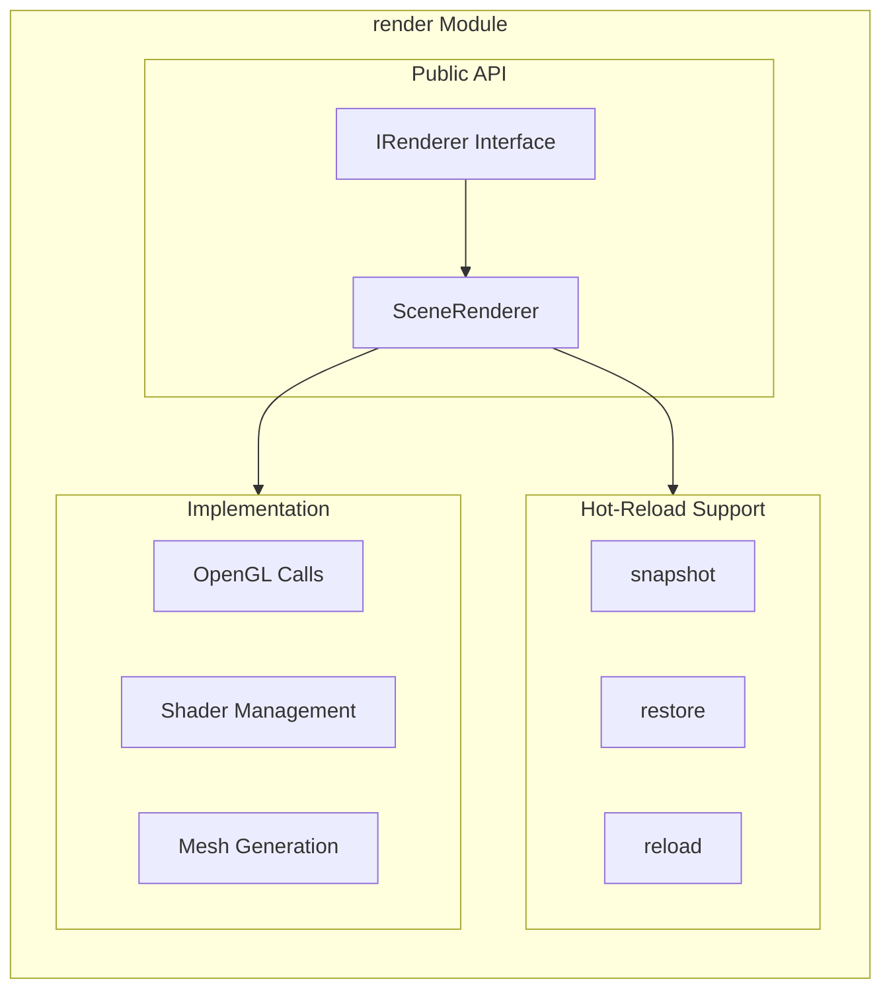

# Build Workflow: Preservation-First Approach

## Core Principle

**NEVER delete functionality to fix a build. Fix the build to enable functionality.**

---

## HARD RULES (Non-Negotiable)

These rules exist because AI will take the easy path unless explicitly blocked.

### Rule 1: NO COMMENTING OUT CODE

```cpp
// FORBIDDEN - This is NEVER acceptable:
// void complex_function() {
//     // 50 lines of complex logic
// }

// FORBIDDEN - "Temporary" comments:
// TODO: Re-enable this later
// FIXME: This was causing issues
```

**If code is commented out, the fix is REJECTED.**

### Rule 2: LINE COUNT MUST NOT DECREASE

Before fix: `module.cpp` = 1500 lines
After fix: `module.cpp` = 1400 lines

**This is a RED FLAG.** Where did 100 lines go?

Acceptable reasons for line decrease:
- Removed duplicate stub file (but real file kept ALL functionality)
- Removed dead code that was truly unused (must prove it)

Unacceptable:
- "Simplified" the complex parts
- "Cleaned up" error handling
- "Removed unused" hot-reload code

### Rule 3: COMPLEXITY PRESERVED = SUCCESS

If the original code has:
- Nested error handling
- State machines
- Transaction rollback
- Hot-reload snapshots
- Edge case handling

The fixed code MUST have all of these. If any are missing, **the fix is wrong.**

### Rule 4: MANDATORY DIFF REVIEW

Before any fix is accepted, show:

```
BEFORE: [file:function] - X lines
AFTER:  [file:function] - Y lines

Lines added: ##
Lines removed: ##
Lines commented: ## (MUST BE ZERO)

Complex patterns preserved:
- [ ] Hot-reload: snapshot/restore
- [ ] Error handling chain
- [ ] State machine logic
- [ ] Transaction support
```

### Rule 5: USER VERIFIES EACH CHANGE

I will show you:
1. The exact code being changed
2. What it looked like before
3. What it looks like after
4. Proof that complex logic is preserved

You approve or reject. No batch changes.

### Rule 6: NO BUILD-DRIVEN DEVELOPMENT

**DO NOT run builds to "see what happens" and then chase errors.**

```
FORBIDDEN workflow:
  Build → See errors → React to errors → Build again → Repeat

REQUIRED workflow:
  Read code → Understand structure → Plan fix → Make surgical change →
  User approves → Then (and only then) build to verify
```

Why this matters:
- Build errors are a LURE that pulls you into reactive mode
- Each "fix" to silence an error often creates new problems
- The error count becomes a score to minimize (by any means)
- Complex code generates more errors, so it gets deleted first

**The build is a VERIFICATION step, not a FEEDBACK loop.**

### Rule 7: UNDERSTAND BEFORE TOUCHING

Before making ANY change:

1. **Read the entire file** (not just the error line)
2. **Understand what the code does** (not just what the error says)
3. **Identify dependencies** (what else uses this?)
4. **Plan the fix in words** (explain it before coding it)
5. **Get approval** (user confirms the plan makes sense)
6. **Make ONE surgical change**
7. **THEN build to verify**

If I cannot explain what a function does, I should NOT be changing it.

### Rule 8: ERROR COUNT IS NOT A METRIC

```
WRONG thinking:
  "We had 50 errors, now we have 10, we're making progress!"

RIGHT thinking:
  "We had 50 errors. Let's understand WHY before touching anything.
   Are they all from one root cause? Is it a missing include?
   Is it a namespace issue? Let's fix the ROOT, not the symptoms."
```

Most build errors are SYMPTOMS of one or two root causes:
- Missing include
- Wrong namespace
- Duplicate definition (stub vs real)
- Missing link library

Fix the root cause = all related errors disappear.
Chase individual errors = destroy the codebase.

---

---

## The Workflow

### Step 0: NO BUILDS UNTIL THE END

```
┌─────────────────────────────────────────────────────────────┐
│                                                             │
│   DO NOT RUN CMAKE/BUILD UNTIL EXPLICITLY TOLD TO           │
│                                                             │
│   The workflow is:                                          │
│   1. READ and understand                                    │
│   2. DOCUMENT what exists                                   │
│   3. PLAN the fix (in words)                                │
│   4. GET APPROVAL from user                                 │
│   5. MAKE the surgical change                               │
│   6. SHOW the before/after                                  │
│   7. USER APPROVES                                          │
│   8. ONLY THEN: build to verify                             │
│                                                             │
│   If build fails after a change, DO NOT chase errors.       │
│   STOP and reassess. Show user what happened.               │
│                                                             │
└─────────────────────────────────────────────────────────────┘
```

### Step 1: Functionality Inventory (BEFORE touching code)

For each module, document what EXISTS and what it DOES:

```markdown
## Module: [name]

### Critical Features to PRESERVE
- [ ] Feature A - file.cpp:123 - Description
- [ ] Feature B - file.cpp:456 - Description
- [ ] Hot-reload support - file.cpp:789

### Current Build Issues
- Error 1: description
- Error 2: description

### Proposed Fix
- Fix approach that KEEPS all features
```

### Step 2: Build Attempt

```bash
cmake --build build 2>&1 | tee build_output.txt
```

Capture ALL errors. Don't fix mid-stream.

### Step 3: Categorize Errors

| Error Type | Correct Fix | WRONG Fix |
|------------|-------------|-----------|
| Missing include | Add the include | Delete the code using it |
| Undefined symbol | Implement it or link it | Remove the call |
| Type mismatch | Fix the types | Delete the function |
| Duplicate definition | Remove STUB, keep REAL | Remove both |
| Template error | Fix template params | Delete template code |

### Step 4: Fix with Verification

For EACH fix:
1. State what you're changing
2. State what functionality is preserved
3. Make the change
4. Verify the functionality still exists

### Step 5: Document Changes

Update `doc/modules/[name].md`:
- What was fixed
- What was preserved
- Current status

---

## Golden Rule: MOST ADVANCED FUNCTIONALITY WINS

When choosing between implementations:

```
┌─────────────────────────────────────────────────────────────┐
│  ALWAYS KEEP THE MORE ADVANCED IMPLEMENTATION               │
│                                                             │
│  Compare by:                                                │
│  1. Line count (more lines = more features usually)         │
│  2. Feature completeness                                    │
│  3. Error handling depth                                    │
│  4. Hot-reload support                                      │
│  5. Edge case handling                                      │
│  6. Integration depth                                       │
│                                                             │
│  If stub.cpp has 50 lines and real.cpp has 500 lines,      │
│  KEEP THE 500 LINES - that's where the work is.            │
└─────────────────────────────────────────────────────────────┘
```

### Decision Matrix

| Scenario | Keep | Delete | Reason |
|----------|------|--------|--------|
| Stub returns `true` vs Real has 50 lines of logic | Real | Stub | Real has actual work |
| Stub has basic impl vs Real has hot-reload | Real | Stub | Hot-reload is advanced |
| Both have impl, A has error handling, B doesn't | A | B | Error handling is advanced |
| Both have impl, A has 3 edge cases, B has 1 | A | B | More edge cases = more complete |
| Stub has caching, Real doesn't | **MERGE** | Neither | Take best of both |

### When to MERGE Instead of Choose

If the "stub" has features the "real" doesn't:
1. Don't delete either immediately
2. Identify what's unique in each
3. Merge the unique parts into ONE implementation
4. Then delete the redundant file

Example:
```cpp
// stub.cpp has:
void func() {
    cache_result();  // <-- This is useful!
    return basic_impl();
}

// real.cpp has:
void func() {
    do_complex_work();
    handle_errors();
    // No caching though
}

// MERGE into real.cpp:
void func() {
    cache_result();      // From stub
    do_complex_work();   // From real
    handle_errors();     // From real
}
```

---

## Red Lines: NEVER Do These

### 1. Never Delete Hot-Reload Code

Hot-reload patterns to PRESERVE:
```cpp
// These patterns are SACRED - never remove:
HotReloadSnapshot snapshot();
Result<void> restore(const HotReloadSnapshot&);
bool is_compatible(const HotReloadSnapshot&);
Version current_version();
void on_reloaded();

// Dehydrate/Rehydrate patterns:
DehydratedState dehydrate();
Result<void> rehydrate(const DehydratedState&);
```

### 2. Never Delete to Fix ODR Violations

WRONG:
```cpp
// Delete one of the implementations
```

RIGHT:
```cpp
// Keep the MORE COMPLETE implementation
// Verify it has all functionality from both
// Then remove the stub
```

### 3. Never Simplify Complex Systems

If you see:
- Transaction systems
- Patch/diff systems
- State machines
- Supervisor trees
- Layer compositing

These are INTENTIONALLY complex. Fix integration, don't simplify.

### 4. Never Remove Error Handling

WRONG:
```cpp
// Just return true to make it compile
return true;
```

RIGHT:
```cpp
// Implement proper error handling
if (failed) {
    return Result<void>::error(ErrorCode::SpecificError, "description");
}
```

---

## Module-by-Module Workflow

### Before Starting a Module

1. Read the existing `doc/modules/[name].md`
2. Read ALL header files for the module
3. Read ALL cpp files for the module
4. Create functionality inventory
5. Identify what's stub vs real
6. Identify hot-reload support

### Build Fix Process

```
┌─────────────────────────────────────────┐
│  1. INVENTORY                           │
│     - List all functions                │
│     - Mark: stub / real / hot-reload    │
│     - Document current behavior         │
└─────────────────┬───────────────────────┘
                  │
                  ▼
┌─────────────────────────────────────────┐
│  2. BUILD                               │
│     - cmake --build build               │
│     - Capture all errors                │
│     - Don't fix yet                     │
└─────────────────┬───────────────────────┘
                  │
                  ▼
┌─────────────────────────────────────────┐
│  3. ANALYZE                             │
│     - Categorize each error             │
│     - Plan fix that preserves features  │
│     - Identify if stub vs real conflict │
└─────────────────┬───────────────────────┘
                  │
                  ▼
┌─────────────────────────────────────────┐
│  4. FIX                                 │
│     - One error at a time               │
│     - Verify functionality preserved    │
│     - Rebuild after each fix            │
└─────────────────┬───────────────────────┘
                  │
                  ▼
┌─────────────────────────────────────────┐
│  5. DOCUMENT                            │
│     - Update module .md                 │
│     - Update mermaid diagrams           │
│     - Log what was preserved            │
└─────────────────────────────────────────┘
```

---

## Functionality Preservation Checklist

Before marking a module "fixed", verify:

### Hot-Reload Support
- [ ] `snapshot()` still exists and works
- [ ] `restore()` still exists and works
- [ ] `dehydrate()` still exists (if applicable)
- [ ] `rehydrate()` still exists (if applicable)
- [ ] Version tracking preserved

### Advanced Features
- [ ] Transaction support preserved
- [ ] Patch/diff support preserved
- [ ] State machine logic preserved
- [ ] Error handling preserved (not stubbed)
- [ ] Async/callback patterns preserved

### Integration Points
- [ ] Module init() connects to real system
- [ ] Factory functions return real implementations
- [ ] No bypassed abstractions (like direct GLFW calls)

---

## Example: Fixing render Module

### Step 1: Inventory

```markdown
## render Module Inventory

### Files
- stub.cpp (218 lines) - STUB implementations
- gl_renderer.cpp (1587 lines) - REAL implementations

### Line Count Comparison (MOST ADVANCED WINS)
| Function | stub.cpp | gl_renderer.cpp | Winner |
|----------|----------|-----------------|--------|
| ShaderProgram::reload() | 3 lines (return true) | 27 lines (full reload) | gl_renderer |
| SceneRenderer::render() | 6 lines (set stats to 0) | 43 lines (full pipeline) | gl_renderer |
| create_sphere_mesh() | 1 line (return empty) | 44 lines (real geometry) | gl_renderer |
| get_uniform_location() | 1 line (return -1) | 9 lines (with caching) | gl_renderer |

### Critical Features in gl_renderer.cpp
- [x] GlCamera with orbit/zoom/pan
- [x] ShaderProgram with hot-reload (reload(), on_reloaded callback)
- [x] SceneRenderer with full pipeline
- [x] Mesh generation (sphere, cube, torus, etc.)
- [x] Uniform caching in get_uniform_location()

### Hot-Reload Support (MUST PRESERVE)
- ShaderProgram::reload() - lines 248-274 (27 lines of real logic!)
- ShaderProgram::snapshot() - lines 322-330 (stores shader paths)
- ShaderProgram::restore() - lines 332-340 (calls reload with error handling)
- m_on_reloaded callback - line 272 (notifies listeners)

### Build Issue
- ODR violation: both stub.cpp and gl_renderer.cpp define same functions

### Fix Plan
1. KEEP gl_renderer.cpp (1587 lines > 218 lines, has hot-reload, real GL calls)
2. REMOVE stub.cpp (only has empty stubs, no unique features)
3. Verify hot-reload still works after removal
```

### Step 2: Execute Fix

```bash
# Remove stub from CMakeLists.txt
# Delete stub.cpp
# Rebuild
cmake --build build
```

### Step 3: Verify Preservation

```bash
# Check hot-reload still exists
grep -n "reload\|snapshot\|restore\|on_reloaded" src/render/gl_renderer.cpp
```

### Step 4: Document

Update `doc/modules/render.md` with:
- stub.cpp removed
- All hot-reload functionality preserved
- Current build status

---

## Mermaid Diagram Template

For each module, maintain architecture diagram:



---

## Summary

1. **Document BEFORE you touch**
2. **Preserve hot-reload as sacred**
3. **Fix integration, don't delete complexity**
4. **Verify functionality after each change**
5. **Update docs with what was preserved**

This workflow ensures we IMPROVE the codebase without losing the advanced features that make it valuable.

---

## How to Catch AI Taking the Easy Path

Use these commands to verify I haven't cheated:

### Check for Commented Code
```bash
# Find all commented function bodies (BAD)
grep -rn "^[[:space:]]*//.*{" src/
grep -rn "^[[:space:]]*//.*void\|bool\|int\|auto" src/

# Find TODO/FIXME that suggest deferred work
grep -rn "TODO:\|FIXME:\|XXX:\|HACK:" src/ | wc -l
# Compare before and after - should not increase
```

### Check Line Counts
```bash
# Before making changes, record:
wc -l src/module/*.cpp > /tmp/before.txt

# After changes:
wc -l src/module/*.cpp > /tmp/after.txt

# Compare:
diff /tmp/before.txt /tmp/after.txt
# Significant decrease = RED FLAG
```

### Check Complex Patterns Still Exist
```bash
# Hot-reload patterns (must still exist after fix)
grep -rn "snapshot\|restore\|dehydrate\|rehydrate" src/module/

# Error handling (must still exist)
grep -rn "Result<\|Error::\|error(" src/module/

# State machines (must still exist)
grep -rn "State::\|transition\|state_machine" src/module/
```

### Verify Function Bodies Not Hollowed Out
```bash
# Find suspiciously short functions (potential stubs)
# Functions with just "return true" or "return {}"
grep -A2 "^[a-zA-Z].*{$" src/module/*.cpp | grep -B1 "return true;\|return {};\|return nullptr;"
```

---

## Red Flags to Watch For

If I say any of these, STOP and question:

| What I Say | What It Means | Your Response |
|------------|---------------|---------------|
| "Simplified the logic" | Deleted complexity | "Show me what was removed" |
| "Cleaned up the code" | Removed features | "Show before/after line count" |
| "Removed unused code" | Might be hot-reload | "Prove it was unused" |
| "Commented out for now" | Taking easy path | "REJECTED - fix it properly" |
| "This can be added later" | Won't be added | "Add it now" |
| "Stubbed this temporarily" | Permanent stub | "No stubs - implement it" |
| "Made it compile" | Probably deleted things | "Show me the diff" |

---

## The Only Acceptable Outcomes

### For Duplicate Code (stub vs real):
- DELETE stub, KEEP 100% of real functionality
- Or MERGE best of both, DELETE nothing unique

### For Build Errors:
- FIX the error while keeping ALL existing code
- NEVER comment out, NEVER delete to fix

### For Complex Code:
- PRESERVE all complexity
- If you don't understand it, ASK, don't delete

---

## What To Do When Build Fails

### STOP. Do Not Chase.

```
Build fails with 50 errors
         │
         ▼
    ┌────────────┐
    │   STOP     │
    │            │
    │ Do NOT     │
    │ "fix" the  │
    │ first error│
    └─────┬──────┘
          │
          ▼
    ┌─────────────────┐
    │ ANALYZE:        │
    │                 │
    │ - Are errors    │
    │   all similar?  │
    │ - Common root?  │
    │ - Missing file? │
    │ - Wrong import? │
    └────────┬────────┘
             │
             ▼
    ┌─────────────────┐
    │ REPORT TO USER: │
    │                 │
    │ "Build has 50   │
    │  errors. They   │
    │  appear to be   │
    │  caused by X.   │
    │  Should I fix   │
    │  X specifically │
    │  or investigate │
    │  more?"         │
    └────────┬────────┘
             │
             ▼
      User decides
```

### Common Root Causes (fix these, not symptoms)

| Error Pattern | Likely Root Cause | Correct Fix |
|---------------|-------------------|-------------|
| "undefined reference" x50 | Missing .cpp in CMakeLists | Add the file to SOURCES |
| "no type named X" x30 | Missing #include | Add the include |
| "multiple definition" x20 | Duplicate in stub + real | Remove stub file entirely |
| "namespace X has no member" | Wrong namespace | Fix namespace declaration |
| "cannot convert" x40 | Type mismatch in one place | Fix the one type definition |

### What NOT To Do

```cpp
// ERROR: undefined reference to 'ComplexSystem::initialize()'

// WRONG response:
// "Let me stub out initialize() to make it compile"
void ComplexSystem::initialize() { } // STUB - destroys functionality

// RIGHT response:
// "This error means ComplexSystem::initialize() is declared but not linked.
//  Let me check if the implementation exists in another file that's not
//  being compiled."
// Then: Add the correct .cpp to CMakeLists, or fix the linking issue.
```

### The One-Error-At-A-Time Trap

Even fixing "one error at a time" is dangerous if you don't understand the root cause.

```
Error 1: undefined reference to `foo()`
  → "Fix": Add stub `void foo() {}`
  → Creates: 3 new errors because foo() was supposed to return something

Error 2: undefined reference to `bar()`
  → "Fix": Add stub `void bar() {}`
  → Creates: 5 new errors

...50 stubs later: compiles! (but nothing works)
```

**The correct response to error 1:**
"Why is foo() undefined? Where should it be defined? Is it in a file that's not being compiled? Is it in a stub that needs to be replaced with real code?"

---

## The Correct Mental Model

### Build Errors Are INFORMATION, Not Tasks

```
WRONG: "I need to fix these 50 errors"
RIGHT: "These 50 errors are telling me something about the codebase structure"

WRONG: "Error says 'undefined foo', so I need to define foo"
RIGHT: "Error says 'undefined foo', so I need to find where foo SHOULD be defined"

WRONG: "Make the errors go away"
RIGHT: "Understand why the errors exist"
```

### The Codebase Already Has The Answers

In void_engine's case:
- gl_renderer.cpp has the real implementations
- stub.cpp has empty stubs
- The "undefined reference" errors probably mean the wrong file is being compiled

The fix is NOT to add more stubs.
The fix is to compile the right file.
