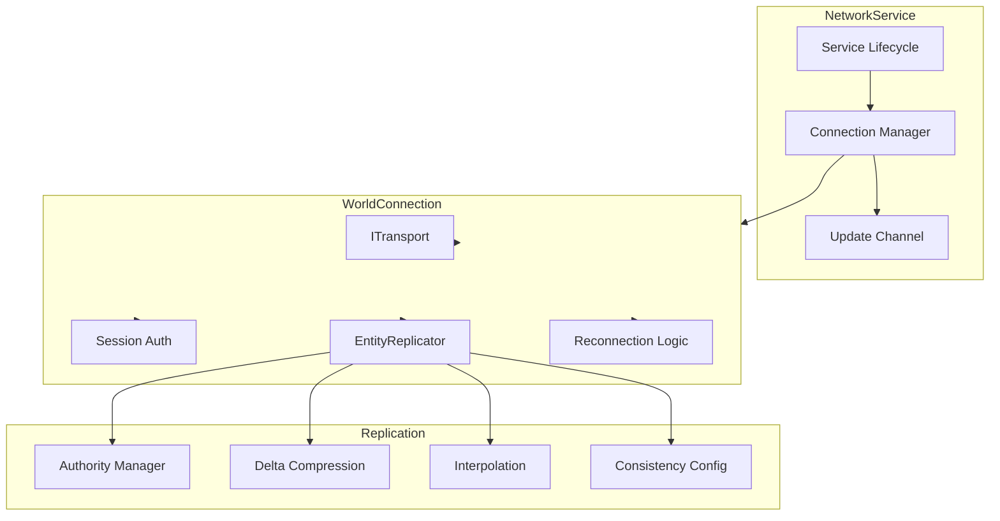

# Void Engine Implementation Analysis

> **Document Purpose**: Technical specification for implementing critical gaps
> **Review Standard**: John Carmack level - zero tolerance for shortcuts
> **Created**: 2026-01-25
> **Status**: PRE-IMPLEMENTATION ANALYSIS

---

## Executive Summary

This document provides complete technical specifications for implementing the four critical gaps identified in the Void Engine migration:

| Gap | Complexity | Estimated LoC | Dependencies | Risk Level |
|-----|------------|---------------|--------------|------------|
| void_hud Hot-Reload | Low | ~500 | void_hud, void_core | Low |
| void_network | High | ~5,000 | void_services, void_event | Medium |
| Linux Backends | Medium | ~3,000 | void_compositor, void_presenter | Medium |
| void_editor | Very High | ~10,000+ | All modules | High |

**Total Estimated Implementation**: ~18,500 lines of production C++20

---

## Table of Contents

1. [Architecture Principles](#architecture-principles)
2. [Implementation 1: void_hud Hot-Reload](#implementation-1-void_hud-hot-reload)
3. [Implementation 2: void_network](#implementation-2-void_network)
4. [Implementation 3: Linux Backends](#implementation-3-linux-backends)
5. [Implementation 4: void_editor](#implementation-4-void_editor)
6. [Cross-Cutting Concerns](#cross-cutting-concerns)
7. [Testing Strategy](#testing-strategy)
8. [Migration Path](#migration-path)

---

## Architecture Principles

### Principle 1: Hot-Reload First

Every component MUST support hot-reload. This is non-negotiable.

```cpp
// Pattern: All stateful systems implement HotReloadable
class MySystem : public void_core::HotReloadable {
    // State that survives hot-reload
    SnapshotData m_persistent_state;

    // State rebuilt after hot-reload
    mutable TransientCache m_cache;

    // Hot-reload implementation
    Result<HotReloadSnapshot> snapshot() override {
        return serialize(m_persistent_state);
    }

    Result<void> restore(HotReloadSnapshot snap) override {
        m_persistent_state = TRY(deserialize<SnapshotData>(snap.data));
        rebuild_cache();  // Transient state rebuilt
        return Ok();
    }
};
```

### Principle 2: Binary Serialization

All snapshots use binary serialization for performance. No JSON, no text.

```cpp
// Snapshot header structure (all snapshots)
struct SnapshotHeader {
    uint32_t magic;      // 4 ASCII chars as uint32
    uint32_t version;    // For migration
    uint32_t size;       // Payload size
    uint32_t checksum;   // CRC32 of payload
};

// Binary layout control
template<typename T>
void write_pod(std::vector<uint8_t>& buffer, const T& value) {
    static_assert(std::is_trivially_copyable_v<T>);
    const auto* bytes = reinterpret_cast<const uint8_t*>(&value);
    buffer.insert(buffer.end(), bytes, bytes + sizeof(T));
}

// String serialization (length-prefixed)
void write_string(std::vector<uint8_t>& buffer, std::string_view str) {
    write_pod(buffer, static_cast<uint32_t>(str.size()));
    buffer.insert(buffer.end(), str.begin(), str.end());
}
```

### Principle 3: Handle-Based References

No raw pointers in persistent state. Use handles that survive reload.

```cpp
// BAD: Raw pointer (dies on reload)
struct BadState {
    Entity* selected;  // ❌ Invalid after DLL reload
};

// GOOD: Handle-based reference
struct GoodState {
    EntityId selected;  // ✓ Survives reload, resolved fresh
};

// Handle resolution pattern
Entity* resolve(EntityId id, World& world) {
    return world.try_get(id);  // May return nullptr if deleted
}
```

### Principle 4: Lock-Free Where Possible

Use atomic operations and lock-free data structures for concurrent access.

```cpp
// Lock-free queue for inter-thread communication
template<typename T>
class LockFreeQueue {
    struct Node {
        std::atomic<Node*> next{nullptr};
        std::optional<T> data;
    };

    std::atomic<Node*> m_head;
    std::atomic<Node*> m_tail;

public:
    void push(T value);
    std::optional<T> pop();
};

// Atomic statistics
struct NetworkStats {
    std::atomic<uint64_t> bytes_sent{0};
    std::atomic<uint64_t> bytes_received{0};
    // ...
};
```

### Principle 5: Result-Based Error Handling

All fallible operations return `Result<T>`.

```cpp
// Never throw in hot paths
// Never return error codes
// Always use Result<T>

Result<Connection> connect(std::string_view address) {
    auto socket = TRY(create_socket());
    TRY(socket.connect(address));
    return Ok(Connection{std::move(socket)});
}
```

---

## Implementation 1: void_hud Hot-Reload

### Overview

| Aspect | Details |
|--------|---------|
| Current State | 5,765 lines implemented, hot-reload missing |
| Changes Required | Add HotReloadable interface, serialization |
| Estimated LoC | ~500 new lines |
| Risk Level | Low (extends working code) |

### File Structure

```
include/void_engine/hud/
├── hud.hpp                 # Existing
├── elements.hpp            # Existing - add serialize() to elements
├── animation.hpp           # Existing - add AnimationSnapshot
├── binding.hpp             # Existing - add BindingSnapshot
└── hot_reload.hpp          # NEW - HotReloadableHudSystem

src/hud/
├── hud.cpp                 # Existing
├── elements.cpp            # Existing - add serialize() impls
└── hot_reload.cpp          # NEW - serialization implementations
```

### Technical Specification

#### HudSystemSnapshot Structure

```cpp
namespace void_hud {

/// Element snapshot - serialized element state
struct ElementSnapshot {
    HudElementId id;
    HudElementType type;
    HudLayerId layer;

    // Transform
    Vec2 position;
    Vec2 size;
    Vec2 anchor;
    Vec2 pivot;
    float rotation;
    float scale;

    // Visual state
    float opacity;
    bool visible;

    // Type-specific data (variant or tagged union)
    std::vector<uint8_t> type_data;
};

/// Animation state snapshot
struct AnimationSnapshot {
    AnimationId id;
    HudElementId target;
    AnimationState state;
    float progress;        // 0.0 - 1.0
    float elapsed_time;
    bool paused;
    bool reversed;

    // Keyframe data for restoration
    std::vector<uint8_t> keyframe_data;
};

/// Data binding snapshot
struct BindingSnapshot {
    BindingId id;
    HudElementId element;
    std::string property;
    std::string source_path;
    BindingMode mode;
    std::vector<uint8_t> cached_value;
};

/// Complete HUD system snapshot
struct HudSystemSnapshot {
    static constexpr uint32_t MAGIC = 0x48554453;  // "HUDS"
    static constexpr uint32_t VERSION = 1;

    // All elements
    std::vector<ElementSnapshot> elements;

    // Layer ordering (bottom to top)
    std::vector<HudLayerId> layer_order;

    // Active animations
    std::vector<AnimationSnapshot> animations;

    // Data bindings
    std::vector<BindingSnapshot> bindings;

    // Viewport state
    float viewport_width;
    float viewport_height;
    float dpi_scale;
    float ui_scale;

    // Focus state
    std::optional<HudElementId> focused_element;
    std::optional<HudElementId> hovered_element;
};

}  // namespace void_hud
```

#### Element Serialization Pattern

```cpp
// Each element type provides serialization
template<>
struct ElementSerializer<HudProgressBar> {
    static std::vector<uint8_t> serialize(const HudProgressBar& bar) {
        std::vector<uint8_t> data;
        write_pod(data, bar.value());
        write_pod(data, bar.min_value());
        write_pod(data, bar.max_value());
        write_pod(data, bar.direction());
        write_color(data, bar.fill_color());
        write_color(data, bar.background_color());
        return data;
    }

    static Result<void> deserialize(
        HudProgressBar& bar,
        std::span<const uint8_t> data
    ) {
        Reader reader(data);
        bar.set_value(TRY(reader.read_pod<float>()));
        bar.set_min_value(TRY(reader.read_pod<float>()));
        bar.set_max_value(TRY(reader.read_pod<float>()));
        bar.set_direction(TRY(reader.read_pod<ProgressDirection>()));
        bar.set_fill_color(TRY(reader.read_color()));
        bar.set_background_color(TRY(reader.read_color()));
        return Ok();
    }
};
```

#### HotReloadableHudSystem Implementation

```cpp
class HotReloadableHudSystem : public HudSystem,
                                public void_core::HotReloadable {
public:
    // Forward constructors
    using HudSystem::HudSystem;

    Result<HotReloadSnapshot> snapshot() override {
        HudSystemSnapshot snap;

        // Capture all elements
        for_each_element([&](const HudElement& elem) {
            snap.elements.push_back(serialize_element(elem));
        });

        // Capture layer ordering
        snap.layer_order = get_layer_order();

        // Capture animations
        for (const auto& anim : m_animator.active_animations()) {
            snap.animations.push_back(serialize_animation(anim));
        }

        // Capture bindings
        for (const auto& binding : m_binding_manager.bindings()) {
            snap.bindings.push_back(serialize_binding(binding));
        }

        // Viewport state
        snap.viewport_width = m_viewport_width;
        snap.viewport_height = m_viewport_height;
        snap.dpi_scale = m_dpi_scale;
        snap.ui_scale = m_ui_scale;

        // Focus state
        snap.focused_element = m_focused;
        snap.hovered_element = m_hovered;

        return Ok(HotReloadSnapshot{
            serialize(snap),
            typeid(HudSystemSnapshot),
            "HudSystem",
            current_version()
        });
    }

    Result<void> restore(HotReloadSnapshot snapshot) override {
        auto snap = TRY(deserialize<HudSystemSnapshot>(snapshot.data));

        // Clear existing state
        clear();

        // Restore elements
        for (const auto& elem_snap : snap.elements) {
            TRY(restore_element(elem_snap));
        }

        // Restore layer ordering
        set_layer_order(snap.layer_order);

        // Restore animations
        for (const auto& anim_snap : snap.animations) {
            TRY(restore_animation(anim_snap));
        }

        // Restore bindings
        for (const auto& bind_snap : snap.bindings) {
            TRY(restore_binding(bind_snap));
        }

        // Restore viewport
        set_viewport(snap.viewport_width, snap.viewport_height);
        set_dpi_scale(snap.dpi_scale);
        set_ui_scale(snap.ui_scale);

        // Restore focus
        m_focused = snap.focused_element;
        m_hovered = snap.hovered_element;

        return Ok();
    }

    bool is_compatible(const Version& v) const override {
        return v.major == current_version().major;
    }

    Version current_version() const override {
        return Version{1, 0, 0};
    }

    std::string type_name() const override {
        return "HudSystem";
    }

    Result<void> prepare_reload() override {
        // Pause all animations
        m_animator.pause_all();
        return Ok();
    }

    Result<void> finish_reload() override {
        // Resume animations
        m_animator.resume_all();
        // Rebuild render caches
        invalidate_render_cache();
        return Ok();
    }
};
```

### Binary Serialization Format

```
HudSystemSnapshot Binary Format:
+00: uint32 magic        = 0x48554453 ("HUDS")
+04: uint32 version      = 1
+08: uint32 payload_size
+12: uint32 crc32_checksum

Payload:
+16: uint32 element_count
+20: ElementSnapshot[element_count]
     +00: uint64 id
     +08: uint8  type
     +09: uint64 layer_id
     +17: float  pos_x, pos_y
     +25: float  size_x, size_y
     +33: float  anchor_x, anchor_y
     +41: float  pivot_x, pivot_y
     +49: float  rotation
     +53: float  scale
     +57: float  opacity
     +61: uint8  visible
     +62: uint32 type_data_size
     +66: uint8[type_data_size]

... layer_order (uint32 count + uint64[count])
... animations
... bindings
... viewport state
... focus state
```

---

## Implementation 2: void_network

### Overview

| Aspect | Details |
|--------|---------|
| Current State | Does not exist |
| Reference | Legacy void_services/network (~2,000 lines) |
| Estimated LoC | ~5,000 lines (C++ is more verbose + tests) |
| Risk Level | Medium (new module, async complexity) |

### File Structure

```
include/void_engine/network/
├── network.hpp             # Main header, NetworkService
├── fwd.hpp                 # Forward declarations
├── types.hpp               # NetworkError, NetworkStats, enums
├── transport.hpp           # ITransport interface
├── connection.hpp          # WorldConnection
├── replication.hpp         # EntityReplicator
├── discovery.hpp           # WorldRegistry
├── consistency.hpp         # ConsistencyConfig
└── hot_reload.hpp          # NetworkSnapshot

src/network/
├── network_service.cpp     # NetworkService implementation
├── transport_websocket.cpp # WebSocket transport
├── transport_mock.cpp      # Mock for testing
├── connection.cpp          # WorldConnection
├── replication.cpp         # EntityReplicator
├── discovery.cpp           # WorldRegistry
├── hot_reload.cpp          # Serialization
└── CMakeLists.txt
```

### Technical Specification

#### NetworkService Architecture



#### Core Types

```cpp
namespace void_network {

/// Network errors
enum class NetworkErrorKind : uint8_t {
    NotConnected,
    ConnectionFailed,
    AuthenticationFailed,
    Timeout,
    ProtocolMismatch,
    MessageTooLarge,
    InvalidMessage,
    Disconnected,
    MaxReconnectAttempts
};

/// Connection state machine
enum class ConnectionState : uint8_t {
    Disconnected,   // Not connected
    Connecting,     // TCP/WebSocket handshake
    Authenticating, // Session authentication
    Connected,      // Fully connected
    Reconnecting    // Lost connection, attempting reconnect
};

/// Entity authority
enum class Authority : uint8_t {
    None,       // Receive-only, no modifications
    Owner,      // Full authority, source of truth
    Predicted   // Client-side prediction with reconciliation
};

/// Consistency level
enum class ConsistencyLevel : uint8_t {
    Eventual,   // Best effort, may drop
    Reliable,   // Guaranteed, may reorder
    Ordered     // Guaranteed and ordered
};

/// Network configuration
struct NetworkConfig {
    uint32_t max_reconnect_attempts = 5;
    std::chrono::milliseconds initial_reconnect_delay{500};
    std::chrono::milliseconds max_reconnect_delay{30000};
    std::chrono::milliseconds ping_interval{15000};
    std::chrono::milliseconds connection_timeout{10000};
    std::chrono::milliseconds auth_timeout{30000};
    bool enable_compression = true;
    size_t compression_threshold = 1024;
    size_t max_message_size = 1 << 20;  // 1 MB
};

/// Network statistics
struct NetworkStats {
    std::atomic<uint64_t> bytes_sent{0};
    std::atomic<uint64_t> bytes_received{0};
    std::atomic<uint64_t> packets_sent{0};
    std::atomic<uint64_t> packets_received{0};
    std::atomic<uint64_t> rtt_us{0};        // Microseconds
    std::atomic<uint32_t> packet_loss_ppm{0}; // Parts per million
    std::atomic<uint32_t> reconnect_count{0};
};

}  // namespace void_network
```

#### Transport Interface

```cpp
/// Abstract transport layer
class ITransport {
public:
    virtual ~ITransport() = default;

    /// Connect to server
    [[nodiscard]] virtual Result<void> connect(
        std::string_view address,
        std::chrono::milliseconds timeout
    ) = 0;

    /// Disconnect from server
    [[nodiscard]] virtual Result<void> disconnect() = 0;

    /// Send binary message
    [[nodiscard]] virtual Result<void> send(
        std::span<const uint8_t> data
    ) = 0;

    /// Receive next message (non-blocking)
    [[nodiscard]] virtual std::optional<std::vector<uint8_t>> receive() = 0;

    /// Check connection status
    [[nodiscard]] virtual bool is_connected() const = 0;

    /// Get current RTT estimate
    [[nodiscard]] virtual std::chrono::microseconds rtt() const = 0;
};

/// WebSocket transport (default)
class WebSocketTransport : public ITransport {
public:
    explicit WebSocketTransport(NetworkConfig config);

    Result<void> connect(
        std::string_view address,
        std::chrono::milliseconds timeout
    ) override;

    Result<void> disconnect() override;
    Result<void> send(std::span<const uint8_t> data) override;
    std::optional<std::vector<uint8_t>> receive() override;
    bool is_connected() const override;
    std::chrono::microseconds rtt() const override;

private:
    struct Impl;
    std::unique_ptr<Impl> m_impl;
};
```

#### Entity Replication

```cpp
/// Entity update message
struct EntityUpdate {
    void_ecs::EntityId entity;
    uint64_t timestamp;     // Server timestamp
    uint32_t sequence;      // For ordering
    ConsistencyLevel consistency;

    // Component updates (type_id -> serialized data)
    std::vector<std::pair<void_ecs::ComponentTypeId, std::vector<uint8_t>>> components;
};

/// Replicated entity state
struct ReplicatedEntity {
    void_ecs::EntityId id;
    Authority authority;
    uint64_t last_update;
    uint32_t version;

    // For interpolation
    std::optional<EntityUpdate> prev_state;
    std::optional<EntityUpdate> next_state;
    float interpolation_factor;
};

/// Entity replicator
class EntityReplicator {
public:
    explicit EntityReplicator(ConsistencyConfig config);

    // Authority management
    void claim_authority(void_ecs::EntityId entity);
    void release_authority(void_ecs::EntityId entity);
    [[nodiscard]] Authority get_authority(void_ecs::EntityId entity) const;

    // Outgoing replication
    void replicate_component(
        void_ecs::EntityId entity,
        void_ecs::ComponentTypeId type,
        std::span<const uint8_t> data,
        ConsistencyLevel consistency = ConsistencyLevel::Reliable
    );

    /// Get and clear pending outgoing updates
    [[nodiscard]] std::vector<EntityUpdate> take_outgoing();

    // Incoming replication
    void apply_incoming(EntityUpdate update);

    /// Get interpolated state for entity
    [[nodiscard]] std::optional<EntityUpdate> get_interpolated(
        void_ecs::EntityId entity,
        float alpha
    ) const;

    // Snapshot for hot-reload
    struct Snapshot {
        std::unordered_map<void_ecs::EntityId, Authority> authorities;
        std::unordered_map<void_ecs::EntityId, uint64_t> versions;
    };

    [[nodiscard]] Snapshot take_snapshot() const;
    void apply_snapshot(const Snapshot& snapshot);

private:
    ConsistencyConfig m_config;
    std::unordered_map<void_ecs::EntityId, ReplicatedEntity> m_entities;
    std::vector<EntityUpdate> m_outgoing;
    mutable std::mutex m_mutex;
};
```

#### NetworkService Implementation

```cpp
class NetworkService : public void_services::IService,
                       public void_core::HotReloadable {
public:
    explicit NetworkService(NetworkConfig config = {});
    ~NetworkService() override;

    // Connection API
    [[nodiscard]] Result<void> connect(std::string_view address);
    [[nodiscard]] Result<void> disconnect();
    [[nodiscard]] bool is_connected() const;
    [[nodiscard]] ConnectionState state() const;

    // Replication access
    [[nodiscard]] EntityReplicator& replicator();
    [[nodiscard]] const EntityReplicator& replicator() const;

    // Statistics
    [[nodiscard]] const NetworkStats& stats() const;

    // Update subscription
    using UpdateCallback = std::function<void(const NetworkUpdate&)>;
    void on_update(UpdateCallback callback);

    // Per-frame processing
    void tick(float dt);

    // IService interface
    std::string_view name() const override { return "network"; }
    void on_start() override;
    void on_stop() override;
    void on_update(float dt) override { tick(dt); }

    // HotReloadable interface
    Result<HotReloadSnapshot> snapshot() override;
    Result<void> restore(HotReloadSnapshot snapshot) override;
    bool is_compatible(const Version& v) const override;
    Version current_version() const override;
    std::string type_name() const override { return "NetworkService"; }

private:
    NetworkConfig m_config;
    std::unique_ptr<ITransport> m_transport;
    EntityReplicator m_replicator;
    NetworkStats m_stats;

    ConnectionState m_state{ConnectionState::Disconnected};
    std::string m_server_address;
    std::string m_session_id;

    std::vector<UpdateCallback> m_callbacks;

    // Reconnection state
    uint32_t m_reconnect_attempts{0};
    std::chrono::steady_clock::time_point m_last_reconnect_attempt;

    void process_incoming();
    void send_outgoing();
    void handle_reconnection();
    std::chrono::milliseconds calculate_backoff() const;
    void notify_update(const NetworkUpdate& update);
};
```

### Protocol Design

```
Message Format:
+00: uint8  message_type
+01: uint32 payload_size
+05: uint8[payload_size] payload

Message Types:
0x01: Ping
0x02: Pong
0x10: Auth Request
0x11: Auth Response
0x20: Entity Update
0x21: Entity Destroy
0x30: World Event
0x40: Error
```

---

## Implementation 3: Linux Backends

### Overview

| Aspect | Details |
|--------|---------|
| Current State | Code structure exists, implementations commented out |
| Reference | Legacy drm.rs (374 lines), smithay_main.rs |
| Estimated LoC | ~3,000 lines |
| Risk Level | Medium (platform-specific, hardware interaction) |

### File Structure

```
include/void_engine/presenter/
├── drm.hpp                 # DRM types, DrmPresenter

include/void_engine/compositor/
├── smithay.hpp             # Smithay compositor interface
├── linux_input.hpp         # libinput wrapper

src/presenter/
├── drm_presenter.cpp       # DRM/KMS implementation

src/compositor/
├── smithay_compositor.cpp  # Smithay Wayland
├── linux_input.cpp         # libinput handling
└── CMakeLists.txt          # Conditional Linux build
```

### Technical Specification

#### DRM Presenter

```cpp
#if defined(__linux__)

namespace void_presenter {

/// DRM device information
struct DrmDeviceInfo {
    std::string path;           // /dev/dri/card0
    std::string driver_name;    // "amdgpu", "i915", etc.
    bool supports_atomic;
    bool supports_vrr;
    std::vector<DrmOutput> outputs;
};

/// DRM output (connector + CRTC)
struct DrmOutput {
    uint32_t connector_id;
    uint32_t crtc_id;
    std::string name;           // "HDMI-A-1", "DP-1"
    bool connected;
    std::vector<DrmMode> modes;
};

/// Display mode
struct DrmMode {
    uint32_t width;
    uint32_t height;
    uint32_t refresh_rate;      // Hz
    bool preferred;
};

/// DRM presenter snapshot
struct DrmPresenterSnapshot {
    static constexpr uint32_t MAGIC = 0x44524D50;  // "DRMP"
    static constexpr uint32_t VERSION = 1;

    std::string device_path;
    uint32_t connector_id;
    uint32_t crtc_id;
    DrmMode mode;
    uint64_t frame_number;
    PresenterConfig config;
};

/// DRM Presenter - renders directly to GPU via DRM/KMS
class DrmPresenter : public IPresenter, public void_core::HotReloadable {
public:
    /// Enumerate available DRM devices
    [[nodiscard]] static std::vector<DrmDeviceInfo> enumerate_devices();

    /// Find primary DRM device
    [[nodiscard]] static std::optional<std::string> find_primary_device();

    /// Create DRM presenter
    [[nodiscard]] static Result<std::unique_ptr<DrmPresenter>> create(
        std::string_view device_path = "/dev/dri/card0"
    );

    ~DrmPresenter() override;

    // IPresenter interface
    [[nodiscard]] PresenterId id() const override;
    [[nodiscard]] const PresenterCapabilities& capabilities() const override;
    [[nodiscard]] const PresenterConfig& config() const override;
    [[nodiscard]] Result<void> reconfigure(PresenterConfig config) override;
    [[nodiscard]] Result<void> resize(uint32_t width, uint32_t height) override;
    [[nodiscard]] Result<Frame> begin_frame() override;
    [[nodiscard]] Result<void> present(Frame frame) override;
    [[nodiscard]] std::pair<uint32_t, uint32_t> size() const override;
    [[nodiscard]] bool is_valid() const override;

    // DRM-specific
    [[nodiscard]] Result<void> set_mode(const DrmMode& mode);
    [[nodiscard]] const DrmOutput& current_output() const;
    [[nodiscard]] bool supports_vrr() const;
    [[nodiscard]] Result<void> enable_vrr(bool enable);

    // HotReloadable interface
    [[nodiscard]] Result<HotReloadSnapshot> snapshot() override;
    [[nodiscard]] Result<void> restore(HotReloadSnapshot snapshot) override;
    [[nodiscard]] bool is_compatible(const Version& v) const override;
    [[nodiscard]] Version current_version() const override;
    [[nodiscard]] std::string type_name() const override { return "DrmPresenter"; }

private:
    explicit DrmPresenter(std::string device_path);

    // Implementation detail (PIMPL)
    struct Impl;
    std::unique_ptr<Impl> m_impl;
};

}  // namespace void_presenter

#endif  // __linux__
```

#### DRM Implementation Detail

```cpp
// src/presenter/drm_presenter.cpp
#if defined(__linux__)

#include <void_engine/presenter/drm.hpp>

#include <xf86drm.h>
#include <xf86drmMode.h>
#include <gbm.h>
#include <fcntl.h>
#include <unistd.h>

namespace void_presenter {

struct DrmPresenter::Impl {
    // DRM state
    int drm_fd = -1;
    gbm_device* gbm = nullptr;
    drmModeCrtc* saved_crtc = nullptr;

    // Output configuration
    uint32_t connector_id = 0;
    uint32_t crtc_id = 0;
    drmModeModeInfo mode{};

    // Double buffering
    struct Buffer {
        gbm_bo* bo = nullptr;
        uint32_t fb_id = 0;
    };
    Buffer buffers[2];
    int current_buffer = 0;

    // Frame tracking
    uint64_t frame_number = 0;

    // Configuration
    PresenterConfig config;
    PresenterCapabilities capabilities;
    PresenterId id;

    ~Impl() {
        cleanup();
    }

    void cleanup() {
        // Restore original CRTC
        if (saved_crtc) {
            drmModeSetCrtc(drm_fd, saved_crtc->crtc_id,
                          saved_crtc->buffer_id,
                          saved_crtc->x, saved_crtc->y,
                          &connector_id, 1, &saved_crtc->mode);
            drmModeFreeCrtc(saved_crtc);
            saved_crtc = nullptr;
        }

        // Destroy framebuffers
        for (auto& buf : buffers) {
            if (buf.fb_id) {
                drmModeRmFB(drm_fd, buf.fb_id);
                buf.fb_id = 0;
            }
            if (buf.bo) {
                gbm_bo_destroy(buf.bo);
                buf.bo = nullptr;
            }
        }

        // Destroy GBM device
        if (gbm) {
            gbm_device_destroy(gbm);
            gbm = nullptr;
        }

        // Close DRM device
        if (drm_fd >= 0) {
            close(drm_fd);
            drm_fd = -1;
        }
    }
};

Result<std::unique_ptr<DrmPresenter>> DrmPresenter::create(
    std::string_view device_path
) {
    auto presenter = std::unique_ptr<DrmPresenter>(
        new DrmPresenter(std::string(device_path))
    );

    auto& impl = *presenter->m_impl;

    // Open DRM device
    impl.drm_fd = open(device_path.data(), O_RDWR | O_CLOEXEC);
    if (impl.drm_fd < 0) {
        return Err(PresenterError::device_not_found(device_path));
    }

    // Create GBM device
    impl.gbm = gbm_create_device(impl.drm_fd);
    if (!impl.gbm) {
        return Err(PresenterError::initialization_failed("GBM"));
    }

    // Get DRM resources
    auto resources = drmModeGetResources(impl.drm_fd);
    if (!resources) {
        return Err(PresenterError::initialization_failed("DRM resources"));
    }

    // Find connected connector
    drmModeConnector* connector = nullptr;
    for (int i = 0; i < resources->count_connectors; i++) {
        connector = drmModeGetConnector(impl.drm_fd,
                                        resources->connectors[i]);
        if (connector && connector->connection == DRM_MODE_CONNECTED) {
            impl.connector_id = connector->connector_id;
            break;
        }
        drmModeFreeConnector(connector);
        connector = nullptr;
    }

    if (!connector) {
        drmModeFreeResources(resources);
        return Err(PresenterError::no_display());
    }

    // Get preferred mode
    if (connector->count_modes == 0) {
        drmModeFreeConnector(connector);
        drmModeFreeResources(resources);
        return Err(PresenterError::no_modes());
    }

    impl.mode = connector->modes[0];  // First mode is usually preferred

    // Find CRTC
    auto encoder = drmModeGetEncoder(impl.drm_fd, connector->encoder_id);
    if (encoder) {
        impl.crtc_id = encoder->crtc_id;
        drmModeFreeEncoder(encoder);
    } else {
        // Find available CRTC
        for (int i = 0; i < resources->count_crtcs; i++) {
            impl.crtc_id = resources->crtcs[i];
            break;
        }
    }

    // Save current CRTC for restoration
    impl.saved_crtc = drmModeGetCrtc(impl.drm_fd, impl.crtc_id);

    drmModeFreeConnector(connector);
    drmModeFreeResources(resources);

    // Create double buffers
    TRY(presenter->create_buffers());

    // Set mode
    TRY(presenter->set_initial_mode());

    // Set capabilities
    impl.capabilities = PresenterCapabilities{
        .present_modes = {PresentMode::Fifo, PresentMode::Immediate},
        .formats = {SurfaceFormat::Bgra8UnormSrgb, SurfaceFormat::Rgba8UnormSrgb},
        .max_resolution = {impl.mode.hdisplay, impl.mode.vdisplay},
        .hdr_support = false,  // TODO: Check for HDR
        .vrr_support = false,  // TODO: Check for VRR
        .xr_passthrough = false
    };

    impl.config = PresenterConfig{
        .format = SurfaceFormat::Bgra8UnormSrgb,
        .present_mode = PresentMode::Fifo,
        .size = {impl.mode.hdisplay, impl.mode.vdisplay},
        .enable_hdr = false,
        .target_frame_rate = impl.mode.vrefresh
    };

    return Ok(std::move(presenter));
}

}  // namespace void_presenter

#endif  // __linux__
```

### CMake Integration

```cmake
# src/presenter/CMakeLists.txt

void_add_module(NAME void_presenter
    SOURCES
        presenter.cpp
        # ... other sources
)

# Linux DRM backend
if(UNIX AND NOT APPLE)
    find_package(PkgConfig REQUIRED)
    pkg_check_modules(DRM REQUIRED libdrm)
    pkg_check_modules(GBM REQUIRED gbm)

    target_sources(void_presenter PRIVATE
        drm_presenter.cpp
    )

    target_include_directories(void_presenter PRIVATE
        ${DRM_INCLUDE_DIRS}
        ${GBM_INCLUDE_DIRS}
    )

    target_link_libraries(void_presenter PRIVATE
        ${DRM_LIBRARIES}
        ${GBM_LIBRARIES}
    )

    target_compile_definitions(void_presenter PRIVATE
        VOID_HAS_DRM
    )
endif()
```

---

## Implementation 4: void_editor

### Overview

| Aspect | Details |
|--------|---------|
| Current State | Only stub.cpp exists |
| Reference | Legacy 47 files, 8,832 lines |
| Estimated LoC | ~10,000+ lines |
| Risk Level | High (largest scope, many dependencies) |

### File Structure

```
include/void_engine/editor/
├── editor.hpp              # Main editor module header
├── fwd.hpp                 # Forward declarations
├── types.hpp               # Editor types
├── editor_state.hpp        # Core editor state
├── selection.hpp           # Selection management
├── commands/
│   ├── command.hpp         # Command interface
│   ├── entity_commands.hpp # Entity manipulation
│   └── transform_commands.hpp
├── panels/
│   ├── panel.hpp           # Panel interface
│   ├── inspector.hpp       # Property inspector
│   ├── hierarchy.hpp       # Scene hierarchy
│   ├── asset_browser.hpp   # Asset management
│   └── console.hpp         # Debug console
├── viewport/
│   ├── viewport.hpp        # Viewport state
│   ├── camera_controller.hpp
│   └── picking.hpp         # Mouse picking
├── gizmos/
│   ├── gizmo.hpp           # Gizmo interface
│   ├── translate_gizmo.hpp
│   ├── rotate_gizmo.hpp
│   ├── scale_gizmo.hpp
│   └── gizmo_renderer.hpp
├── tools/
│   ├── tool.hpp            # Tool interface
│   ├── selection_tool.hpp
│   ├── transform_tool.hpp
│   └── creation_tool.hpp
└── hot_reload.hpp          # EditorSnapshot

src/editor/
├── editor_state.cpp
├── selection.cpp
├── commands/
│   ├── command.cpp
│   ├── entity_commands.cpp
│   └── transform_commands.cpp
├── panels/
│   ├── panel.cpp
│   ├── inspector.cpp
│   ├── hierarchy.cpp
│   ├── asset_browser.cpp
│   └── console.cpp
├── viewport/
│   ├── viewport.cpp
│   ├── camera_controller.cpp
│   └── picking.cpp
├── gizmos/
│   ├── gizmo.cpp
│   ├── translate_gizmo.cpp
│   ├── rotate_gizmo.cpp
│   ├── scale_gizmo.cpp
│   └── gizmo_renderer.cpp
├── tools/
│   ├── tool.cpp
│   ├── selection_tool.cpp
│   ├── transform_tool.cpp
│   └── creation_tool.cpp
├── hot_reload.cpp
└── CMakeLists.txt
```

### Core Architecture

```mermaid
graph TB
    subgraph EditorCore[Editor Core]
        EditorState[EditorState]
        Selection[SelectionManager]
        History[UndoHistory]
        Commands[CommandSystem]
    end

    subgraph Panels[Panel System]
        PanelRegistry[PanelRegistry]
        Inspector[InspectorPanel]
        Hierarchy[HierarchyPanel]
        AssetBrowser[AssetBrowserPanel]
        Console[ConsolePanel]
    end

    subgraph Viewport[Viewport System]
        ViewportMgr[ViewportManager]
        Camera[CameraController]
        Picking[PickingSystem]
    end

    subgraph Gizmos[Gizmo System]
        GizmoMgr[GizmoManager]
        Translate[TranslateGizmo]
        Rotate[RotateGizmo]
        Scale[ScaleGizmo]
        GizmoRender[GizmoRenderer]
    end

    subgraph Tools[Tool System]
        ToolRegistry[ToolRegistry]
        SelectTool[SelectionTool]
        TransformTool[TransformTool]
        CreateTool[CreationTool]
    end

    subgraph Integration[Engine Integration]
        EcsBridge[ECS Bridge]
        IrBridge[IR Bridge]
        SceneBridge[Scene Bridge]
        RenderBridge[Render Bridge]
    end

    EditorState --> Selection
    EditorState --> History
    EditorState --> Commands
    EditorState --> PanelRegistry
    EditorState --> ViewportMgr
    EditorState --> ToolRegistry

    PanelRegistry --> Inspector
    PanelRegistry --> Hierarchy
    PanelRegistry --> AssetBrowser
    PanelRegistry --> Console

    ViewportMgr --> Camera
    ViewportMgr --> Picking
    ViewportMgr --> GizmoMgr

    GizmoMgr --> Translate
    GizmoMgr --> Rotate
    GizmoMgr --> Scale
    GizmoMgr --> GizmoRender

    ToolRegistry --> SelectTool
    ToolRegistry --> TransformTool
    ToolRegistry --> CreateTool

    Commands --> EcsBridge
    Commands --> IrBridge
    Commands --> SceneBridge
```



### Command Pattern Implementation

```cpp
namespace void_editor {

/// Command interface for undo/redo
class ICommand {
public:
    virtual ~ICommand() = default;

    /// Execute the command
    [[nodiscard]] virtual Result<void> execute(EditorContext& ctx) = 0;

    /// Undo the command
    [[nodiscard]] virtual Result<void> undo(EditorContext& ctx) = 0;

    /// Get display name for UI
    [[nodiscard]] virtual std::string_view name() const = 0;

    /// Serialize command for hot-reload
    [[nodiscard]] virtual std::vector<uint8_t> serialize() const = 0;

    /// Can merge with another command of same type?
    [[nodiscard]] virtual bool can_merge(const ICommand& other) const {
        return false;
    }

    /// Merge another command into this one
    virtual void merge(std::unique_ptr<ICommand> other) {}
};

/// Create entity command
class CreateEntityCommand : public ICommand {
public:
    explicit CreateEntityCommand(
        std::string name = "Entity",
        std::optional<void_ecs::EntityId> parent = std::nullopt
    );

    Result<void> execute(EditorContext& ctx) override;
    Result<void> undo(EditorContext& ctx) override;
    std::string_view name() const override { return "Create Entity"; }
    std::vector<uint8_t> serialize() const override;

    [[nodiscard]] void_ecs::EntityId created_entity() const {
        return m_created_id;
    }

private:
    std::string m_name;
    std::optional<void_ecs::EntityId> m_parent;
    void_ecs::EntityId m_created_id{};
};

/// Delete entity command
class DeleteEntityCommand : public ICommand {
public:
    explicit DeleteEntityCommand(void_ecs::EntityId entity);

    Result<void> execute(EditorContext& ctx) override;
    Result<void> undo(EditorContext& ctx) override;
    std::string_view name() const override { return "Delete Entity"; }
    std::vector<uint8_t> serialize() const override;

private:
    void_ecs::EntityId m_entity;
    std::vector<uint8_t> m_saved_state;  // For undo
};

/// Transform modification command
class TransformCommand : public ICommand {
public:
    TransformCommand(
        void_ecs::EntityId entity,
        const Transform& old_transform,
        const Transform& new_transform
    );

    Result<void> execute(EditorContext& ctx) override;
    Result<void> undo(EditorContext& ctx) override;
    std::string_view name() const override { return "Transform"; }
    std::vector<uint8_t> serialize() const override;

    bool can_merge(const ICommand& other) const override;
    void merge(std::unique_ptr<ICommand> other) override;

private:
    void_ecs::EntityId m_entity;
    Transform m_old_transform;
    Transform m_new_transform;
};

/// Undo history manager
class UndoHistory {
public:
    explicit UndoHistory(size_t max_size = 100);

    /// Execute command and add to history
    Result<void> execute(std::unique_ptr<ICommand> cmd, EditorContext& ctx);

    /// Undo last command
    Result<void> undo(EditorContext& ctx);

    /// Redo next command
    Result<void> redo(EditorContext& ctx);

    /// Clear all history
    void clear();

    [[nodiscard]] bool can_undo() const;
    [[nodiscard]] bool can_redo() const;
    [[nodiscard]] std::string_view next_undo_name() const;
    [[nodiscard]] std::string_view next_redo_name() const;

    // Transaction support
    void begin_transaction(std::string_view name);
    void end_transaction();
    void cancel_transaction();
    [[nodiscard]] bool in_transaction() const;

    // Hot-reload
    struct Snapshot {
        std::vector<std::vector<uint8_t>> undo_stack;
        std::vector<std::vector<uint8_t>> redo_stack;
        size_t index;
    };

    [[nodiscard]] Snapshot take_snapshot() const;
    void apply_snapshot(const Snapshot& snapshot, CommandFactory& factory);

private:
    std::vector<std::unique_ptr<ICommand>> m_undo_stack;
    std::vector<std::unique_ptr<ICommand>> m_redo_stack;
    size_t m_max_size;

    // Transaction state
    std::vector<std::unique_ptr<ICommand>> m_transaction_commands;
    std::string m_transaction_name;
    bool m_in_transaction = false;
};

}  // namespace void_editor
```

### Gizmo System

```cpp
namespace void_editor {

/// Gizmo operation mode
enum class GizmoMode : uint8_t {
    Translate,
    Rotate,
    Scale
};

/// Transform space
enum class TransformSpace : uint8_t {
    World,
    Local
};

/// Gizmo axis
enum class GizmoAxis : uint8_t {
    None = 0,
    X = 1 << 0,
    Y = 1 << 1,
    Z = 1 << 2,
    XY = X | Y,
    XZ = X | Z,
    YZ = Y | Z,
    XYZ = X | Y | Z
};

/// Gizmo interface
class IGizmo {
public:
    virtual ~IGizmo() = default;

    /// Check if mouse hits gizmo
    [[nodiscard]] virtual std::optional<GizmoAxis> hit_test(
        const Ray& ray,
        const Transform& transform
    ) const = 0;

    /// Start drag operation
    virtual void begin_drag(
        GizmoAxis axis,
        const Ray& ray,
        const Transform& initial_transform
    ) = 0;

    /// Update drag
    [[nodiscard]] virtual Transform update_drag(
        const Ray& ray,
        const Transform& current_transform
    ) = 0;

    /// End drag
    virtual void end_drag() = 0;

    /// Render gizmo
    virtual void render(
        const Transform& transform,
        const Camera& camera,
        GizmoRenderer& renderer
    ) const = 0;
};

/// Translation gizmo
class TranslateGizmo : public IGizmo {
public:
    std::optional<GizmoAxis> hit_test(
        const Ray& ray,
        const Transform& transform
    ) const override;

    void begin_drag(
        GizmoAxis axis,
        const Ray& ray,
        const Transform& initial_transform
    ) override;

    Transform update_drag(
        const Ray& ray,
        const Transform& current_transform
    ) override;

    void end_drag() override;

    void render(
        const Transform& transform,
        const Camera& camera,
        GizmoRenderer& renderer
    ) const override;

private:
    GizmoAxis m_drag_axis = GizmoAxis::None;
    Vec3 m_drag_start;
    Vec3 m_drag_offset;
    Transform m_initial_transform;
};

/// Gizmo manager
class GizmoManager {
public:
    void set_mode(GizmoMode mode);
    void set_space(TransformSpace space);

    [[nodiscard]] GizmoMode mode() const { return m_mode; }
    [[nodiscard]] TransformSpace space() const { return m_space; }

    /// Process input and return transform delta
    [[nodiscard]] std::optional<Transform> process_input(
        const ViewportInput& input,
        const Transform& current_transform,
        const Camera& camera
    );

    /// Render active gizmo
    void render(
        const Transform& transform,
        const Camera& camera,
        GizmoRenderer& renderer
    );

private:
    GizmoMode m_mode = GizmoMode::Translate;
    TransformSpace m_space = TransformSpace::World;

    TranslateGizmo m_translate_gizmo;
    RotateGizmo m_rotate_gizmo;
    ScaleGizmo m_scale_gizmo;

    IGizmo* active_gizmo();
    bool m_dragging = false;
};

}  // namespace void_editor
```

---

## Cross-Cutting Concerns

### Thread Safety

```cpp
// Pattern: Mutex wrapper for complex state
template<typename T>
class Synchronized {
    mutable std::mutex m_mutex;
    T m_value;

public:
    template<typename F>
    auto with_lock(F&& func) -> decltype(func(std::declval<T&>())) {
        std::lock_guard lock(m_mutex);
        return func(m_value);
    }

    template<typename F>
    auto with_lock(F&& func) const -> decltype(func(std::declval<const T&>())) {
        std::lock_guard lock(m_mutex);
        return func(m_value);
    }
};

// Usage
Synchronized<std::vector<EntityUpdate>> pending_updates;

pending_updates.with_lock([&](auto& updates) {
    updates.push_back(update);
});
```

### Memory Management

```cpp
// Pattern: Arena allocator for frame-local allocations
class FrameArena {
    std::vector<uint8_t> m_buffer;
    size_t m_offset = 0;

public:
    explicit FrameArena(size_t capacity)
        : m_buffer(capacity) {}

    void* allocate(size_t size, size_t alignment = alignof(std::max_align_t)) {
        size_t aligned_offset = (m_offset + alignment - 1) & ~(alignment - 1);
        if (aligned_offset + size > m_buffer.size()) {
            return nullptr;  // Out of memory
        }
        void* ptr = m_buffer.data() + aligned_offset;
        m_offset = aligned_offset + size;
        return ptr;
    }

    template<typename T, typename... Args>
    T* create(Args&&... args) {
        void* ptr = allocate(sizeof(T), alignof(T));
        if (!ptr) return nullptr;
        return new (ptr) T(std::forward<Args>(args)...);
    }

    void reset() {
        m_offset = 0;
    }
};
```

### Logging

```cpp
// Consistent logging format
#define VOID_LOG_TRACE(fmt, ...) \
    void_core::log(void_core::LogLevel::Trace, __FILE__, __LINE__, fmt, ##__VA_ARGS__)

#define VOID_LOG_DEBUG(fmt, ...) \
    void_core::log(void_core::LogLevel::Debug, __FILE__, __LINE__, fmt, ##__VA_ARGS__)

#define VOID_LOG_INFO(fmt, ...) \
    void_core::log(void_core::LogLevel::Info, __FILE__, __LINE__, fmt, ##__VA_ARGS__)

#define VOID_LOG_WARN(fmt, ...) \
    void_core::log(void_core::LogLevel::Warn, __FILE__, __LINE__, fmt, ##__VA_ARGS__)

#define VOID_LOG_ERROR(fmt, ...) \
    void_core::log(void_core::LogLevel::Error, __FILE__, __LINE__, fmt, ##__VA_ARGS__)
```

---

## Testing Strategy

### Unit Tests

```cpp
// Catch2 test pattern
TEST_CASE("HudSystem hot-reload", "[hud][hot-reload]") {
    HotReloadableHudSystem hud;

    SECTION("empty system survives reload") {
        auto snapshot = hud.snapshot();
        REQUIRE(snapshot);

        HotReloadableHudSystem restored;
        auto result = restored.restore(*snapshot);
        REQUIRE(result);
    }

    SECTION("elements survive reload") {
        auto id = hud.create_element<HudText>();
        hud.get<HudText>(id)->set_text("Hello");

        auto snapshot = hud.snapshot();
        REQUIRE(snapshot);

        HotReloadableHudSystem restored;
        auto result = restored.restore(*snapshot);
        REQUIRE(result);

        auto* elem = restored.get<HudText>(id);
        REQUIRE(elem != nullptr);
        REQUIRE(elem->text() == "Hello");
    }

    SECTION("animations survive reload") {
        auto id = hud.create_element<HudPanel>();
        auto anim_id = hud.animate(id)
            .property(&HudPanel::opacity, 1.0f, 0.0f)
            .duration(1.0f)
            .start();

        // Advance animation to 50%
        hud.update(0.5f);

        auto snapshot = hud.snapshot();
        HotReloadableHudSystem restored;
        restored.restore(*snapshot);

        // Animation should be at ~50%
        auto* elem = restored.get<HudPanel>(id);
        REQUIRE(elem->opacity() == Approx(0.5f).margin(0.01f));
    }
}
```

### Hot-Reload Stress Test

```cpp
TEST_CASE("Hot-reload stress test", "[integration][hot-reload]") {
    constexpr int NUM_ITERATIONS = 100;

    auto system = create_test_system();
    populate_with_test_data(system);

    for (int i = 0; i < NUM_ITERATIONS; i++) {
        // Take snapshot
        auto snapshot = system.snapshot();
        REQUIRE(snapshot);

        // Simulate DLL reload (destroy and recreate)
        auto new_system = create_test_system();

        // Restore
        auto result = new_system.restore(*snapshot);
        REQUIRE(result);

        // Verify state matches
        verify_state_matches(system, new_system);

        // Continue using new system
        system = std::move(new_system);
        advance_simulation(system);
    }
}
```

### Platform Tests

```cpp
#if defined(__linux__)
TEST_CASE("DRM presenter", "[linux][presenter]") {
    // Skip if no DRM device available
    auto device = void_presenter::DrmPresenter::find_primary_device();
    if (!device) {
        SKIP("No DRM device available");
    }

    auto presenter = void_presenter::DrmPresenter::create(*device);
    REQUIRE(presenter);

    SECTION("basic frame cycle") {
        auto frame = presenter->begin_frame();
        REQUIRE(frame);

        // Render something
        // ...

        auto result = presenter->present(*frame);
        REQUIRE(result);
    }

    SECTION("hot-reload preserves state") {
        // Present some frames
        for (int i = 0; i < 10; i++) {
            auto frame = presenter->begin_frame();
            presenter->present(*frame);
        }

        auto snapshot = presenter->snapshot();
        auto new_presenter = void_presenter::DrmPresenter::create(*device);
        new_presenter->restore(*snapshot);

        // Verify frame number preserved
        auto frame = new_presenter->begin_frame();
        REQUIRE(frame->number >= 10);
    }
}
#endif
```

---

## Migration Path

### Phase 1: void_hud Hot-Reload (Week 1)
1. Add `hot_reload.hpp` header
2. Implement `ElementSerializer` for each element type
3. Implement `HotReloadableHudSystem`
4. Add serialization functions
5. Write unit tests
6. Update CMakeLists.txt

### Phase 2: void_network (Weeks 2-3)
1. Create module directory structure
2. Implement core types and interfaces
3. Implement WebSocket transport
4. Implement EntityReplicator
5. Implement NetworkService
6. Add hot-reload support
7. Write unit tests and integration tests
8. Update CMakeLists.txt

### Phase 3: Linux Backends (Week 4)
1. Add DRM presenter implementation
2. Add Smithay compositor implementation
3. Add Linux input handling
4. Update CMakeLists.txt with conditional compilation
5. Write platform-specific tests
6. Update documentation

### Phase 4: void_editor (Weeks 5-8)
1. Create module directory structure
2. Implement core editor state
3. Implement command system
4. Implement selection manager
5. Implement undo history
6. Implement panels (one at a time)
7. Implement viewport and camera
8. Implement gizmo system
9. Implement tool system
10. Add hot-reload support
11. Write comprehensive tests
12. Update CMakeLists.txt

---

## Acceptance Criteria

### All Implementations Must:

- [ ] Implement `void_core::HotReloadable` interface
- [ ] Pass all unit tests
- [ ] Pass hot-reload stress test (100 iterations)
- [ ] Have complete Doxygen documentation
- [ ] Have no compiler warnings (W4/Wall)
- [ ] Have no memory leaks (Valgrind/ASan clean)
- [ ] Have no data races (TSan clean)
- [ ] Follow naming conventions from CLAUDE.md
- [ ] Have architecture diagram in Mermaid

### Code Review Checklist:

- [ ] Binary serialization used (no JSON/text)
- [ ] No raw new/delete
- [ ] Result<T> for all fallible operations
- [ ] No unbounded allocations in hot paths
- [ ] Lock-free where applicable
- [ ] Cache-friendly data layout
- [ ] Clear ownership semantics
- [ ] No circular dependencies

---

## Document Revision History

| Date | Version | Author | Changes |
|------|---------|--------|---------|
| 2026-01-25 | 1.0 | Claude | Initial document |
