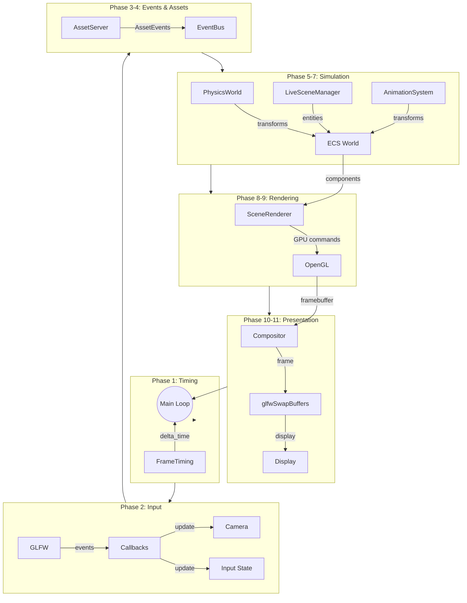

# Void Engine C++ - Render Loop Sequence Diagram

This document contains a precise Mermaid sequence diagram of the C++ render loop based on the actual implementation in `src/main.cpp` (lines 624-785).

## Main Render Loop Sequence

```mermaid
sequenceDiagram
    autonumber

    participant Main as main.cpp
    participant FT as FrameTiming
    participant GLFW as GLFW
    participant EB as EventBus
    participant AS as AssetServer
    participant PW as PhysicsWorld
    participant LSM as LiveSceneManager
    participant Anim as AnimationSystem
    participant ECS as ECS World
    participant SR as SceneRenderer
    participant Comp as Compositor
    participant FS as FrameScheduler

    loop while !glfwWindowShouldClose(window)

        Note over Main,FS: ═══════════ FRAME START ═══════════

        rect rgb(40, 60, 80)
            Note right of Main: Phase 1: Frame Timing
            Main->>FT: begin_frame()
            FT-->>FT: now = Clock::now()
            FT-->>FT: Calculate delta from last frame
            FT-->>FT: Update frame history (120 samples)
            FT-->>FT: ++frame_count
            FT-->>Main: return TimePoint now
            Main->>FT: delta_time()
            FT-->>Main: return float delta_time
        end

        rect rgb(60, 40, 80)
            Note right of Main: Phase 2: Input Processing
            Main->>GLFW: glfwPollEvents()
            GLFW-->>GLFW: Process window events
            GLFW-->>GLFW: Update keyboard state
            GLFW-->>GLFW: Update mouse state
            GLFW-->>GLFW: Fire registered callbacks
            Note right of GLFW: Callbacks update:<br/>- g_input state<br/>- camera orbit/pan/zoom<br/>- window resize
        end

        rect rgb(80, 60, 40)
            Note right of Main: Phase 3: Event Bus - Frame Start
            Main->>EB: publish(FrameStartEvent{delta_time})
            EB-->>EB: Queue event with subscribers
            Main->>EB: process_queue()
            EB-->>EB: Sort events by priority
            EB-->>EB: Dispatch to all subscribers
            EB-->>EB: Clear processed events
        end

        rect rgb(40, 80, 60)
            Note right of Main: Phase 4: Asset Server Processing
            Main->>AS: process()
            AS-->>AS: Check async load completions
            AS-->>AS: Process hot-reload file changes
            AS-->>AS: Update cache tiers (hot/resident/streaming)
            Main->>AS: drain_events()
            AS-->>Main: return vector<AssetEvent>

            loop for each asset_event
                alt event.type == Loaded
                    Main->>EB: publish(AssetLoadedEvent{path})
                else event.type == Failed
                    Main-->>Main: Log warning
                else event.type == Reloaded
                    Main->>EB: publish(AssetLoadedEvent{path})
                else event.type == Unloaded
                    Main-->>Main: Log debug
                else event.type == FileChanged
                    Main-->>Main: Log debug
                end
            end
        end

        rect rgb(80, 40, 60)
            Note right of Main: Phase 5: Physics Simulation
            Main->>PW: step(delta_time)
            PW-->>PW: accumulated_time += delta_time

            loop while accumulated_time >= fixed_timestep (1/60s)
                PW-->>PW: Integrate velocities
                PW-->>PW: Broad phase collision detection
                PW-->>PW: Narrow phase collision detection
                PW-->>PW: Solve constraints
                PW-->>PW: Fire collision callbacks
                PW-->>PW: Fire trigger callbacks
                PW-->>PW: accumulated_time -= fixed_timestep
            end

            PW-->>PW: Interpolate visual state
            Note right of PW: TODO: Sync transforms to ECS
        end

        rect rgb(60, 80, 40)
            Note right of Main: Phase 6: Scene Hot-Reload Check
            Main-->>Main: hot_reload_timer += delta_time

            alt hot_reload_timer >= 0.5f
                Main-->>Main: hot_reload_timer = 0.0f
                Main->>LSM: update(delta_time)
                LSM-->>LSM: Poll file system for changes

                alt scene file modified
                    LSM->>LSM: parse scene file
                    LSM->>LSM: hot_reload(instance, new_scene)
                    LSM-->>LSM: Destroy old entities
                    LSM-->>LSM: Create new entities
                    LSM->>Main: on_scene_changed callback
                    Main->>SR: load_scene(scene_data)
                end
            end
        end

        rect rgb(40, 60, 80)
            Note right of Main: Phase 7: ECS Animation Update
            Main->>Anim: update(ecs_world, delta_time)
            Anim->>ECS: query<AnimationComponent, TransformComponent>
            ECS-->>Anim: return matching entities

            loop for each (entity, anim, transform)
                Anim-->>Anim: anim.elapsed_time += delta_time

                alt anim.type == Rotation
                    Anim-->>Anim: Update rotation angles
                else anim.type == Oscillation
                    Anim-->>Anim: Calculate sine wave offset
                else anim.type == Orbit
                    Anim-->>Anim: Calculate orbital position
                else anim.type == Pulse
                    Anim-->>Anim: Calculate scale oscillation
                else anim.type == Path
                    Anim-->>Anim: Interpolate path points
                end

                Anim->>ECS: Update TransformComponent
            end
        end

        rect rgb(60, 40, 80)
            Note right of Main: Phase 8: Renderer Update
            Main->>SR: update(delta_time)
            SR-->>SR: Check shader file modifications

            alt shader files changed
                SR-->>SR: Recompile shaders
                SR-->>SR: Relink programs
            end

            SR-->>SR: Sync ECS data to RenderEntities
            Note right of SR: Reads from ECS:<br/>- TransformComponent<br/>- MeshComponent<br/>- MaterialComponent
        end

        rect rgb(80, 60, 40)
            Note right of Main: Phase 9: GPU Rendering
            Main->>SR: render()

            SR-->>SR: glClear(GL_COLOR_BUFFER_BIT | GL_DEPTH_BUFFER_BIT)

            Note right of SR: Shadow Pass (if enabled)
            SR-->>SR: Bind shadow FBO
            SR-->>SR: Render depth from light view

            Note right of SR: Geometry Pass
            SR-->>SR: Bind PBR shader
            SR-->>SR: Set camera uniforms (view, projection)
            SR-->>SR: Upload light array

            loop for each RenderEntity
                SR-->>SR: Compute model matrix
                SR-->>SR: Set material uniforms (albedo, metallic, roughness, ao)
                SR-->>SR: Bind VAO
                SR-->>SR: glDrawElements()
            end

            Note right of SR: Debug Pass
            SR-->>SR: Render grid (if enabled)
            SR-->>SR: Render gizmos (if enabled)

            SR-->>SR: Update stats (draw_calls, triangles)
        end

        rect rgb(40, 80, 60)
            Note right of Main: Phase 10: Compositor Processing
            Main->>Comp: dispatch()
            Comp-->>Comp: Process display events
            Comp-->>Comp: Update VRR state
            Comp->>FS: update timing

            Main->>Comp: should_render()
            Comp-->>Main: return bool

            alt should_render == true
                Main->>Comp: begin_frame()
                Comp-->>Comp: Acquire render target
                Comp-->>Main: return RenderTarget

                Note right of Main: Post-processing would happen here

                Main->>Comp: end_frame(render_target)
                Comp-->>Comp: Submit to display pipeline
            end

            Main->>Comp: update_content_velocity(0.5f)
            Comp->>FS: Adjust VRR frame pacing
        end

        rect rgb(80, 40, 60)
            Note right of Main: Phase 11: Presentation
            Main->>GLFW: glfwSwapBuffers(window)
            GLFW-->>GLFW: Swap front/back buffers
            GLFW-->>GLFW: VSync synchronization
            Note right of GLFW: Frame now visible on display
        end

        rect rgb(60, 80, 40)
            Note right of Main: Phase 12: Frame End
            Main->>EB: publish(FrameEndEvent{frame_count})
            Main-->>Main: ++frame_count

            Note right of Main: Statistics (every 1.0 second)
            alt fps_elapsed >= 1.0
                Main->>SR: stats()
                SR-->>Main: return RenderStats
                Main->>PW: stats()
                PW-->>Main: return PhysicsStats
                Main->>EB: stats()
                EB-->>Main: return EventStats
                Main->>Comp: frame_scheduler()
                Comp->>FS: current_fps()
                FS-->>Main: return fps

                Main-->>Main: Log FPS, draw calls, entities, physics, assets

                Main->>AS: collect_garbage()
                AS-->>AS: Remove unreferenced assets
                AS-->>Main: return gc_count
            end
        end

        Note over Main,FS: ═══════════ FRAME END ═══════════

    end
```

## Initialization Sequence

```mermaid
sequenceDiagram
    autonumber

    participant Main as main()
    participant TOML as toml++
    participant GLFW as GLFW
    participant SR as SceneRenderer
    participant EB as EventBus
    participant Reg as ServiceRegistry
    participant AS as AssetServer
    participant ECS as ECS World
    participant LSM as LiveSceneManager
    participant PW as PhysicsWorld
    participant FT as FrameTiming
    participant Comp as Compositor

    Note over Main,Comp: ═══════════ INITIALIZATION ═══════════

    rect rgb(40, 60, 80)
        Note right of Main: Load Project Configuration
        Main->>TOML: parse_file(manifest_path)
        TOML-->>Main: return ProjectConfig
        Main-->>Main: Extract name, version, scene_file, window size
    end

    rect rgb(60, 40, 80)
        Note right of Main: Initialize GLFW
        Main->>GLFW: glfwInit()
        Main->>GLFW: glfwWindowHint(CONTEXT_VERSION_MAJOR, 3)
        Main->>GLFW: glfwWindowHint(CONTEXT_VERSION_MINOR, 3)
        Main->>GLFW: glfwWindowHint(OPENGL_PROFILE, CORE)
        Main->>GLFW: glfwCreateWindow(width, height, title)
        GLFW-->>Main: return GLFWwindow*
        Main->>GLFW: glfwMakeContextCurrent(window)
        Main->>GLFW: glfwSwapInterval(1) [VSync ON]
        Main->>GLFW: Set callbacks (resize, mouse, keyboard)
    end

    rect rgb(80, 60, 40)
        Note right of Main: Initialize Renderer
        Main->>SR: initialize(window)
        SR-->>SR: Load OpenGL functions (glad)
        SR-->>SR: Create built-in meshes (sphere, cube, torus, etc.)
        SR-->>SR: Load PBR shader
        SR-->>SR: Load grid shader
        SR-->>Main: return success
    end

    rect rgb(40, 80, 60)
        Note right of Main: Initialize Services
        Main->>EB: EventBus()
        Main->>Reg: ServiceRegistry()
        Main->>Reg: set_event_callback(logger)
        Main->>EB: subscribe<SceneLoadedEvent>(handler)
        Main->>EB: subscribe<AssetLoadedEvent>(handler)
    end

    rect rgb(80, 40, 60)
        Note right of Main: Initialize Asset Server
        Main->>AS: AssetServer(config)
        Main->>AS: register_loader<TextureAsset>(TextureLoader)
        Main->>AS: register_loader<ModelAsset>(ModelLoader)
        Main-->>Main: asset_hot_reload = make_hot_reloadable(asset_server)
    end

    rect rgb(60, 80, 40)
        Note right of Main: Initialize ECS
        Main->>ECS: World(1024) [pre-allocate capacity]
        Main-->>Main: Create EcsSceneBridge(world, renderer, assets)
        Main->>LSM: LiveSceneManager(world)
        Main->>LSM: initialize()
        LSM-->>LSM: Setup file watching
        LSM-->>LSM: Register ECS components
        Main->>LSM: on_scene_changed(callback)
    end

    rect rgb(40, 60, 80)
        Note right of Main: Initialize Physics
        Main->>PW: PhysicsWorldBuilder()
        Main->>PW: .gravity(0, -9.81, 0)
        Main->>PW: .fixed_timestep(1/60)
        Main->>PW: .max_bodies(10000)
        Main->>PW: .enable_ccd(true)
        Main->>PW: .hot_reload(true)
        Main->>PW: .build()
        PW-->>Main: return PhysicsWorld
        Main->>PW: on_collision_begin(callback)
        Main->>PW: on_trigger_enter(callback)
    end

    rect rgb(60, 40, 80)
        Note right of Main: Load Initial Scene
        Main->>LSM: load_scene(scene_path)
        LSM-->>LSM: Parse scene.toml
        LSM-->>LSM: Instantiate entities into ECS
        LSM->>Main: on_scene_changed callback
        Main->>SR: load_scene(scene_data)
        Main->>EB: publish(SceneLoadedEvent)
    end

    rect rgb(80, 60, 40)
        Note right of Main: Enable Hot-Reload
        Main->>SR: set_shader_hot_reload(true)
        Main->>LSM: set_hot_reload_enabled(true)
        Main->>Reg: start_health_monitor()
    end

    rect rgb(40, 80, 60)
        Note right of Main: Initialize Timing & Compositor
        Main->>FT: FrameTiming(60) [target 60 FPS]
        Main->>Comp: CompositorFactory::create(config)
        Comp-->>Main: return ICompositor
    end

    Note over Main,Comp: ═══════════ READY ═══════════
```

## Shutdown Sequence

```mermaid
sequenceDiagram
    autonumber

    participant Main as main()
    participant FT as FrameTiming
    participant Reg as ServiceRegistry
    participant EB as EventBus
    participant LSM as LiveSceneManager
    participant ECS as ECS World
    participant PW as PhysicsWorld
    participant AS as AssetServer
    participant Comp as Compositor
    participant SR as SceneRenderer
    participant GLFW as GLFW

    Note over Main,GLFW: ═══════════ SHUTDOWN ═══════════

    Main-->>Main: Log "Shutting down..."

    rect rgb(40, 60, 80)
        Note right of Main: Log Final Statistics
        Main->>FT: frame_count(), average_fps()
        FT-->>Main: return stats
        Main-->>Main: Log frame timing final stats
    end

    rect rgb(60, 40, 80)
        Note right of Main: Stop Services
        Main->>Reg: stop_health_monitor()
        Main->>Reg: stop_all()
        Main->>Reg: stats()
        Reg-->>Main: return ServiceStats
        Main-->>Main: Log service shutdown stats
    end

    rect rgb(80, 60, 40)
        Note right of Main: Log Event Bus Stats
        Main->>EB: stats()
        EB-->>Main: return EventStats
        Main-->>Main: Log events published/processed/dropped
    end

    rect rgb(40, 80, 60)
        Note right of Main: Shutdown Scene Manager
        Main->>LSM: shutdown()
        LSM-->>LSM: Unload all scenes
        LSM-->>LSM: Destroy scene entities
        Main->>ECS: clear()
        ECS-->>ECS: Clear all remaining entities
    end

    rect rgb(80, 40, 60)
        Note right of Main: Shutdown Physics
        Main->>PW: stats()
        PW-->>Main: return PhysicsStats
        Main-->>Main: Log physics final stats
        Main->>PW: clear()
        PW-->>PW: Destroy all bodies and joints
    end

    rect rgb(60, 80, 40)
        Note right of Main: Shutdown Assets
        Main->>AS: collect_garbage()
        AS-->>AS: Clean unreferenced assets
        Main->>AS: loaded_count(), pending_count()
        AS-->>Main: return counts
        Main-->>Main: Log asset final stats
    end

    rect rgb(40, 60, 80)
        Note right of Main: Shutdown Compositor
        Main->>Comp: frame_number()
        Main->>Comp: frame_scheduler().current_fps()
        Comp-->>Main: return stats
        Main-->>Main: Log compositor final stats
        Main->>Comp: shutdown()
    end

    rect rgb(60, 40, 80)
        Note right of Main: Shutdown Renderer & Window
        Main-->>Main: g_renderer = nullptr
        Main->>SR: shutdown()
        SR-->>SR: Delete GPU meshes
        SR-->>SR: Delete shaders
        SR-->>SR: Delete textures
        Main->>GLFW: glfwDestroyWindow(window)
        Main->>GLFW: glfwTerminate()
    end

    Main-->>Main: Log "Shutdown complete."
    Main-->>Main: return 0

    Note over Main,GLFW: ═══════════ TERMINATED ═══════════
```

## Data Flow Summary

## Module Participation by Phase

| Phase | Module | Function Called | Purpose |
|-------|--------|-----------------|---------|
| 1 | `void_presenter::FrameTiming` | `begin_frame()`, `delta_time()` | Calculate frame timing |
| 2 | GLFW | `glfwPollEvents()` | Process OS input events |
| 3 | `void_services::EventBus` | `publish()`, `process_queue()` | Inter-system communication |
| 4 | `void_asset::AssetServer` | `process()`, `drain_events()` | Async asset loading |
| 5 | `void_physics::PhysicsWorld` | `step()` | Fixed-timestep simulation |
| 6 | `void_scene::LiveSceneManager` | `update()` | Scene hot-reload |
| 7 | `void_scene::AnimationSystem` | `update()` | ECS animation |
| 8 | `void_render::SceneRenderer` | `update()` | Shader hot-reload, sync |
| 9 | `void_render::SceneRenderer` | `render()` | GPU draw calls |
| 10 | `void_compositor::ICompositor` | `dispatch()`, `begin_frame()`, `end_frame()` | Display composition |
| 11 | GLFW | `glfwSwapBuffers()` | Present to display |
| 12 | `void_services::EventBus` | `publish()` | Frame end notification |

## Key Timing Characteristics

| Aspect | Value | Source |
|--------|-------|--------|
| Target FPS | 60 | `FrameTiming(60)` |
| Physics Timestep | 1/60s (16.67ms) | `PhysicsWorldBuilder::fixed_timestep()` |
| Hot-Reload Poll | 0.5s | `hot_reload_timer` check |
| VSync | Enabled | `glfwSwapInterval(1)` |
| Frame History | 120 samples | `FrameTiming` internal |
| Statistics Log | Every 1.0s | `fps_elapsed >= 1.0` |

---

*Sequence diagram generated from actual C++ implementation in `src/main.cpp`*
