# Void Engine Render Module Migration Plan

## Overview

This document provides comprehensive UML diagrams and a migration plan for aligning the render module's header declarations with their cpp implementations.

**Status**: Discovery Complete
**Date**: 2026-01-26
**Files Affected**: 8 cpp files, 6+ header files

---

## Table of Contents

1. [Current Architecture Overview](#1-current-architecture-overview)
2. [Texture Subsystem](#2-texture-subsystem)
3. [Shadow Subsystem](#3-shadow-subsystem)
4. [Debug Subsystem](#4-debug-subsystem)
5. [Instancing Subsystem](#5-instancing-subsystem)
6. [Spatial Subsystem](#6-spatial-subsystem)
7. [Mesh Subsystem](#7-mesh-subsystem)
8. [Post-Processing Subsystem](#8-post-processing-subsystem)
9. [GLTF Loading Subsystem](#9-gltf-loading-subsystem)
10. [LOD Subsystem](#10-lod-subsystem)
11. [Temporal Effects Subsystem](#11-temporal-effects-subsystem)
12. [Header Dependency Graph](#12-header-dependency-graph)
13. [Identified Mismatches](#13-identified-mismatches)
14. [Migration Tasks](#14-migration-tasks)

---

## 1. Current Architecture Overview

```mermaid
graph TB
    subgraph "Public Headers (include/void_engine/render/)"
        fwd[fwd.hpp<br/>Forward Declarations]
        resource[resource.hpp<br/>Resource Types]
        texture_h[texture.hpp]
        mesh_h[mesh.hpp]
        shadow_h[shadow.hpp]
        debug_h[debug.hpp]
        instancing_h[instancing.hpp]
        spatial_h[spatial.hpp]
        camera_h[camera.hpp]
        material_h[material.hpp]
        gl_renderer_h[gl_renderer.hpp]
        render_h[render.hpp<br/>Master Include]
    end

    subgraph "Implementation (src/render/)"
        texture_cpp[texture.cpp]
        shadow_cpp[shadow_renderer.cpp]
        debug_cpp[debug_renderer.cpp]
        instancing_cpp[instancing.cpp]
        spatial_cpp[spatial.cpp]
        gltf_cpp[gltf_loader.cpp]
        lod_cpp[lod.cpp]
        temporal_cpp[temporal_effects.cpp]
        post_cpp[post_process.cpp]
        gl_cpp[gl_renderer.cpp]
    end

    subgraph "Missing Headers"
        gltf_h[gltf.hpp ❌]
        lod_h[lod.hpp ❌]
        temporal_h[temporal.hpp ❌]
        post_h[post_process.hpp ❌]
    end

    texture_cpp --> texture_h
    shadow_cpp --> shadow_h
    debug_cpp --> debug_h
    instancing_cpp --> instancing_h
    spatial_cpp --> spatial_h
    gltf_cpp -.-> gltf_h
    lod_cpp -.-> lod_h
    temporal_cpp -.-> temporal_h
    post_cpp -.-> post_h

    render_h --> texture_h
    render_h --> mesh_h
    render_h --> shadow_h
    render_h --> debug_h
    render_h --> instancing_h
    render_h --> spatial_h
```

---

## 2. Texture Subsystem

### Header Declaration (texture.hpp)

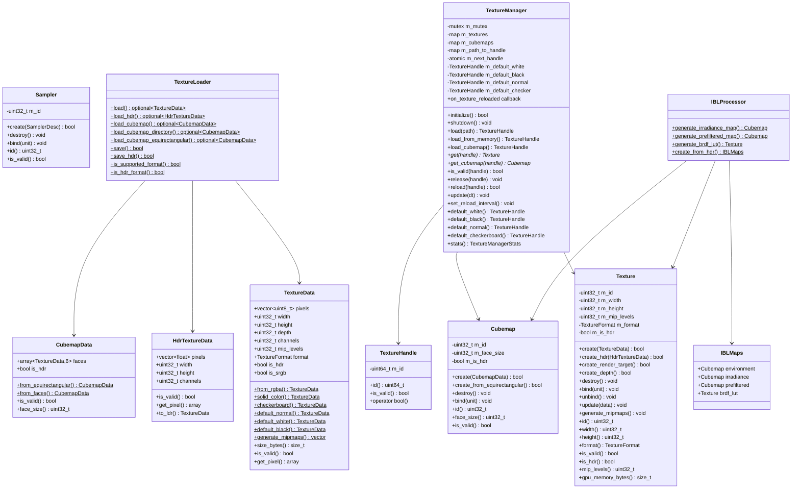

### Implementation Status

| Class | Header Declared | CPP Implemented | Match Status |
|-------|-----------------|-----------------|--------------|
| TextureHandle | ✅ Full | ✅ Full | ✅ Match |
| TextureData | ✅ Full | ✅ Full | ✅ Match |
| HdrTextureData | ✅ Full | ✅ Full | ✅ Match |
| CubemapData | ✅ Full | ✅ Full | ✅ Match |
| Texture | ✅ Full | ✅ Full | ✅ Match |
| Cubemap | ✅ Full | ✅ Full | ✅ Match |
| Sampler | ✅ Full | ⚠️ Skeleton | ⚠️ Incomplete |
| TextureLoader | ✅ Full | ⚠️ Skeleton | ⚠️ Incomplete |
| TextureManager | ✅ Full | ⚠️ Skeleton | ⚠️ Incomplete |
| IBLProcessor | ✅ Full | ⚠️ Skeleton | ⚠️ Incomplete |

---

## 3. Shadow Subsystem

### Header Declaration (shadow.hpp)

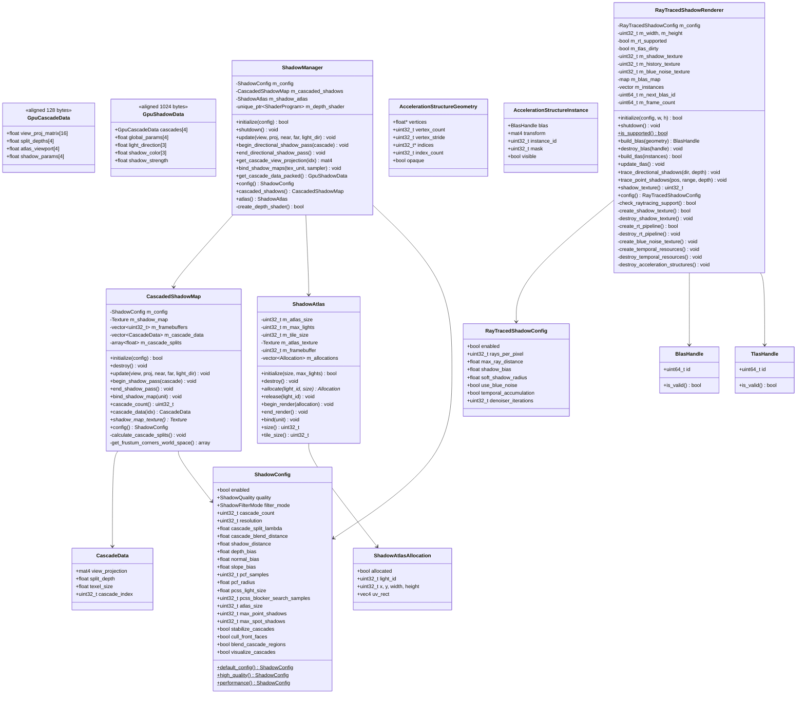

### Implementation Status

| Class | Header Declared | CPP Implemented | Match Status |
|-------|-----------------|-----------------|--------------|
| ShadowConfig | ✅ Full | ✅ Full | ✅ Match |
| CascadeData | ✅ Full | ✅ Full | ✅ Match |
| GpuCascadeData | ✅ Full | ✅ Full | ✅ Match |
| GpuShadowData | ✅ Full | ✅ Full | ✅ Match |
| CascadedShadowMap | ✅ Full | ✅ Full | ✅ Match |
| ShadowAtlas | ✅ Full | ✅ Full | ✅ Match |
| ShadowManager | ✅ Full | ✅ Full | ✅ Match |
| RayTracedShadowConfig | ✅ Full | ✅ Full | ✅ Match |
| RayTracedShadowRenderer | ✅ Full | ✅ Full | ✅ Match |

---

## 4. Debug Subsystem

### Header Declaration (debug.hpp)

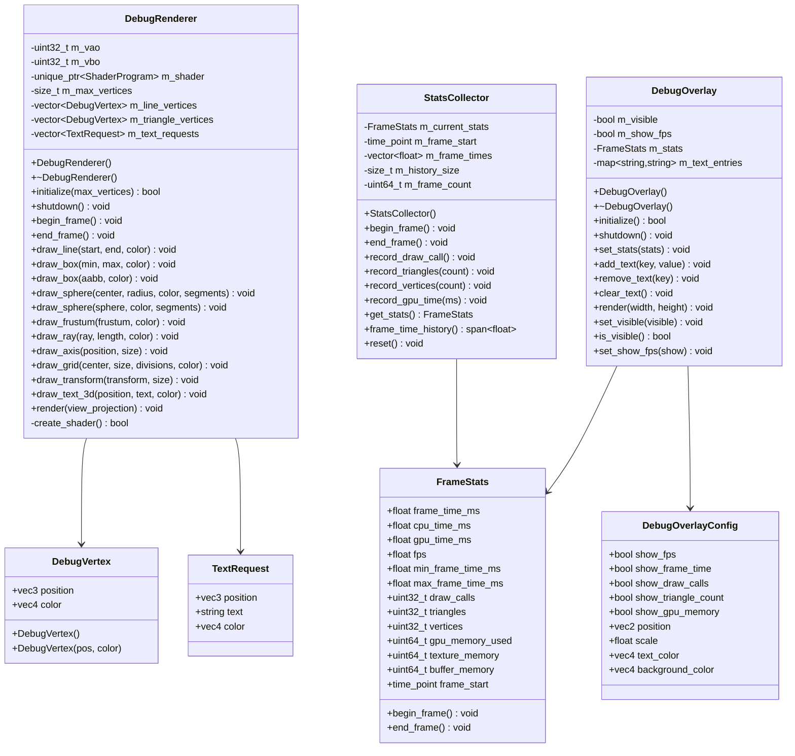

### Global Functions

```cpp
bool init_debug_rendering(size_t max_vertices = 65536);
void shutdown_debug_rendering();
DebugRenderer* get_debug_renderer();
StatsCollector* get_stats_collector();
DebugOverlay* get_debug_overlay();
```

### Implementation Status

| Class | Header Declared | CPP Implemented | Match Status |
|-------|-----------------|-----------------|--------------|
| DebugVertex | ✅ Full | ✅ Full | ✅ Match |
| TextRequest | ✅ Full | ✅ Full | ✅ Match |
| FrameStats | ✅ Full | ✅ Full | ✅ Match |
| DebugRenderer | ✅ Full | ✅ Full | ✅ Match |
| StatsCollector | ✅ Full | ✅ Full | ✅ Match |
| DebugOverlay | ✅ Full | ⚠️ Partial | ⚠️ Incomplete |
| Global Functions | ✅ Declared | ✅ Implemented | ✅ Match |

---

## 5. Instancing Subsystem

### Header Declaration (instancing.hpp)

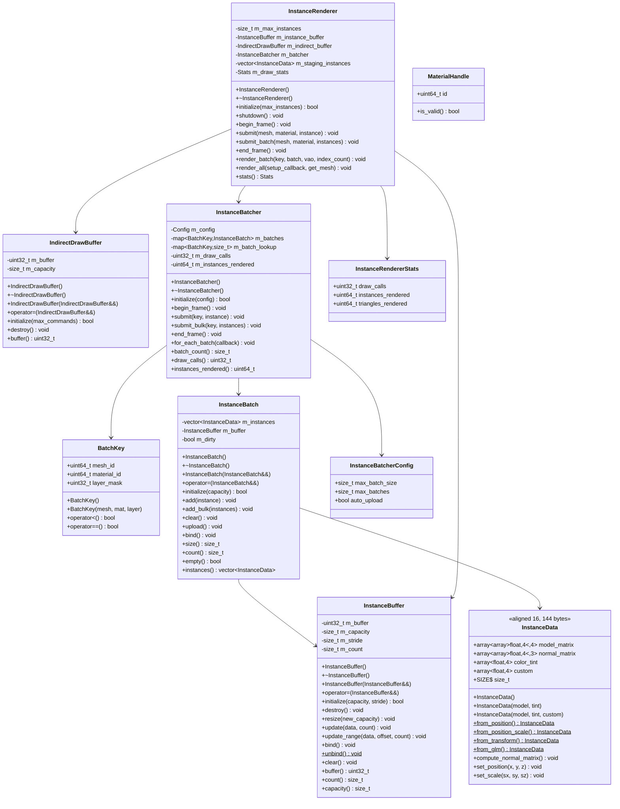

### Implementation Status

| Class | Header Declared | CPP Implemented | Match Status |
|-------|-----------------|-----------------|--------------|
| InstanceData | ✅ Full | ✅ Full | ✅ Match |
| BatchKey | ✅ Full | ✅ Full | ✅ Match |
| InstanceBuffer | ✅ Full | ✅ Full | ✅ Match |
| IndirectDrawBuffer | ✅ Full | ✅ Full | ✅ Match |
| InstanceBatch | ✅ Full | ✅ Full | ✅ Match |
| InstanceBatcher | ✅ Full | ✅ Full | ✅ Match |
| InstanceRenderer | ✅ Full | ✅ Full | ✅ Match |
| MaterialHandle | ✅ Full | ✅ Full | ✅ Match |

---

## 6. Spatial Subsystem

### Header Declaration (spatial.hpp)

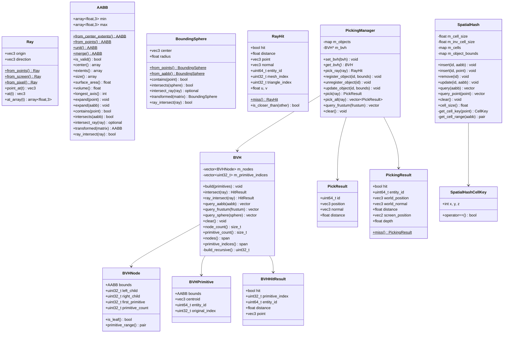

### Implementation Status

| Class | Header Declared | CPP Implemented | Match Status |
|-------|-----------------|-----------------|--------------|
| Ray | ✅ Full | ✅ Full | ✅ Match |
| AABB | ✅ Full | ✅ Full | ✅ Match |
| BoundingSphere | ✅ Full | ✅ Full | ✅ Match |
| RayHit | ✅ Full | ✅ Full | ✅ Match |
| BVHNode | ✅ Full | ✅ Full | ✅ Match |
| BVH | ✅ Full | ✅ Full | ✅ Match |
| PickingManager | ✅ Full | ✅ Full | ✅ Match |
| SpatialHash | ✅ Full | ✅ Full | ✅ Match |

---

## 7. Mesh Subsystem

### Header Declaration (mesh.hpp)

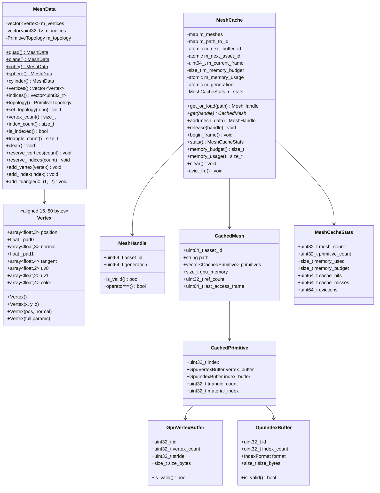

---

## 8. Post-Processing Subsystem

### ❌ MISSING HEADER - Needs Creation

**File needed**: `include/void_engine/render/post_process.hpp`

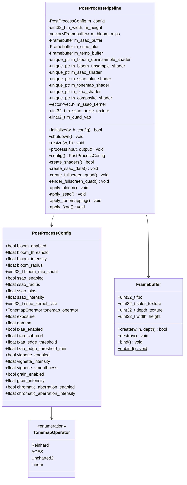

### Global Functions to Declare

```cpp
bool init_post_processing(uint32_t width, uint32_t height, const PostProcessConfig& config);
void shutdown_post_processing();
void resize_post_processing(uint32_t width, uint32_t height);
void apply_post_processing(uint32_t input_texture, uint32_t output_fbo);
```

---

## 9. GLTF Loading Subsystem

### ❌ MISSING HEADER - Needs Creation

**File needed**: `include/void_engine/render/gltf.hpp`

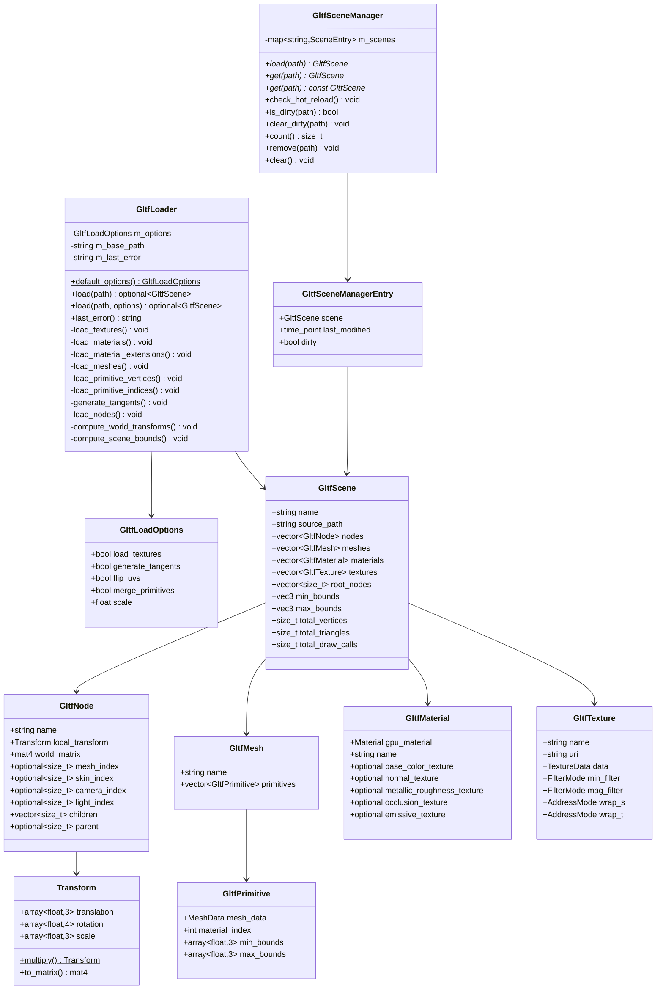

---

## 10. LOD Subsystem

### ❌ MISSING HEADER - Needs Creation

**File needed**: `include/void_engine/render/lod.hpp`

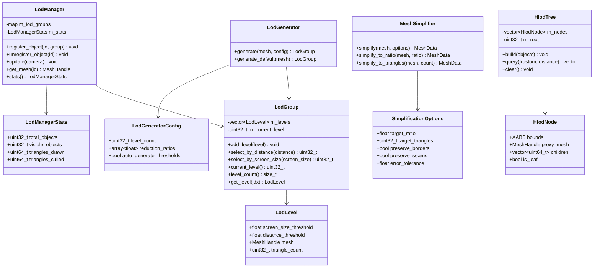

---

## 11. Temporal Effects Subsystem

### ❌ MISSING HEADER - Needs Creation

**File needed**: `include/void_engine/render/temporal.hpp`

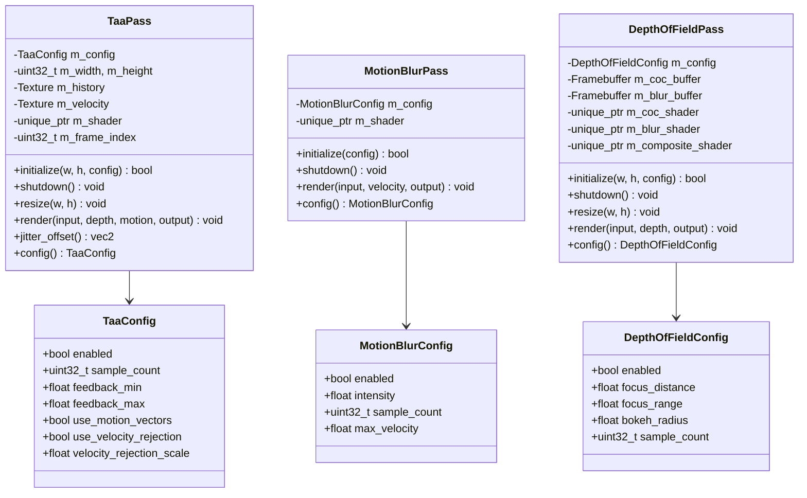

---

## 12. Header Dependency Graph

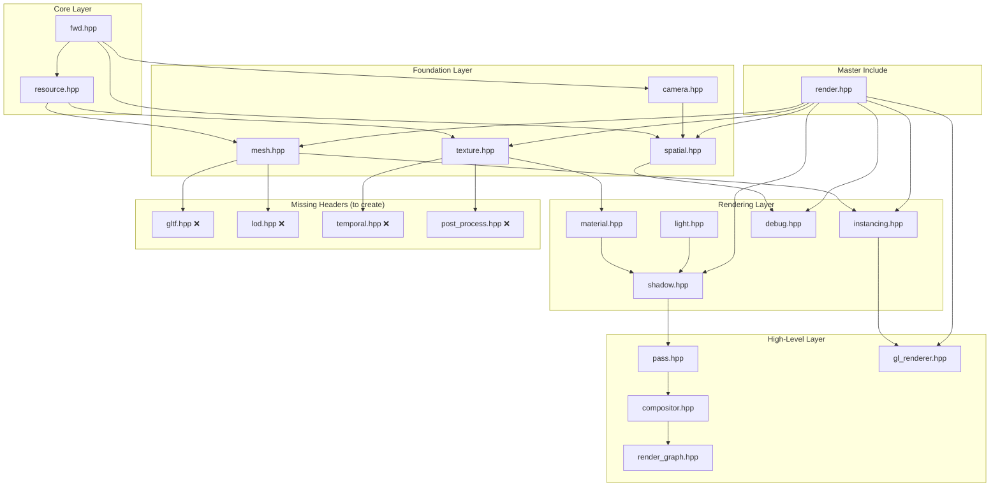

---

## 13. Identified Mismatches

### Critical Issues (Must Fix)

| Issue | File | Description | Priority |
|-------|------|-------------|----------|
| Missing Header | gltf_loader.cpp | No public header for GLTF types | HIGH |
| Missing Header | lod.cpp | No public header for LOD types | HIGH |
| Missing Header | temporal_effects.cpp | No public header for temporal effects | HIGH |
| Missing Header | post_process.cpp | No public header for post-processing | HIGH |

### Incomplete Implementations

| Class | Header | CPP | Issue |
|-------|--------|-----|-------|
| Sampler | texture.hpp | texture.cpp | Skeleton only |
| TextureLoader | texture.hpp | texture.cpp | Skeleton only |
| TextureManager | texture.hpp | texture.cpp | Skeleton only |
| IBLProcessor | texture.hpp | texture.cpp | Not implemented |
| DebugOverlay | debug.hpp | debug_renderer.cpp | Partial implementation |

### API Mismatches (Already Fixed)

| Class | Issue | Status |
|-------|-------|--------|
| DebugRenderer | Header had inline impl, cpp had GPU impl | ✅ Fixed |
| InstanceBatch | Missing count(), bind() methods | ✅ Fixed |
| InstanceBatcher | Different API (Config struct) | ✅ Fixed |
| InstanceRenderer | Not declared in original header | ✅ Fixed |

---

## 14. Migration Tasks

### Phase 1: Create Missing Headers (Priority: HIGH)

1. **Create `gltf.hpp`**
   - Declare: Transform, GltfPrimitive, GltfMesh, GltfNode, GltfMaterial, GltfTexture, GltfScene, GltfLoadOptions, GltfLoader, GltfSceneManager
   - Include in: render.hpp
   - Dependencies: mesh.hpp, texture.hpp, material.hpp

2. **Create `lod.hpp`**
   - Declare: LodLevel, LodGroup, SimplificationOptions, MeshSimplifier, LodGeneratorConfig, LodGenerator, LodManagerStats, LodManager, HlodNode, HlodTree
   - Include in: render.hpp
   - Dependencies: mesh.hpp, spatial.hpp

3. **Create `temporal.hpp`**
   - Declare: TaaConfig, TaaPass, MotionBlurConfig, MotionBlurPass, DepthOfFieldConfig, DepthOfFieldPass
   - Include in: render.hpp
   - Dependencies: texture.hpp, gl_renderer.hpp

4. **Create `post_process.hpp`**
   - Declare: TonemapOperator, PostProcessConfig, Framebuffer, PostProcessPipeline, global functions
   - Include in: render.hpp
   - Dependencies: texture.hpp, gl_renderer.hpp

### Phase 2: Complete Skeleton Implementations (Priority: MEDIUM)

1. **texture.cpp** - Complete:
   - Sampler full implementation
   - TextureLoader file I/O
   - TextureManager cache logic
   - IBLProcessor IBL generation

2. **debug_renderer.cpp** - Complete:
   - DebugOverlay text rendering

### Phase 3: Update render.hpp (Priority: LOW)

1. Add includes for new headers:
   ```cpp
   #include "gltf.hpp"
   #include "lod.hpp"
   #include "temporal.hpp"
   #include "post_process.hpp"
   ```

### Phase 4: Testing

1. Build each module individually
2. Run existing tests
3. Add unit tests for new APIs

---

## Files to Modify Summary

| Action | File | Estimated Changes |
|--------|------|-------------------|
| CREATE | include/void_engine/render/gltf.hpp | ~300 lines |
| CREATE | include/void_engine/render/lod.hpp | ~250 lines |
| CREATE | include/void_engine/render/temporal.hpp | ~200 lines |
| CREATE | include/void_engine/render/post_process.hpp | ~200 lines |
| MODIFY | include/void_engine/render/render.hpp | ~10 lines |
| COMPLETE | src/render/texture.cpp | Implement skeletons |
| COMPLETE | src/render/debug_renderer.cpp | Implement DebugOverlay |

---

## Notes for Implementation

1. **All classes in `void_render` namespace**
2. **Use `#pragma once` for header guards**
3. **Follow existing patterns**: Non-copyable with deleted copy ops, move semantics where appropriate
4. **GPU-aligned structs**: Use `alignas(16)` for GPU data
5. **Use glm types**: `glm::vec3`, `glm::vec4`, `glm::mat4` for math
6. **Include order**: fwd.hpp first, then dependencies, then STL headers

---

*Document generated: 2026-01-26*
*For use in fresh Claude Code session*
