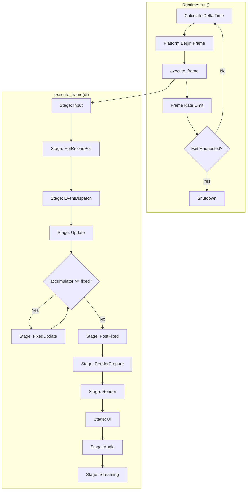
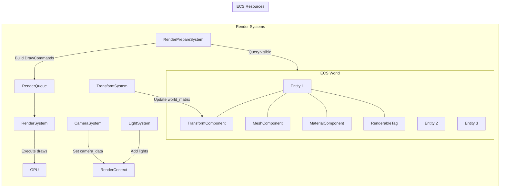
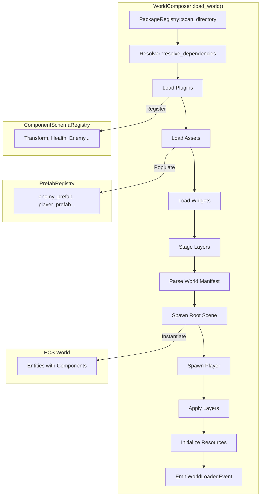
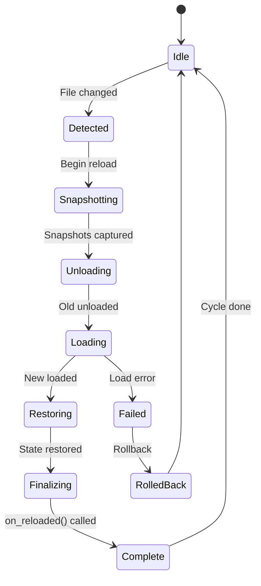
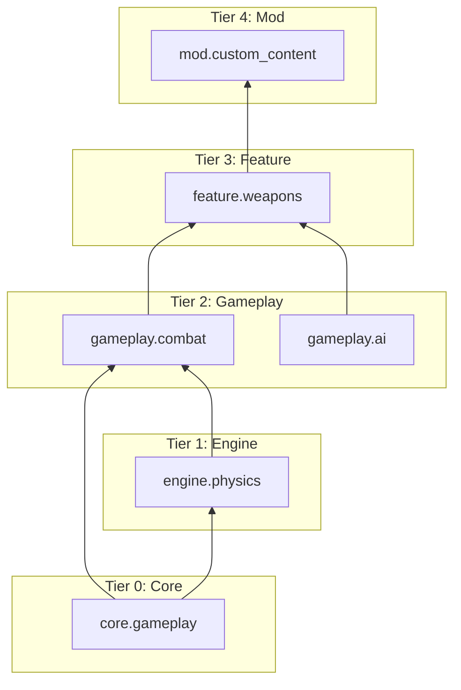
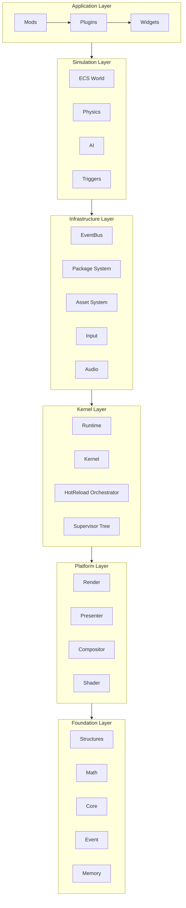

# void_engine Architecture Deep Dive

## Executive Summary

void_engine is a production-grade C++20 game engine with **37 modules** designed for hot-reload, remote content loading, and extensibility. This document provides a comprehensive analysis of all systems and their integration points, with special focus on the new package-based ECS system and how it must connect to rendering.

---

## Table of Contents

1. [Module Inventory](#1-module-inventory)
2. [Architectural Layers](#2-architectural-layers)
3. [Frame Execution Pipeline](#3-frame-execution-pipeline)
4. [ECS System Architecture](#4-ecs-system-architecture)
5. [Render System Architecture](#5-render-system-architecture)
6. [Package System Architecture](#6-package-system-architecture)
7. [Integration Analysis](#7-integration-analysis)
8. [Mermaid Diagrams](#8-mermaid-diagrams)
9. [Critical Gaps & Recommendations](#9-critical-gaps--recommendations)

---

## 1. Module Inventory

### Foundation Tier (No Dependencies)
| Module | Purpose | Key Classes |
|--------|---------|-------------|
| `void_core` | Error handling, hot-reload patterns | `Result<T>`, `Error`, `HotReloadable`, `PluginRegistry` |
| `void_structures` | Cache-efficient data structures | `SlotMap`, `SparseSet`, `BitSet`, `LockFreeQueue` |
| `void_math` | Vector/matrix math | `Vec3`, `Mat4`, `Quat`, `Transform`, `Bounds` |
| `void_memory` | Memory management | Allocators, pools |
| `void_event` | Event bus, channels | `EventBus`, `EventChannel<T>`, `BroadcastChannel<T>` |
| `void_cpp` | C++ utilities | Helpers, type traits |

### Engine Core
| Module | Purpose | Key Classes |
|--------|---------|-------------|
| `void_kernel` | Central orchestrator | `Kernel`, `ModuleLoader`, `SupervisorTree`, `HotReloadOrchestrator` |
| `void_runtime` | Application lifecycle | `Runtime`, `RuntimeConfig`, `RuntimeState` |
| `void_engine` | High-level facade | `Engine`, `AppBase` |

### ECS & Simulation
| Module | Purpose | Key Classes |
|--------|---------|-------------|
| `void_ecs` | Entity-Component-System | `World`, `Entity`, `Component`, `Archetype`, `Query`, `System` |
| `void_scene` | Scene/World management | `World` (scene), `SpatialContext`, `SceneData` |
| `void_physics` | Physics simulation | `PhysicsSystem`, `RigidBody`, `Constraint`, `Raycast` |

### Rendering & Presentation
| Module | Purpose | Key Classes |
|--------|---------|-------------|
| `void_render` | Render systems & components | `TransformComponent`, `MeshComponent`, `MaterialComponent`, `RenderContext` |
| `void_presenter` | Window management | `Presenter`, `Surface`, `Frame` |
| `void_compositor` | Frame composition | `ICompositor`, `DisplayManagement` |
| `void_shader` | Shader management | `ShaderRegistry`, `ShaderCompiler` |
| `void_graph` | Render graph | `RenderGraph`, `RenderPass` |

### Content & Assets
| Module | Purpose | Key Classes |
|--------|---------|-------------|
| `void_asset` | Asset management | `AssetServer`, `AssetHandle<T>`, `Loaders` |
| `void_package` | Package system | `PackageRegistry`, `WorldComposer`, `PrefabRegistry`, `ComponentSchemaRegistry` |

### I/O
| Module | Purpose | Key Classes |
|--------|---------|-------------|
| `void_input` | Input handling | `InputSystem`, `Action`, `Context`, `Keyboard`, `Mouse`, `Gamepad` |
| `void_audio` | Audio playback | `AudioSystem`, `Source`, `Listener`, `Mixer` |

### Gameplay Systems
| Module | Purpose |
|--------|---------|
| `void_ai` | Behavior trees, state machines, navmesh, steering |
| `void_combat` | Health, damage, weapons, status effects |
| `void_gamestate` | Game state management |
| `void_inventory` | Inventory system |
| `void_triggers` | Trigger/event system |

### UI & Visualization
| Module | Purpose |
|--------|---------|
| `void_ui` | User interface system |
| `void_widget` | Reactive widget framework |
| `void_hud` | HUD elements |
| `void_editor` | Editor tools |

### Specialized
| Module | Purpose |
|--------|---------|
| `void_scripting` | Script integration (Lua, Python) |
| `void_services` | Service discovery |
| `void_plugin_api` | Plugin API |
| `void_xr` | VR/AR support |
| `void_shell` | Console interface |

---

## 2. Architectural Layers

```
┌─────────────────────────────────────────────────────────────────┐
│  APPLICATION LAYER (Game Logic)                                 │
│  Plugins, Widgets, Custom Systems, Mods                         │
├─────────────────────────────────────────────────────────────────┤
│  SIMULATION LAYER                                               │
│  ECS World, Systems, Entities, Components                       │
│  Physics, AI, Combat, Triggers                                  │
├─────────────────────────────────────────────────────────────────┤
│  INFRASTRUCTURE LAYER                                           │
│  Event Bus, Input, Audio, Asset Management                      │
│  Scene/World Management, Package System                         │
├─────────────────────────────────────────────────────────────────┤
│  RUNTIME & KERNEL LAYER                                         │
│  Runtime (lifecycle, world loading/unloading)                   │
│  Kernel (system scheduling, hot-reload, stages)                 │
├─────────────────────────────────────────────────────────────────┤
│  PLATFORM LAYER                                                 │
│  Render (OpenGL, Vulkan), Presenter, Compositor, Shader         │
├─────────────────────────────────────────────────────────────────┤
│  FOUNDATION LAYER                                               │
│  Structures, Math, Core, Event, Memory                          │
└─────────────────────────────────────────────────────────────────┘
```

---

## 3. Frame Execution Pipeline

### Kernel Stage System

The kernel executes **11 stages** in strict sequential order each frame:

| Stage | Purpose | Systems Run |
|-------|---------|-------------|
| `Input` | Poll input events | `InputSystem`, `platform_events` |
| `HotReloadPoll` | Check for file changes | `HotReloadOrchestrator` |
| `EventDispatch` | Dispatch queued events | `EventBus::process()` |
| `Update` | Game logic (variable dt) | `ecs_progress`, game systems, `TransformSystem` |
| `FixedUpdate` | Physics (fixed 60Hz) | `PhysicsSystem` |
| `PostFixed` | Physics response | Trigger events, collision response |
| `RenderPrepare` | Build render queue | `CameraSystem`, `LightSystem`, `RenderPrepareSystem` |
| `Render` | Execute GPU commands | `RenderSystem`, `platform_present` |
| `UI` | UI rendering | `UISystem`, widgets |
| `Audio` | Audio generation | `AudioSystem` |
| `Streaming` | Asset streaming | Asset loading, API sync |

### Fixed Timestep Handling

```cpp
void Runtime::execute_frame(float dt) {
    m_accumulator += dt;

    run_stage(Stage::Input, dt);
    run_stage(Stage::HotReloadPoll, dt);
    run_stage(Stage::EventDispatch, dt);
    run_stage(Stage::Update, dt);

    // Fixed timestep loop - physics at exactly 60Hz
    while (m_accumulator >= m_config.fixed_timestep) {
        run_stage(Stage::FixedUpdate, m_config.fixed_timestep);
        m_accumulator -= m_config.fixed_timestep;
    }

    run_stage(Stage::PostFixed, dt);
    run_stage(Stage::RenderPrepare, dt);
    run_stage(Stage::Render, dt);
    run_stage(Stage::UI, dt);
    run_stage(Stage::Audio, dt);
    run_stage(Stage::Streaming, dt);
}
```

### System Priority Ordering

Within each stage, systems execute by **priority** (lower = earlier):

```
Stage::Update:
  Priority -100: physics_pre
  Priority    0: ai_logic, input_handling
  Priority   50: gameplay_systems
  Priority  100: ecs_progress (WorldComposer::update)
  Priority  200: debug_overlay

Stage::Render:
  Priority    0: scene_render
  Priority 1000: platform_present
```

---

## 4. ECS System Architecture

### Core Concepts

| Concept | Description |
|---------|-------------|
| **Entity** | Generational ID (`index`, `generation`) |
| **Component** | POD data attached to entities |
| **Archetype** | Cache-efficient storage for entities with same components |
| **Query** | Filtered iteration over entities |
| **System** | Function that operates on queries |
| **Resource** | Global singleton accessible to systems |

### Hot-Reload Pattern (SACRED)

All reloadable systems implement:

```cpp
class HotReloadable {
    HotReloadSnapshot snapshot();           // Capture state
    Result<void> restore(const HotReloadSnapshot&);  // Restore state
    void on_reloaded();                     // Post-reload callback
    Version current_version() const;
    bool is_compatible(const Version&) const;
};
```

### ECS World Operations

```cpp
// Spawn entity
Entity e = world.spawn();

// Add components
world.add_component(e, Transform{...});
world.add_component(e, Mesh{...});

// Query entities
auto query = world.query<Transform, Mesh>();
for (auto [entity, transform, mesh] : query) {
    // Process...
}

// Resources (global singletons)
world.insert_resource(RenderContext{...});
auto& ctx = world.resource<RenderContext>();
```

---

## 5. Render System Architecture

### Render Components

| Component | Purpose | Fields |
|-----------|---------|--------|
| `TransformComponent` | 3D transform | position, rotation (quat), scale, world_matrix, dirty |
| `MeshComponent` | Mesh reference | builtin_mesh, mesh_handle, submesh_index |
| `MaterialComponent` | PBR material | albedo, metallic, roughness, ao, emissive, textures |
| `LightComponent` | Light source | type, color, intensity, range, cone angles, shadows |
| `CameraComponent` | Camera | projection, fov, near/far, active |
| `RenderableTag` | Visibility flag | visible, layer_mask, render_order |
| `HierarchyComponent` | Parent-child | parent_id, parent_generation, child_count |
| `AnimationComponent` | Animation state | type, axis, speed, amplitude, state |

### Render Systems

| System | Stage | Purpose |
|--------|-------|---------|
| `ModelLoaderSystem` | Update | Loads ModelComponent assets asynchronously |
| `TransformSystem` | Update | Updates world matrices from hierarchy |
| `AnimationSystem` | Update | Updates animation state |
| `CameraSystem` | RenderPrepare | Collects camera data for frame |
| `LightSystem` | RenderPrepare | Collects light data for frame |
| `RenderPrepareSystem` | RenderPrepare | Builds DrawCommand queue from entities |
| `RenderSystem` | Render | Executes GPU draw calls |

### Render Pipeline Flow

```
ECS Query (RenderableTag + Transform + Mesh + Material)
    │
    ▼
TransformSystem (update world matrices)
    │
    ▼
CameraSystem + LightSystem (collect camera/light data)
    │
    ▼
RenderPrepareSystem (build DrawCommands)
    │
    ▼
RenderQueue (sort by state)
    │
    ▼
RenderSystem (execute GL draw calls)
```

### RenderContext Resource

```cpp
class RenderContext {
    RenderAssetManager& assets();      // Asset loading
    const CameraData& camera_data();   // Current camera
    const vector<LightData>& lights(); // Frame lights
    RenderQueue& render_queue();       // Draw commands
    Stats& stats();                    // Draw calls, triangles
};
```

---

## 6. Package System Architecture

### Package Types

| Type | Extension | Purpose | Dependencies |
|------|-----------|---------|--------------|
| **World** | `.world.json` | Composition root | layer, plugin, widget, asset |
| **Layer** | `.layer.json` | Additive patches | plugin, widget, asset |
| **Plugin** | `.plugin.json` | Systems, components | plugin (lower tier), asset |
| **Widget** | `.widget.json` | UI, overlays | plugin, asset |
| **Asset** | `.bundle.json` | Content (models, textures, prefabs) | asset (prefer none) |

### Plugin Tiers (Dependency Hierarchy)

```
core.*     (0) ← Foundation components (Transform, Health)
engine.*   (1) ← Engine-level systems
gameplay.* (2) ← Gameplay systems (Combat, AI)
feature.*  (3) ← Specific features
mod.*      (4) ← User mods/content
```

### Key Components

| Component | Purpose |
|-----------|---------|
| `PackageRegistry` | Discovery, scanning, loading |
| `PackageManifest` | Package metadata (name, version, deps) |
| `Resolver` | Dependency resolution, load ordering |
| `LoadContext` | Context passed to loaders |
| `ComponentSchemaRegistry` | Component type definitions for JSON→ECS |
| `PrefabRegistry` | Entity templates for instantiation |
| `DefinitionRegistry` | Custom data type definitions |
| `WorldComposer` | Orchestrates complete world loading |
| `LayerApplier` | Applies layer modifications |
| `WidgetManager` | Widget lifecycle |

### World Loading Sequence (12 Steps)

1. **Scan** - PackageRegistry discovers packages
2. **Resolve** - Resolver builds dependency graph
3. **Load Plugins** - ComponentSchemaRegistry populated
4. **Load Assets** - PrefabRegistry populated
5. **Load Widgets** - WidgetManager creates UI
6. **Stage Layers** - LayerApplier queues modifications
7. **Parse World** - World manifest read
8. **Spawn Root Scene** - PrefabRegistry instantiates entities
9. **Spawn Player** - Player prefab instantiated
10. **Apply Layers** - LayerApplier applies modifications
11. **Initialize Resources** - ECS resources configured
12. **Emit Event** - WorldLoadedEvent published

### Prefab Definition

```json
{
  "id": "enemy_prefab",
  "components": {
    "Transform": {
      "position": [0, 0, 0],
      "rotation": [0, 0, 0, 1],
      "scale": [1, 1, 1]
    },
    "Health": {
      "current": 100,
      "max": 100
    },
    "Enemy": {}
  },
  "tags": ["enemy", "ai"]
}
```

---

## 7. Integration Analysis

### Current State

The package system creates entities with **gameplay components** defined in plugins:
- `Transform`, `Velocity`, `Health`, `Player`, `Enemy`
- `Weapon`, `DamageReceiver`, `Attacker`

The render system expects entities with **render components**:
- `TransformComponent`, `MeshComponent`, `MaterialComponent`, `RenderableTag`

**GAP**: These are **separate systems** that don't talk to each other.

### The Bridge Problem

```
┌─────────────────────────┐     ┌─────────────────────────┐
│   PACKAGE SYSTEM        │     │   RENDER SYSTEM         │
│                         │     │                         │
│ ComponentSchemaRegistry │     │ RenderContext (Resource)│
│ - Transform (gameplay)  │ ✗ → │ - TransformComponent    │
│ - Health               │      │ - MeshComponent         │
│ - Enemy                │      │ - MaterialComponent     │
│                         │     │ - RenderableTag         │
│ PrefabRegistry         │      │                         │
│ - enemy_prefab         │      │ Render Systems          │
│ - player_prefab        │      │ - TransformSystem       │
│                         │     │ - RenderPrepareSystem   │
│ WorldComposer          │      │ - RenderSystem          │
│ - ECS World            │ ✗ → │                         │
└─────────────────────────┘     └─────────────────────────┘
```

### What's Missing

1. **Render components NOT in ComponentSchemaRegistry**
   - Prefabs can't define meshes, materials, visibility

2. **Render systems NOT registered with Kernel**
   - TransformSystem, RenderPrepareSystem, RenderSystem not running

3. **RenderContext NOT added as ECS resource**
   - Render systems can't access it

4. **No camera or lights in ECS**
   - Currently in legacy SceneRenderer only

---

## 8. Mermaid Diagrams

### Complete Frame Loop



### ECS-Render Integration Flow



### World Loading Pipeline



### Hot-Reload Cycle



### Package Dependency Graph



### Complete System Architecture



---

## 9. Critical Gaps & Recommendations

### Gap 1: Render Components Not in Schema Registry

**Problem**: Prefabs can't define visual appearance.

**Solution**: Register render component schemas in `ComponentSchemaRegistry`:

```cpp
// In runtime initialization or as a core.render plugin
schema_registry->register_component<void_render::TransformComponent>("Transform", {
    {"position", FieldType::Vec3, offsetof(TransformComponent, position)},
    {"rotation", FieldType::Vec4, offsetof(TransformComponent, rotation)},
    {"scale", FieldType::Vec3, offsetof(TransformComponent, scale)}
});

schema_registry->register_component<void_render::MeshComponent>("Mesh", {
    {"builtin", FieldType::String, offsetof(MeshComponent, builtin_mesh)}
});

schema_registry->register_component<void_render::MaterialComponent>("Material", {
    {"albedo", FieldType::Vec4, offsetof(MaterialComponent, albedo)},
    {"metallic", FieldType::Float, offsetof(MaterialComponent, metallic_value)},
    {"roughness", FieldType::Float, offsetof(MaterialComponent, roughness_value)}
});

schema_registry->register_component<void_render::RenderableTag>("Renderable", {
    {"visible", FieldType::Bool, offsetof(RenderableTag, visible)},
    {"layer_mask", FieldType::UInt32, offsetof(RenderableTag, layer_mask)}
});
```

### Gap 2: Render Systems Not Running

**Problem**: No render pipeline in frame loop.

**Solution**: Register render systems with kernel during init:

```cpp
// In Runtime::init_render() or init_simulation()
void_render::register_render_systems(*m_packages->ecs_world);

// This registers:
// - TransformSystem at Stage::Update
// - CameraSystem at Stage::RenderPrepare
// - LightSystem at Stage::RenderPrepare
// - RenderPrepareSystem at Stage::RenderPrepare
// - RenderSystem at Stage::Render
```

### Gap 3: RenderContext Not in ECS

**Problem**: Render systems can't access GPU resources.

**Solution**: Add RenderContext as ECS resource:

```cpp
// In Runtime::init_render()
void_render::RenderContext ctx;
ctx.initialize(width, height);
m_packages->ecs_world->insert_resource(std::move(ctx));
```

### Gap 4: No Camera or Lights in Package World

**Problem**: Nothing to render without camera/lights.

**Solution**: World manifest should define camera and lights, or spawn defaults:

```cpp
// In WorldComposer after spawning root scene
if (!world_has_camera()) {
    spawn_default_camera(*ecs_world);
}
if (!world_has_lights()) {
    spawn_default_light(*ecs_world);
}
```

### Gap 5: Legacy SceneRenderer vs ECS Render

**Problem**: Two separate render paths.

**Solution**: Migrate to ECS render exclusively:

```cpp
// REMOVE from init_render():
m_render->renderer = std::make_unique<void_render::SceneRenderer>();

// REPLACE with ECS render systems:
// 1. RenderContext as resource
// 2. Render systems registered with kernel
// 3. All visual entities via ECS components
```

### Recommended Integration Order

1. **Register render component schemas** in ComponentSchemaRegistry
2. **Create render core plugin** (`core.render.plugin.json`) with component definitions
3. **Register render systems** with kernel in init_packages/init_render
4. **Add RenderContext** as ECS resource
5. **Update prefabs** to include Mesh, Material, Renderable components
6. **Ensure camera/lights** exist in world
7. **Remove legacy SceneRenderer** dependency

### Prefab with Visual Components

```json
{
  "id": "enemy_prefab",
  "components": {
    "Transform": {
      "position": [0, 1, 0],
      "rotation": [0, 0, 0, 1],
      "scale": [1, 1, 1]
    },
    "Mesh": {
      "builtin": "sphere"
    },
    "Material": {
      "albedo": [0.8, 0.2, 0.2, 1.0],
      "metallic": 0.0,
      "roughness": 0.5
    },
    "Renderable": {
      "visible": true,
      "layer_mask": 4294967295
    },
    "Health": {
      "current": 100,
      "max": 100
    },
    "Enemy": {}
  }
}
```

---

## Summary

void_engine has a sophisticated architecture with clear separation of concerns. The package system successfully loads worlds and instantiates entities, but there's a critical gap between **gameplay components** (loaded via packages) and **render components** (hardcoded in void_render).

To make the engine render package-loaded content:

1. Register render components in ComponentSchemaRegistry
2. Register render systems with kernel
3. Add RenderContext as ECS resource
4. Ensure prefabs include visual components
5. Spawn camera and lights in world

This integration will allow **any remotely loaded content** to be fully rendered, achieving the goal of a **100% performant and extensible** engine where external creators can define complete visual entities through JSON manifests.
