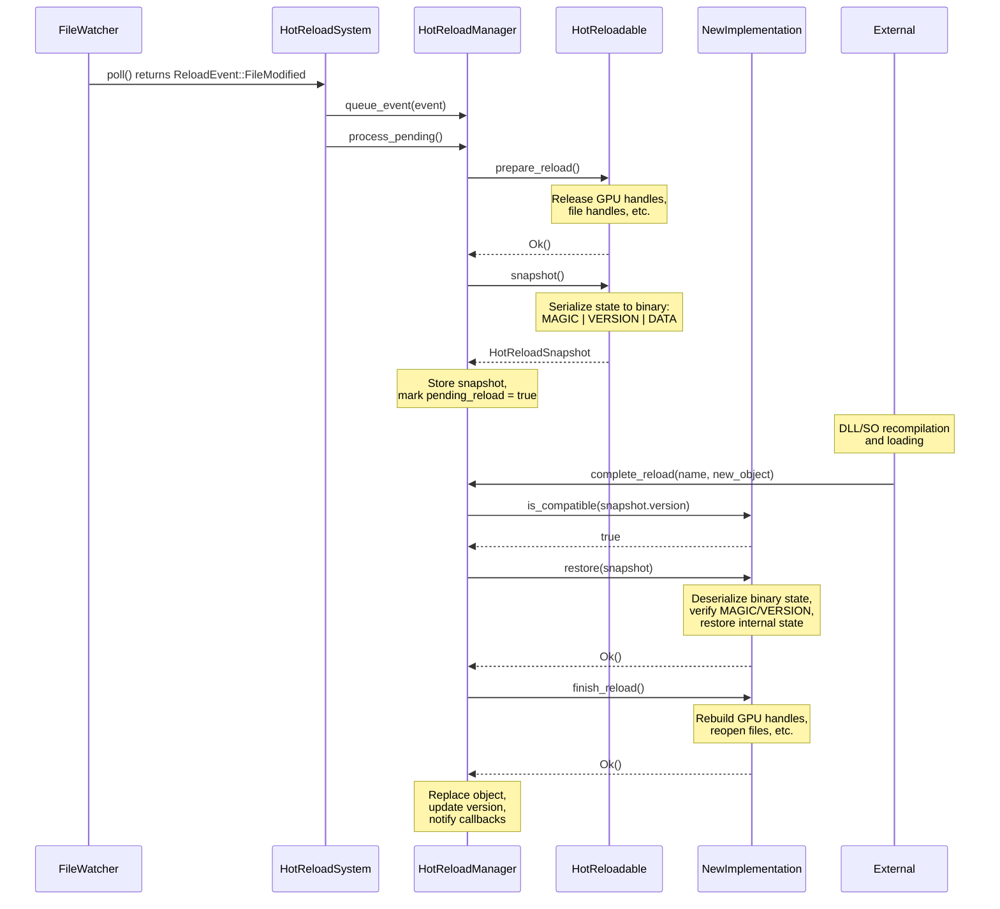
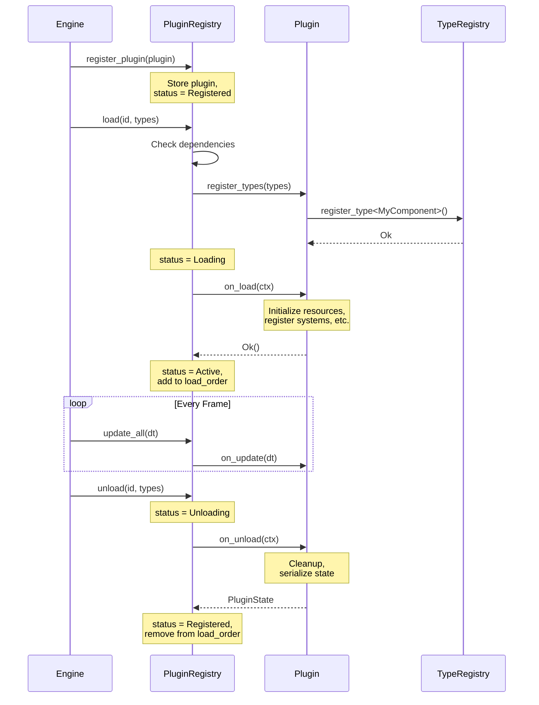
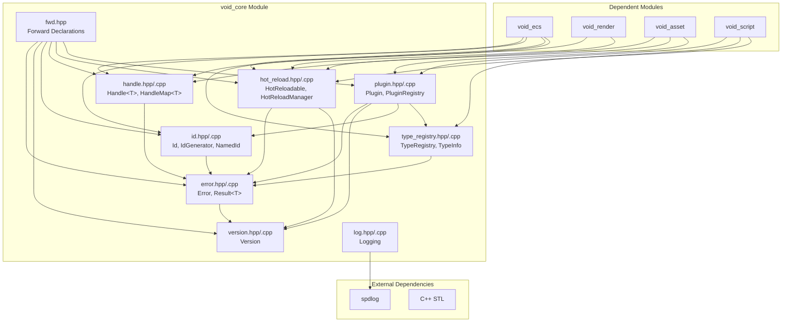
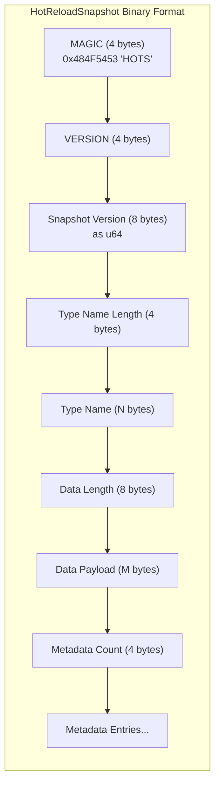
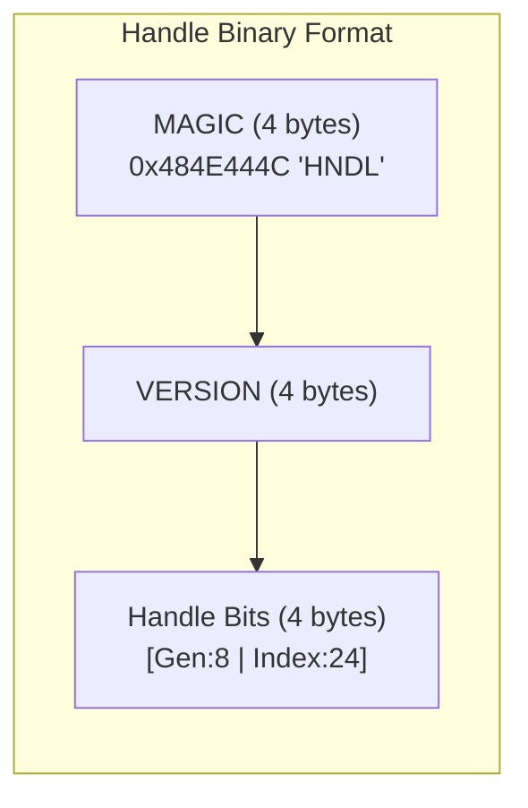
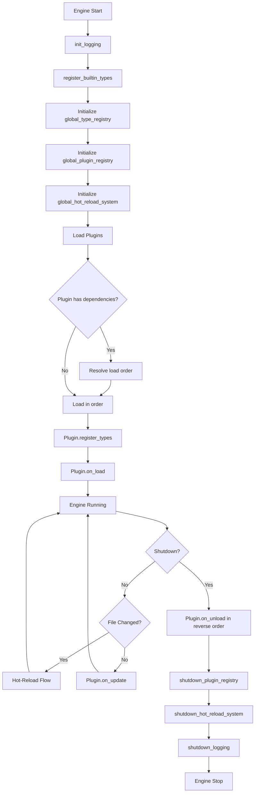

# void_core Module Integration Diagrams

## Class Diagram

```mermaid
classDiagram
    class Error {
        -ErrorCode m_code
        -Variant m_error
        -map~string,string~ m_context
        +code() ErrorCode
        +message() string
        +is~T~() bool
        +as~T~() T*
        +with_context(key, value) Error
    }

    class Result~T,E~ {
        -optional~T~ m_value
        -E m_error
        +is_ok() bool
        +is_err() bool
        +value() T
        +error() E
        +unwrap() T
        +map~F~(func) Result~U,E~
    }

    class Version {
        +uint16_t major
        +uint16_t minor
        +uint16_t patch
        +is_compatible_with(other) bool
        +parse(str) optional~Version~
        +to_u64() uint64_t
        +to_string() string
    }

    class Id {
        +uint64_t bits
        +create(index, generation) Id
        +is_null() bool
        +index() uint32_t
        +generation() uint32_t
    }

    class IdGenerator {
        -atomic~uint64_t~ m_next
        +next() Id
        +next_batch(count) Id
        +current() uint64_t
    }

    class NamedId {
        +string name
        +uint64_t hash
        +to_id() Id
    }

    class Handle~T~ {
        +uint32_t bits
        +create(index, generation) Handle~T~
        +is_null() bool
        +index() uint32_t
        +generation() uint8_t
    }

    class HandleAllocator~T~ {
        -vector~uint8_t~ m_generations
        -vector~uint32_t~ m_free_list
        +allocate() Handle~T~
        +free(handle) bool
        +is_valid(handle) bool
    }

    class HandleMap~T~ {
        -HandleAllocator~T~ m_allocator
        -vector~optional~T~~ m_values
        +insert(value) Handle~T~
        +remove(handle) optional~T~
        +get(handle) T*
    }

    class TypeInfo {
        +type_index type_id
        +string name
        +size_t size
        +size_t align
        +bool needs_drop
        +optional~TypeSchema~ schema
    }

    class TypeRegistry {
        -map m_by_id
        -map m_by_name
        -map m_constructors
        +register_type~T~() TypeRegistry
        +get~T~() TypeInfo*
        +create(type_id) unique_ptr~DynType~
    }

    class HotReloadable {
        <<interface>>
        +snapshot() Result~HotReloadSnapshot~
        +restore(snapshot) Result~void~
        +is_compatible(version) bool
        +prepare_reload() Result~void~
        +finish_reload() Result~void~
        +current_version() Version
        +type_name() string
    }

    class HotReloadSnapshot {
        +vector~uint8_t~ data
        +type_index type_id
        +string type_name
        +Version version
        +map~string,string~ metadata
    }

    class HotReloadManager {
        -map m_entries
        -map m_path_to_name
        -map m_pending_snapshots
        -queue m_pending_events
        -mutex m_queue_mutex
        +register_object(name, object) Result~void~
        +reload(name) Result~void~
        +complete_reload(name, new_object) Result~void~
        +process_pending() vector~Result~void~~
    }

    class FileWatcher {
        <<interface>>
        +watch(path) Result~void~
        +unwatch(path) Result~void~
        +poll() vector~ReloadEvent~
    }

    class Plugin {
        <<interface>>
        +id() PluginId
        +version() Version
        +dependencies() vector~PluginId~
        +on_load(ctx) Result~void~
        +on_unload(ctx) Result~PluginState~
        +on_reload(ctx, state) Result~void~
        +supports_hot_reload() bool
    }

    class PluginRegistry {
        -map m_plugins
        -map m_info
        -vector m_load_order
        +register_plugin(plugin) Result~void~
        +load(id, types) Result~void~
        +unload(id, types) Result~PluginState~
        +hot_reload(id, new_plugin, types) Result~void~
    }

    Error <|-- PluginError
    Error <|-- TypeRegistryError
    Error <|-- HotReloadError
    Error <|-- HandleError

    HandleAllocator~T~ --* HandleMap~T~
    Handle~T~ <.. HandleAllocator~T~ : creates
    Handle~T~ <.. HandleMap~T~ : uses

    HotReloadSnapshot <.. HotReloadable : produces
    HotReloadManager o-- HotReloadable : manages
    HotReloadManager ..> HotReloadSnapshot : stores

    FileWatcher <|-- MemoryFileWatcher
    FileWatcher <|-- PollingFileWatcher
    HotReloadSystem o-- HotReloadManager
    HotReloadSystem o-- FileWatcher

    Plugin ..> PluginState : produces
    Plugin ..> Version : uses
    Plugin ..> PluginId : uses
    PluginRegistry o-- Plugin : manages
    PluginRegistry ..> TypeRegistry : uses

    TypeRegistry o-- TypeInfo : stores
    TypeInfo ..> TypeSchema : contains
```

## Hot-Reload Sequence Diagram

## Plugin Lifecycle Sequence Diagram

## Dependency Graph

## Binary Serialization Format

## Module Initialization Flow

