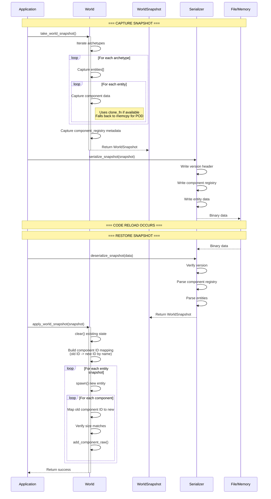
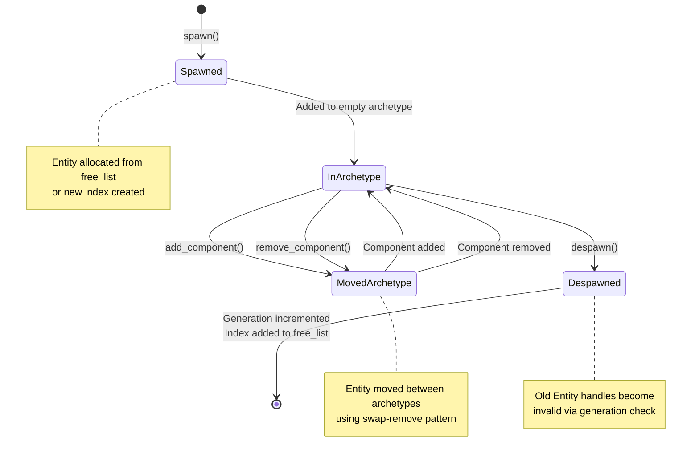
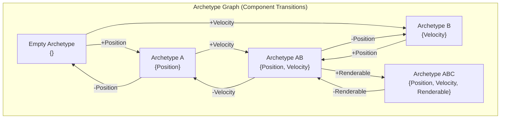
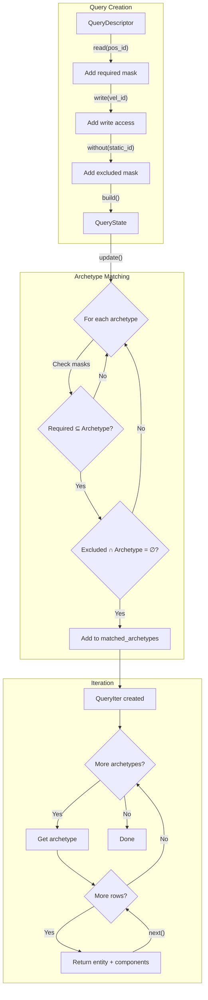
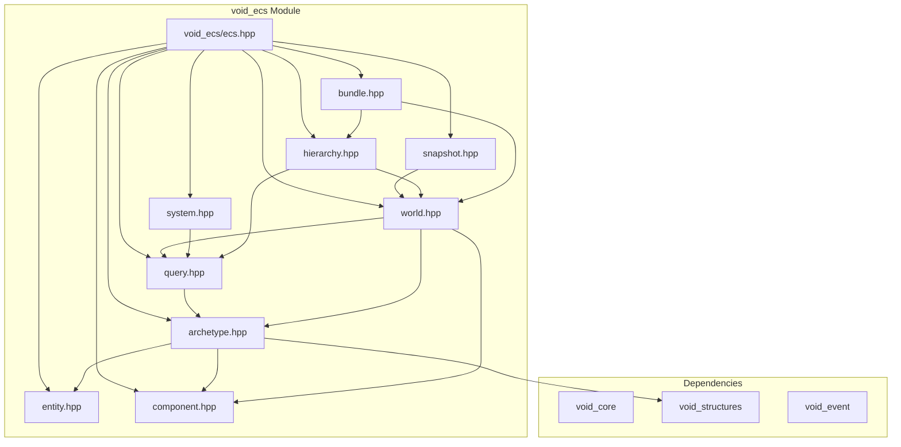
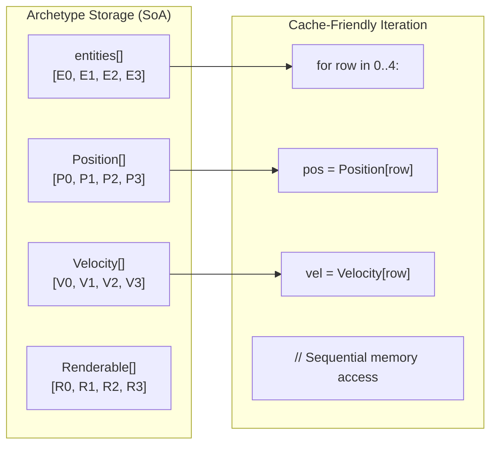

# void_ecs Integration

This document provides integration diagrams for the void_ecs module, an archetype-based Entity Component System designed for cache-efficient iteration and hot-reload support.

## Architecture Overview

The void_ecs module is **header-only by design**, maximizing inlining opportunities for performance-critical iteration patterns. All types are templated or inline to enable compiler optimizations.

## Class Diagram

```mermaid
classDiagram
    direction TB

    %% Core Entity Types
    class Entity {
        +EntityIndex index
        +Generation generation
        +is_null() bool
        +is_valid() bool
        +to_bits() uint64_t
        +from_bits(uint64_t) Entity$
    }

    class EntityAllocator {
        -vector~Generation~ generations_
        -vector~EntityIndex~ free_list_
        -size_t alive_count_
        +allocate() Entity
        +deallocate(Entity) bool
        +is_alive(Entity) bool
    }

    class EntityLocation {
        +ArchetypeId archetype_id
        +size_t row
        +is_valid() bool
    }

    %% Component Types
    class ComponentId {
        +uint32_t id
        +is_valid() bool
        +value() uint32_t
    }

    class ComponentInfo {
        +ComponentId id
        +string name
        +size_t size
        +size_t align
        +type_index type_id
        +function drop_fn
        +function move_fn
        +function clone_fn
        +of~T~() ComponentInfo$
    }

    class ComponentRegistry {
        -vector~ComponentInfo~ components_
        -unordered_map type_map_
        +register_component~T~() ComponentId
        +get_id~T~() optional
        +get_info(ComponentId) ComponentInfo*
    }

    class ComponentStorage {
        -ComponentInfo info_
        -vector~byte~ data_
        -size_t len_
        +push~T~(T) void
        +get~T~(size_t) T&
        +get_raw(size_t) void*
        +swap_remove(size_t) bool
    }

    %% Archetype Types
    class ArchetypeId {
        +uint32_t id
        +is_valid() bool
    }

    class Archetype {
        -ArchetypeId id_
        -vector~ComponentId~ components_
        -BitSet component_mask_
        -vector~ComponentStorage~ storages_
        -vector~Entity~ entities_
        +has_component(ComponentId) bool
        +add_entity(Entity, data) size_t
        +remove_entity(size_t) optional~Entity~
        +get_component~T~(ComponentId, size_t) T*
    }

    class Archetypes {
        -vector~unique_ptr~Archetype~~ archetypes_
        -map signature_map_
        +get(ArchetypeId) Archetype*
        +get_or_create(ComponentInfo[]) ArchetypeId
        +find(ComponentId[]) optional~ArchetypeId~
    }

    %% Query Types
    class QueryDescriptor {
        -vector~ComponentAccess~ components_
        -BitSet required_mask_
        -BitSet excluded_mask_
        +read(ComponentId) QueryDescriptor&
        +write(ComponentId) QueryDescriptor&
        +without(ComponentId) QueryDescriptor&
        +matches_archetype(Archetype) bool
    }

    class QueryState {
        -QueryDescriptor descriptor_
        -vector~ArchetypeId~ matched_archetypes_
        +update(Archetypes) void
        +matched_archetypes() vector~ArchetypeId~
    }

    class QueryIter {
        -Archetypes* archetypes_
        -vector~ArchetypeId~* matched_
        -size_t archetype_index_
        -size_t row_
        +entity() Entity
        +next() bool
        +empty() bool
    }

    %% System Types
    class SystemDescriptor {
        +string name
        +SystemStage stage
        +vector~QueryDescriptor~ queries
        +vector~ResourceAccess~ resources
        +bool exclusive
        +conflicts_with(SystemDescriptor) bool
    }

    class System {
        <<interface>>
        +descriptor() SystemDescriptor
        +run(World) void
    }

    class SystemScheduler {
        -array~vector~System~~ stages_
        +add_system(System) void
        +run(World) void
        +run_stage(World, SystemStage) void
    }

    %% World
    class World {
        -EntityAllocator entities_
        -vector~EntityLocation~ locations_
        -ComponentRegistry components_
        -Archetypes archetypes_
        -Resources resources_
        +spawn() Entity
        +despawn(Entity) bool
        +add_component~T~(Entity, T) bool
        +get_component~T~(Entity) T*
        +query(QueryDescriptor) QueryState
    }

    %% Hierarchy
    class Parent {
        +Entity entity
    }

    class Children {
        +vector~Entity~ entities
        +add(Entity) void
        +remove(Entity) void
    }

    class LocalTransform {
        +Vec3 position
        +Quat rotation
        +Vec3 scale
        +to_matrix() Mat4
    }

    class GlobalTransform {
        +Mat4 matrix
        +position() Vec3
    }

    %% Snapshot Types
    class WorldSnapshot {
        +uint32_t version
        +vector~EntitySnapshot~ entities
        +vector~ComponentMeta~ component_registry
    }

    class EntitySnapshot {
        +uint64_t entity_bits
        +vector~ComponentSnapshot~ components
    }

    %% Relationships
    World *-- EntityAllocator
    World *-- ComponentRegistry
    World *-- Archetypes
    World *-- Resources
    World o-- EntityLocation

    Archetypes *-- Archetype
    Archetype *-- ComponentStorage
    Archetype o-- Entity
    ComponentStorage o-- ComponentInfo

    ComponentRegistry *-- ComponentInfo

    QueryState o-- QueryDescriptor
    QueryIter o-- Archetypes
    QueryIter o-- QueryState

    SystemScheduler *-- System
    System o-- SystemDescriptor

    WorldSnapshot *-- EntitySnapshot
    EntitySnapshot *-- ComponentSnapshot
```



## Hot-Reload Flow



## Entity Lifecycle



## Archetype Graph



## Data Flow (Query Iteration)



## Module Dependencies



## Memory Layout



## Key Design Decisions

### Header-Only Architecture

The entire ECS module is implemented as header-only code because:

1. **Inlining**: ECS iteration is performance-critical; inline implementations allow the compiler to optimize away function call overhead
2. **Templates**: Heavy use of templates for type safety requires header definitions
3. **Zero-Cost Abstractions**: Queries, iterators, and component access compile to direct memory operations
4. **Link-Time Optimization**: All code visible to compiler enables aggressive cross-module optimization

### Generational Entities

```cpp
struct Entity {
    EntityIndex index;      // 32-bit slot in allocator
    Generation generation;  // 32-bit version counter
};
```

- Prevents use-after-free bugs
- O(1) validity checks
- No dangling reference issues across hot-reload

### Archetype-Based Storage

- Entities with same components stored contiguously
- Cache-friendly iteration patterns
- Swap-remove for O(1) entity removal
- Graph edges for fast archetype transitions

### Hot-Reload Support

- Component ID mapping by name (survives recompilation)
- Binary snapshot format with version checking
- Size validation prevents data corruption
- Clone functions for non-POD components
