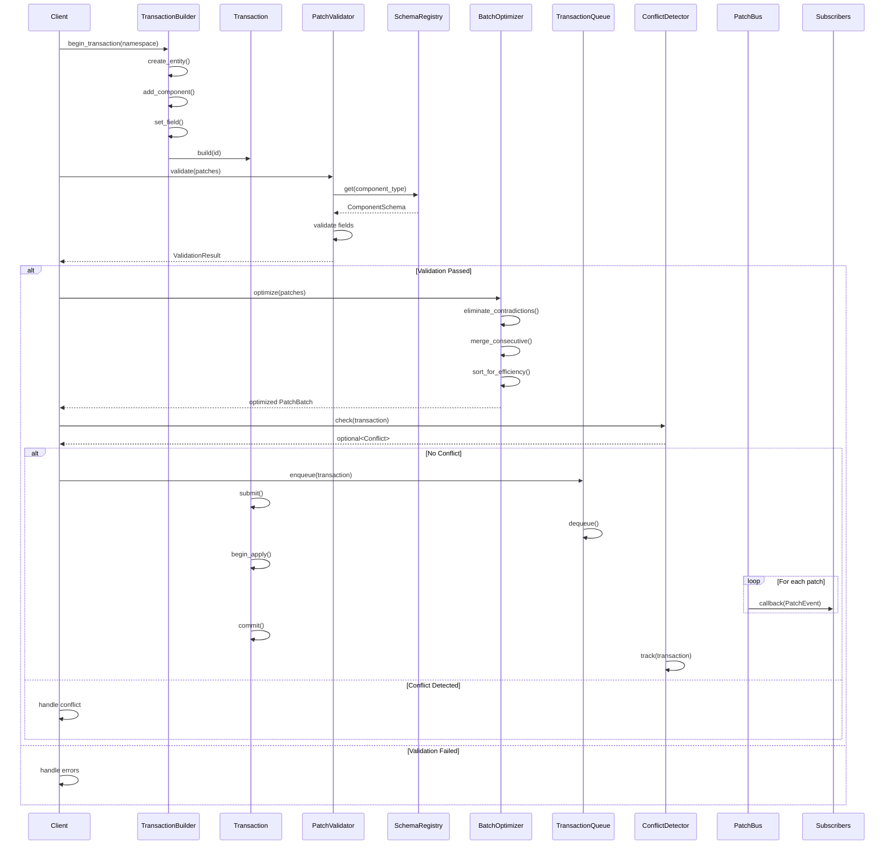
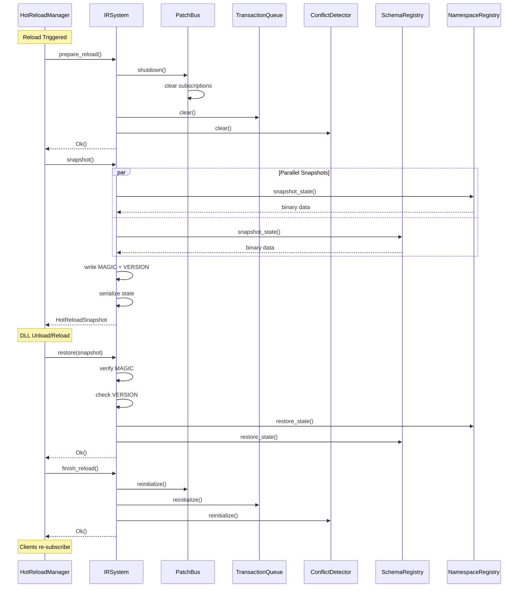
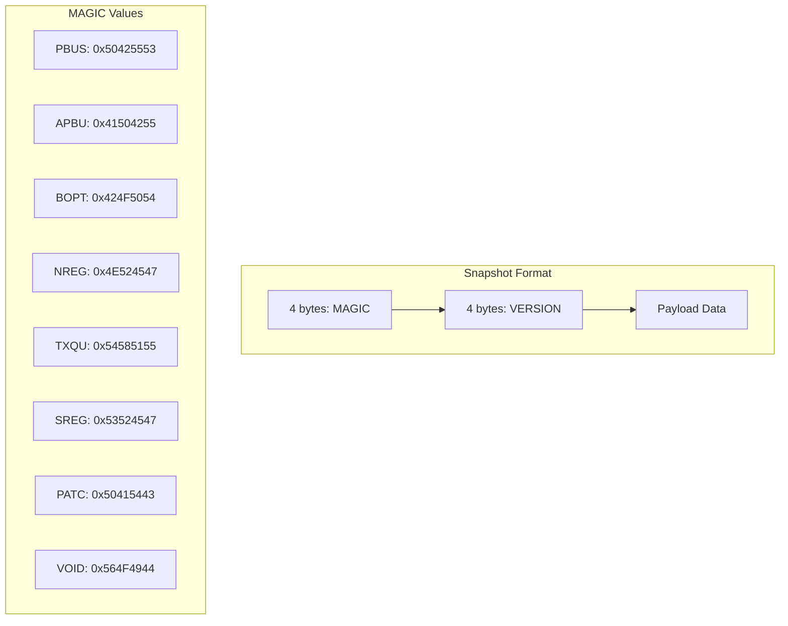
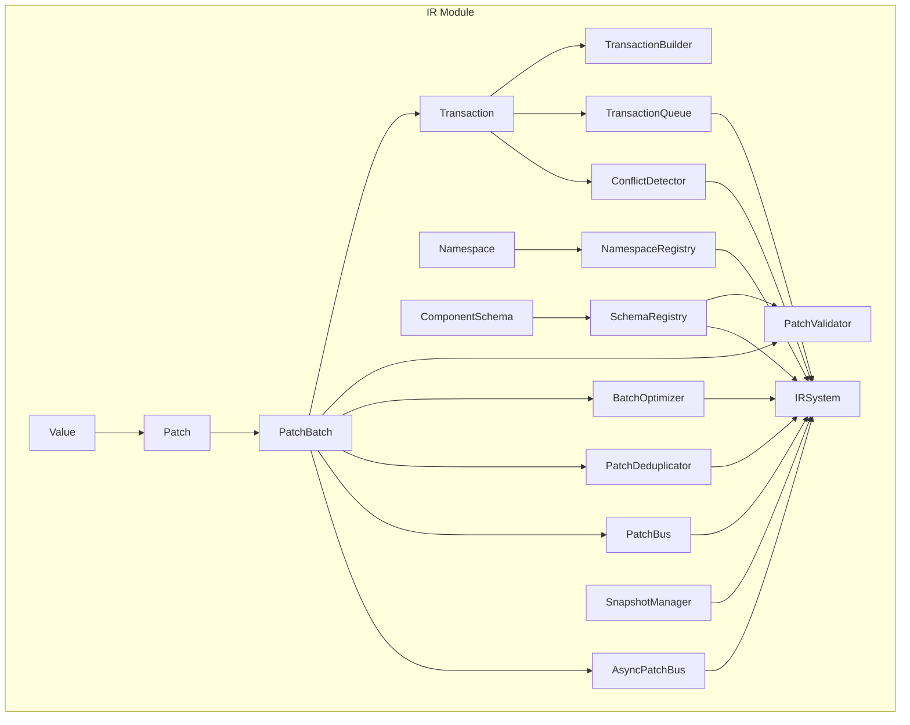

# void_ir Integration Diagrams

This document provides Mermaid diagrams showing the void_ir module architecture and data flow.

## Class Diagram

```mermaid
classDiagram
    class Patch {
        +PatchKind kind()
        +target_entity() EntityRef
        +visit(F)
    }

    class PatchBatch {
        -vector~Patch~ m_patches
        +push(Patch)
        +append(PatchBatch)
        +size() size_t
        +reserve(size_t)
    }

    class PatchBus {
        -shared_mutex m_mutex
        -map~uint64_t, Subscription~ m_subscriptions
        -atomic~size_t~ m_sequence_number
        +subscribe(PatchFilter, Callback) SubscriptionId
        +unsubscribe(SubscriptionId)
        +publish(Patch, NamespaceId, TransactionId)
        +publish_batch(PatchBatch)
        +shutdown()
    }

    class AsyncPatchBus {
        -mutex m_queue_mutex
        -queue~PatchEvent~ m_queue
        -condition_variable m_condition
        +publish(Patch)
        +try_consume() optional~PatchEvent~
        +consume() optional~PatchEvent~
        +consume_all() vector~PatchEvent~
        +shutdown()
    }

    class Transaction {
        -TransactionId m_id
        -NamespaceId m_namespace
        -TransactionState m_state
        -PatchBatch m_patches
        -vector~TransactionId~ m_dependencies
        +id() TransactionId
        +state() TransactionState
        +patches() PatchBatch
        +add_patch(Patch)
        +submit()
        +commit()
        +rollback()
    }

    class TransactionBuilder {
        -NamespaceId m_namespace
        -PatchBatch m_patches
        +create_entity(EntityRef)
        +add_component(EntityRef, type, Value)
        +set_field(EntityRef, type, field, Value)
        +build(TransactionId) Transaction
    }

    class TransactionQueue {
        -vector~Transaction~ m_pending
        +enqueue(Transaction)
        +dequeue() optional~Transaction~
        +peek() Transaction*
    }

    class ConflictDetector {
        -map~uint64_t, vector~TransactionId~~ m_modified_entities
        -map~pair, vector~TransactionId~~ m_modified_components
        +track(Transaction)
        +detect() vector~Conflict~
        +check(Transaction) optional~Conflict~
        +clear()
    }

    class SchemaRegistry {
        -map~string, ComponentSchema~ m_schemas
        +register_schema(ComponentSchema)
        +get(type_name) ComponentSchema*
        +validate_patch(ComponentPatch) ValidationResult
    }

    class PatchValidator {
        -SchemaRegistry& m_schemas
        +validate(Patch, Namespace) ValidationResult
        +validate_batch(PatchBatch, Namespace) ValidationResult
    }

    class BatchOptimizer {
        -Options m_options
        -OptimizationStats m_stats
        +optimize(PatchBatch) PatchBatch
        +stats() OptimizationStats
    }

    class Namespace {
        -NamespaceId m_id
        -string m_name
        -NamespacePermissions m_permissions
        -ResourceLimits m_limits
        -ResourceUsage m_usage
        +allocate_entity() uint64_t
        +within_limits() bool
    }

    class NamespaceRegistry {
        -vector~Namespace~ m_namespaces
        -map~string, NamespaceId~ m_name_to_id
        +create(name) NamespaceId
        +get(NamespaceId) Namespace*
        +find_by_name(name) optional~NamespaceId~
    }

    class IRSystem {
        -NamespaceRegistry m_namespaces
        -SchemaRegistry m_schemas
        -PatchBus m_patch_bus
        -AsyncPatchBus m_async_bus
        -BatchOptimizer m_optimizer
        -TransactionQueue m_transaction_queue
        -ConflictDetector m_conflict_detector
        +begin_transaction(NamespaceId) TransactionBuilder
        +submit_transaction(Transaction)
        +validate_transaction(Transaction) ValidationResult
    }

    class HotReloadable {
        <<interface>>
        +snapshot() Result~HotReloadSnapshot~
        +restore(HotReloadSnapshot) Result~void~
        +prepare_reload() Result~void~
        +finish_reload() Result~void~
    }

    Patch --> PatchBatch
    PatchBatch --> Transaction
    Transaction --> TransactionQueue
    Transaction --> ConflictDetector
    TransactionBuilder --> Transaction
    PatchBus --> PatchEvent
    AsyncPatchBus --> PatchEvent
    IRSystem --> NamespaceRegistry
    IRSystem --> SchemaRegistry
    IRSystem --> PatchBus
    IRSystem --> AsyncPatchBus
    IRSystem --> TransactionQueue
    IRSystem --> ConflictDetector
    IRSystem --> BatchOptimizer
    PatchValidator --> SchemaRegistry
    IRSystem ..|> HotReloadable
```

## Patch Flow Sequence Diagram

## Hot-Reload Sequence Diagram

## Binary Snapshot Format

## Component Relationships

