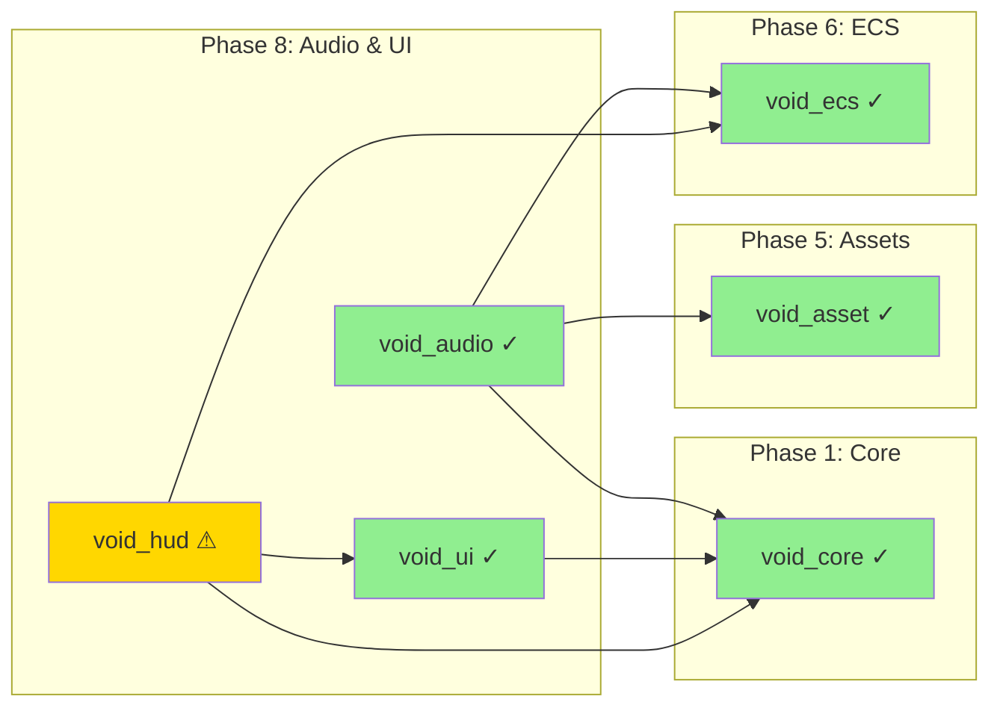
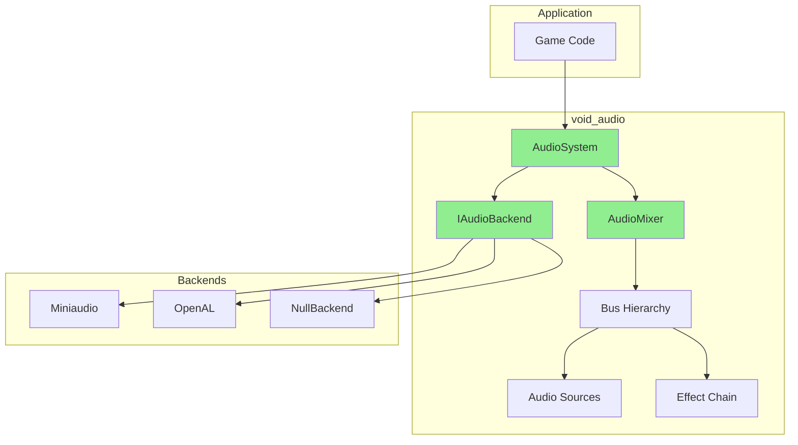
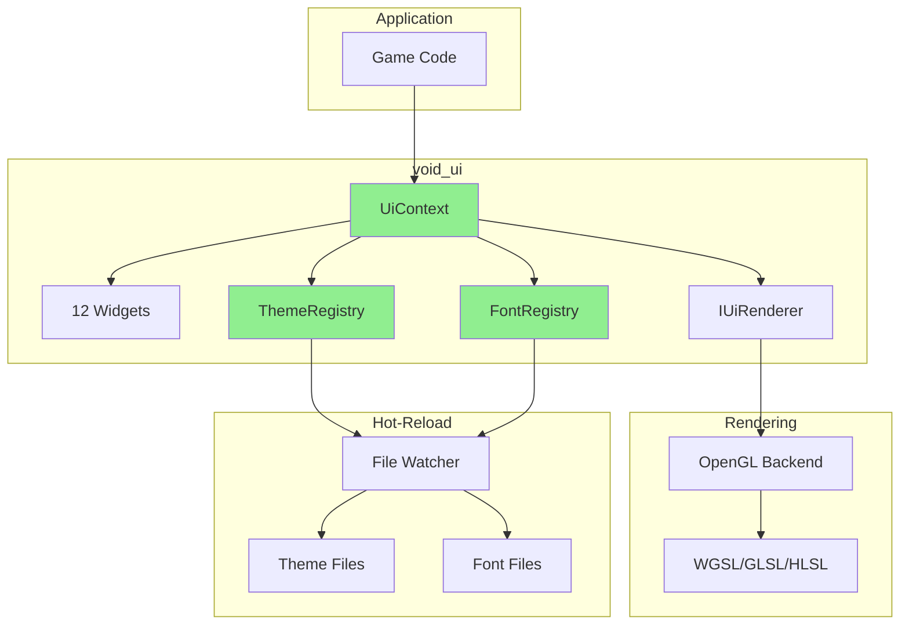
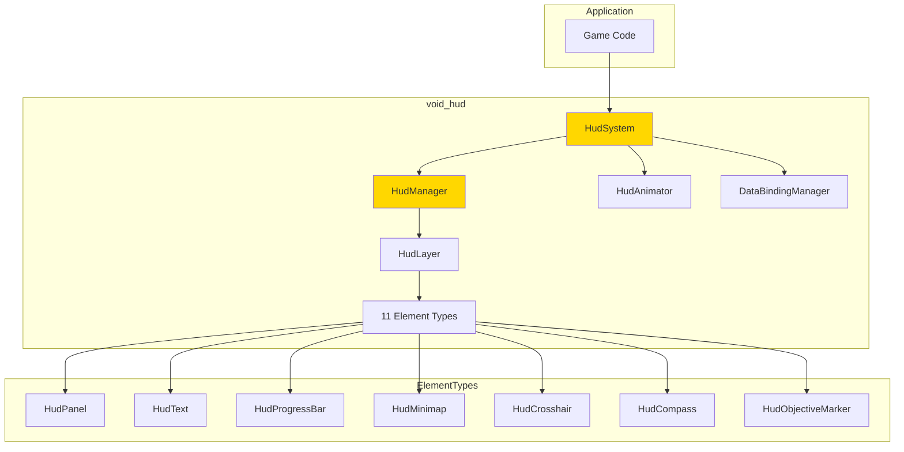
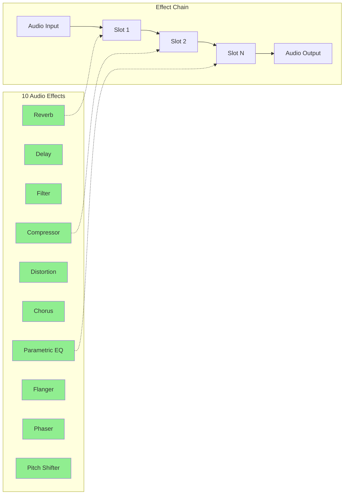

# Phase 8: Audio & UI

> **Validated**: 2026-01-25
> **Status**: VERIFIED COMPLETE (with caveat)
> **Modules**: void_audio, void_ui, void_hud

---

## Executive Summary

| Metric | Value |
|--------|-------|
| Migration Status | Claimed 100% → **Verified 100%** |
| Hot-Reload Status | **Partial** (void_hud missing) |
| Integration Status | **Integrated** |
| Total Legacy Lines | ~4,605 |
| Total Modern Lines | ~19,771 |

All Phase 8 modules have been validated with **complete feature parity plus significant enhancements**. The C++ implementations are substantially more comprehensive than their Rust counterparts. **Critical Note**: void_hud does NOT implement hot-reload support.

---

## Module 1: void_audio

### Legacy Analysis (1,413 lines)

| File | Lines | Purpose |
|------|-------|---------|
| lib.rs | 40 | Module exports, prelude |
| system.rs | 419 | Core AudioSystem |
| channel.rs | 253 | Channel management, mixing |
| settings.rs | 373 | Configuration types |
| source.rs | 328 | Entity components |

**Legacy Features:**
- Audio playback (WAV, MP3, OGG via rodio)
- Spatial audio (3D positioning, pan calculation)
- 3 attenuation models (Linear, Inverse, Exponential)
- Hierarchical channel mixing (6 default channels)
- Fade in/out support
- **NO hot-reload support**

### Modern C++ Analysis (8,722 lines)

| Component | Lines | Purpose |
|-----------|-------|---------|
| Headers | 3,535 | Complete API surface |
| Implementation | 5,187 | Full audio engine |

**Key Features:**
- **Multi-backend architecture** (Miniaudio, OpenAL, Null)
- **10 audio effects** (Reverb, Delay, Compressor, EQ, Chorus, etc.)
- **HRTF binaural audio** support
- **7 attenuation models** including custom curves
- **Voice limiting** with priority-based stealing
- **Audio ducking** for sidechain compression
- **Streaming buffers** with async loading
- **Complete hot-reload** with mixer snapshots

### Hot-Reload Verification

```cpp
// backend.hpp - AudioSystem hot-reload
class AudioSystem {
    HotReloadSnapshot snapshot();
    bool restore(HotReloadSnapshot snapshot);
};

// Snapshot contents:
// - Number of buses
// - Per-bus ID and volume pairs
// - Current music source ID
// - Binary serialization via std::memcpy

// mixer.hpp - Mixer snapshots
class AudioMixer {
    void take_snapshot(const std::string& name);
    void apply_snapshot(const MixerSnapshot& snapshot, float blend_time);
    void blend_snapshots(const MixerSnapshot& from, const MixerSnapshot& to, float t);
};
```

---

## Module 2: void_ui

### Legacy Analysis (1,158 lines)

| File | Lines | Purpose |
|------|-------|---------|
| lib.rs | 160 | Core UI context |
| widgets.rs | 355 | Widget library |
| renderer.rs | 264 | wgpu rendering |
| theme.rs | 142 | Theme system |
| font.rs | 223 | Bitmap fonts |

**Legacy Features:**
- Immediate-mode UI architecture
- 6 widgets (DebugPanel, Label, ProgressBar, FrameTimeGraph, Toast, HelpModal)
- 4 themes (Dark, Light, High Contrast, Retro)
- 8x16 bitmap fonts
- wgpu GPU acceleration
- **NO hot-reload support**

### Modern C++ Analysis (5,284 lines)

| Component | Lines | Purpose |
|-----------|-------|---------|
| Headers | 1,716 | API definitions |
| Implementation | 3,568 | Full UI system |

**Key Features:**
- **12 widgets** (Button, Checkbox, Slider, TextInput, Panel, + legacy)
- **6 built-in themes** with smooth transitions
- **Theme interpolation** for animated changes
- **Custom font loading** with hot-reload
- **UTF-8 text input** support
- **Backend-agnostic rendering** (OpenGL, WGSL, GLSL, HLSL shaders)
- **Complete hot-reload** via ThemeRegistry and FontRegistry

### Hot-Reload Verification

```cpp
// theme.hpp - ThemeRegistry hot-reload
class ThemeRegistry {
    void watch_directory(const std::filesystem::path& path);
    void poll_changes();  // Check file timestamps
    Result<void> load_theme_from_file(const std::filesystem::path& path);
    Result<void> save_theme_to_file(const std::string& name, const path& path);
    void transition_to(const std::string& name, float duration);
    bool is_transitioning() const;
    void set_theme_changed_callback(std::function<void(const Theme&)>);
};

// font.hpp - FontRegistry hot-reload
class FontRegistry {
    void watch_directory(const std::filesystem::path& path);
    void poll_changes();
    Result<void> load_font_from_file(const std::string& name, const path& path,
                                      uint32_t glyph_width, uint32_t glyph_height);
    void set_font_changed_callback(std::function<void(const std::string&)>);
};
```

---

## Module 3: void_hud

### Legacy Analysis (2,034 lines)

| File | Lines | Purpose |
|------|-------|---------|
| lib.rs | 44 | Module exports |
| bar.rs | 385 | Health/resource bars |
| crosshair.rs | 259 | Crosshair/reticle |
| damage_number.rs | 285 | Floating damage numbers |
| minimap.rs | 360 | Minimap system |
| notification.rs | 375 | Notification manager |
| prompt.rs | 326 | Interaction prompts |

**Legacy Features:**
- Health/resource bars with animation
- 5 crosshair styles with spread
- Floating damage numbers
- Minimap with markers
- Notification system
- Interaction prompts with hold mechanics
- Serde serializable (hot-reload ready but not implemented)

### Modern C++ Analysis (5,765 lines)

| Component | Lines | Purpose |
|-----------|-------|---------|
| Headers | 2,696 | Complete API |
| Implementation | 3,069 | Full HUD system |

**Key Features:**
- **11 specialized HUD elements** (Panel, Text, ProgressBar, Icon, Minimap, Crosshair, Compass, ObjectiveMarker, DamageIndicator, Notification, Tooltip)
- **16 easing functions** for animations
- **Animation system** with sequences, groups, keyframes
- **Data binding** with converters (OneWay, TwoWay, OneTime)
- **Layered rendering** with z-order
- **World-space markers** with screen clamping
- **Builder pattern** for elements and animations

### Hot-Reload Status: NOT IMPLEMENTED

```cpp
// CRITICAL: void_hud does NOT implement hot-reload
// Analysis shows:
// - No HotReloadable interface or inheritance
// - No snapshot() or restore() methods
// - No serialization infrastructure
// - Elements created dynamically but not persistable

// Mitigation: Serde-like serialization would need to be added
// All element types have well-defined properties that could serialize
```

---

## Dependencies



**Legend:**
- Green (#90EE90): Full hot-reload support
- Yellow (#FFD700): Missing hot-reload

---

## Audio Architecture



---

## UI Architecture



---

## HUD Architecture



---

## Effects System (void_audio)



---

## Discrepancies Found

### void_audio
| Aspect | Legacy | Modern | Notes |
|--------|--------|--------|-------|
| Line count | 1,413 | 8,722 | 6x larger |
| Effects | None | 10 types | Major enhancement |
| Backends | rodio | Miniaudio + OpenAL | Multi-backend |
| Spatial modes | 1 | 3 (incl. HRTF) | Enhanced |
| Attenuation | 3 models | 7 models | Enhanced |
| Hot-reload | None | Full snapshots | Added |

### void_ui
| Aspect | Legacy | Modern | Notes |
|--------|--------|--------|-------|
| Line count | 1,158 | 5,284 | 4.5x larger |
| Widgets | 6 | 12 | 2x more |
| Themes | 4 | 6 | Enhanced |
| Hot-reload | None | Registry + file watch | Added |
| Input | Basic | UTF-8 + keyboard | Enhanced |
| Shaders | WGSL only | WGSL + GLSL + HLSL | Multi-target |

### void_hud
| Aspect | Legacy | Modern | Notes |
|--------|--------|--------|-------|
| Line count | 2,034 | 5,765 | 2.8x larger |
| Elements | 6 types | 11 types | Enhanced |
| Animation | Basic lerp | 16 easing + sequences | Major enhancement |
| Data binding | None | Full MVVM-style | Added |
| Hot-reload | Serde-ready | **NOT IMPLEMENTED** | **Gap** |

---

## Summary

| Module | Legacy Lines | Modern Lines | Feature Parity | Hot-Reload |
|--------|-------------|--------------|----------------|------------|
| void_audio | 1,413 | 8,722 | ✓ 100%+ | ✓ Complete |
| void_ui | 1,158 | 5,284 | ✓ 100%+ | ✓ Complete |
| void_hud | 2,034 | 5,765 | ✓ 100%+ | ✗ Missing |
| **Total** | **4,605** | **19,771** | | |

**Phase 8 Status: VERIFIED COMPLETE (with caveat)**

The C++ implementations provide complete feature parity with substantial enhancements:
- **void_audio**: Production-grade audio engine with 10 effects, HRTF, multi-backend
- **void_ui**: Comprehensive UI toolkit with hot-reloadable themes and fonts
- **void_hud**: Feature-rich HUD system with animations and data binding

**Critical Gap**: void_hud does NOT implement hot-reload support. This would require adding:
1. `HotReloadable` interface implementation
2. Binary serialization for element state
3. State snapshot/restore mechanism
4. File watching for configuration changes

This gap should be addressed in a future iteration to maintain hot-reload consistency across the engine.
