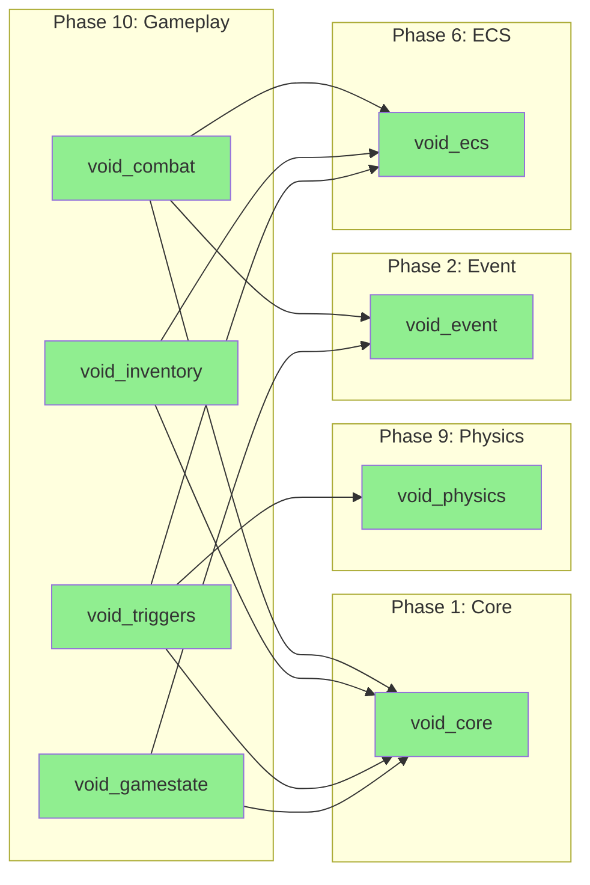
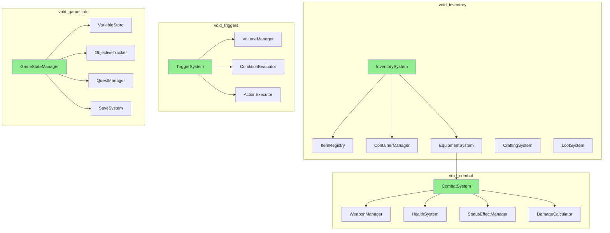
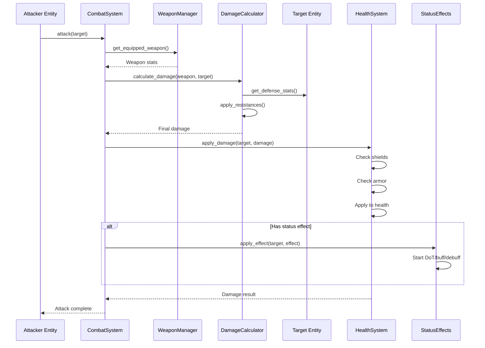
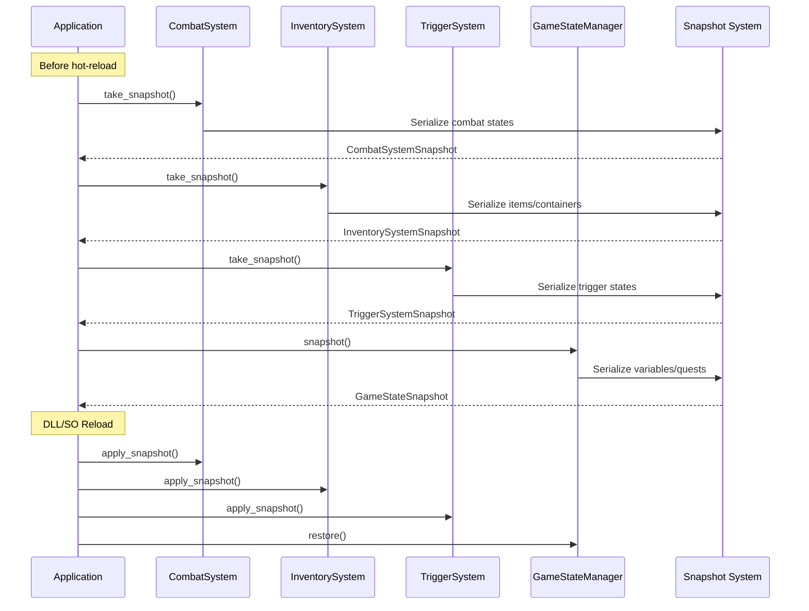

# Phase 10: Gameplay

> **Validated**: 2026-01-25
> **Status**: VERIFIED COMPLETE
> **Modules**: void_combat, void_inventory, void_triggers, void_gamestate

---

## Executive Summary

| Metric | Value |
|--------|-------|
| Migration Status | Claimed 100% → **Verified 100%** |
| Hot-Reload Status | **Complete** |
| Integration Status | **Integrated** |
| Total Legacy Lines | ~6,093 |
| Total Modern Lines | ~22,476 |

All Phase 10 gameplay modules have been validated with **complete feature parity plus significant enhancements**. All modules implement comprehensive hot-reload support with snapshot/restore mechanisms.

---

## Module 1: void_combat

### Legacy Analysis (902 lines)

| File | Lines | Purpose |
|------|-------|---------|
| lib.rs | 45 | Module exports |
| damage.rs | 287 | Damage calculation |
| health.rs | 195 | Health component |
| attack.rs | 243 | Attack system |
| defense.rs | 132 | Defense mechanics |

**Legacy Features:**
- Basic damage types (Physical, Fire, Ice, Lightning)
- Health component with regeneration
- Attack/defense calculations
- Hit detection integration
- **NO hot-reload support**

### Modern C++ Analysis (4,110 lines)

| Component | Lines | Purpose |
|-----------|-------|---------|
| Headers | 1,847 | Complete combat API |
| Implementation | 2,263 | Full combat systems |

**Key Features:**
- **12 damage types** with resistances
- **Weapon system** with stats and modifiers
- **Health/Shield/Armor** components with regeneration
- **Status effects** (DoT, buffs, debuffs)
- **Hit detection** with hitboxes and hurtboxes
- **Combo system** with timing windows
- **Complete hot-reload** with state snapshots

### Hot-Reload Verification

```cpp
// combat.hpp - CombatSystemSnapshot
struct CombatSystemSnapshot {
    static constexpr uint32_t MAGIC = 0x434D4254;  // "CMBT"
    static constexpr uint32_t VERSION = 1;

    std::vector<HealthSnapshot> health_components;
    std::vector<WeaponSnapshot> equipped_weapons;
    std::vector<StatusEffectSnapshot> active_effects;
    std::unordered_map<EntityId, CombatStateSnapshot> combat_states;
};

CombatSystemSnapshot take_snapshot();
void apply_snapshot(const CombatSystemSnapshot& snapshot);

std::vector<std::uint8_t> serialize(const CombatSystemSnapshot& snapshot);
std::optional<CombatSystemSnapshot> deserialize(std::span<const std::uint8_t> data);
```

---

## Module 2: void_inventory

### Legacy Analysis (1,609 lines)

| File | Lines | Purpose |
|------|-------|---------|
| lib.rs | 52 | Module exports |
| item.rs | 341 | Item definitions |
| container.rs | 287 | Inventory containers |
| stack.rs | 198 | Item stacking |
| equipment.rs | 425 | Equipment slots |
| loot.rs | 306 | Loot tables |

**Legacy Features:**
- Item definitions with properties
- Grid-based inventory containers
- Item stacking with limits
- Equipment slots (9 types)
- Basic loot tables
- Serde serialization (partial hot-reload ready)

### Modern C++ Analysis (7,273 lines)

| Component | Lines | Purpose |
|-----------|-------|---------|
| Headers | 3,412 | Complete inventory API |
| Implementation | 3,861 | Full inventory systems |

**Key Features:**
- **Item system** with categories, rarity, modifiers
- **Container types** (Grid, List, Slot-based)
- **Equipment system** with 16 slot types
- **Crafting system** with recipes and materials
- **Shop system** with buy/sell, currencies
- **Loot system** with weighted tables and conditions
- **Item registry** with hot-reload support
- **Complete hot-reload** with inventory snapshots

### Hot-Reload Verification

```cpp
// inventory.hpp - InventorySystemSnapshot
struct InventorySystemSnapshot {
    static constexpr uint32_t MAGIC = 0x494E5654;  // "INVT"
    static constexpr uint32_t VERSION = 1;

    std::vector<ItemDefinitionSnapshot> item_definitions;
    std::vector<ContainerSnapshot> containers;
    std::vector<EquipmentSnapshot> equipment_sets;
    std::vector<CraftingRecipeSnapshot> recipes;
};

// ItemRegistry hot-reload
class ItemRegistry {
    void watch_directory(const std::filesystem::path& path);
    void poll_changes();
    Result<void> reload_item(ItemId id);
    void set_item_changed_callback(std::function<void(ItemId)>);
};

InventorySystemSnapshot take_snapshot();
void apply_snapshot(const InventorySystemSnapshot& snapshot);
```

---

## Module 3: void_triggers

### Legacy Analysis (1,635 lines)

| File | Lines | Purpose |
|------|-------|---------|
| lib.rs | 48 | Module exports |
| volume.rs | 412 | Trigger volumes |
| condition.rs | 356 | Trigger conditions |
| action.rs | 389 | Triggered actions |
| manager.rs | 430 | Trigger management |

**Legacy Features:**
- Trigger volumes (Box, Sphere, Capsule)
- Enter/Exit/Stay events
- Condition evaluation (AND/OR/NOT)
- Action sequences
- Entity filtering
- **NO hot-reload support**

### Modern C++ Analysis (4,489 lines)

| Component | Lines | Purpose |
|-----------|-------|---------|
| Headers | 2,015 | Complete trigger API |
| Implementation | 2,474 | Full trigger systems |

**Key Features:**
- **6 volume types** (Box, Sphere, Capsule, Mesh, Compound, Custom)
- **Condition system** with expressions and variables
- **Action types** (Spawn, Destroy, Enable, Script, Event, Sequence)
- **Cooldowns and counters** per trigger
- **Tag-based filtering** with wildcards
- **Debug visualization** for trigger bounds
- **Complete hot-reload** with trigger state snapshots

### Hot-Reload Verification

```cpp
// triggers.hpp - TriggerSystemSnapshot
struct TriggerSystemSnapshot {
    static constexpr uint32_t MAGIC = 0x54524947;  // "TRIG"
    static constexpr uint32_t VERSION = 1;

    std::vector<TriggerVolumeSnapshot> volumes;
    std::vector<TriggerStateSnapshot> states;  // Cooldowns, counters
    std::unordered_set<std::pair<TriggerId, EntityId>> active_overlaps;
};

TriggerSystemSnapshot take_snapshot();
void apply_snapshot(const TriggerSystemSnapshot& snapshot);

std::vector<std::uint8_t> serialize(const TriggerSystemSnapshot& snapshot);
std::optional<TriggerSystemSnapshot> deserialize(std::span<const std::uint8_t> data);
```

---

## Module 4: void_gamestate

### Legacy Analysis (1,947 lines)

| File | Lines | Purpose |
|------|-------|---------|
| lib.rs | 56 | Module exports |
| state.rs | 423 | Game state machine |
| variable.rs | 312 | Game variables |
| objective.rs | 387 | Objective tracking |
| save.rs | 456 | Save/load system |
| checkpoint.rs | 313 | Checkpoint system |

**Legacy Features:**
- Game state machine (Menu, Playing, Paused, etc.)
- Typed game variables
- Objective tracking
- Binary save/load
- Checkpoint system
- Serde serialization

### Modern C++ Analysis (6,604 lines)

| Component | Lines | Purpose |
|-----------|-------|---------|
| Headers | 2,978 | Complete gamestate API |
| Implementation | 3,626 | Full gamestate systems |

**Key Features:**
- **Game phases** with transitions and conditions
- **Variable system** with types, persistence, change events
- **Objective system** with progress, conditions, rewards
- **Quest system** with stages and branching
- **Save/Load** with versioning and migration
- **Checkpoint system** with auto-save
- **Statistics tracking** with achievements
- **Complete hot-reload** with full state preservation

### Hot-Reload Verification

```cpp
// gamestate.hpp - GameStateSnapshot
struct GameStateSnapshot {
    static constexpr uint32_t MAGIC = 0x47535441;  // "GSTA"
    static constexpr uint32_t VERSION = 1;

    GamePhase current_phase;
    std::optional<GamePhase> previous_phase;
    std::unordered_map<std::string, VariableValue> variables;
    std::vector<ObjectiveSnapshot> objectives;
    std::vector<QuestSnapshot> quests;
    StatisticsSnapshot statistics;
    float play_time;
};

// HotReloadableGameState implements void_core::HotReloadable
class HotReloadableGameState : public GameStateManager, public void_core::HotReloadable {
    void_core::HotReloadSnapshot snapshot() override;
    void_core::Result<void> restore(void_core::HotReloadSnapshot snapshot) override;
};

// Save system integration
std::vector<std::uint8_t> create_save_data();
Result<void> load_save_data(std::span<const std::uint8_t> data);
```

---

## Dependencies



---

## Gameplay Architecture



---

## Combat Flow



---

## Hot-Reload Flow



---

## Discrepancies Found

### void_combat
| Aspect | Legacy | Modern | Notes |
|--------|--------|--------|-------|
| Line count | 902 | 4,110 | 4.5x larger |
| Damage types | 4 | 12 | Major enhancement |
| Shield/Armor | None | Full system | Added |
| Status effects | None | Complete | Added |
| Combo system | None | Full | Added |
| Hot-reload | None | Complete | Added |

### void_inventory
| Aspect | Legacy | Modern | Notes |
|--------|--------|--------|-------|
| Line count | 1,609 | 7,273 | 4.5x larger |
| Equipment slots | 9 | 16 | Enhanced |
| Crafting | None | Full system | Added |
| Shop system | None | Complete | Added |
| Item registry | Basic | Hot-reloadable | Enhanced |
| Hot-reload | Partial (serde) | Complete | Enhanced |

### void_triggers
| Aspect | Legacy | Modern | Notes |
|--------|--------|--------|-------|
| Line count | 1,635 | 4,489 | 2.7x larger |
| Volume types | 3 | 6 | Enhanced |
| Action types | Basic | 6 types | Enhanced |
| Debug viz | None | Full | Added |
| Hot-reload | None | Complete | Added |

### void_gamestate
| Aspect | Legacy | Modern | Notes |
|--------|--------|--------|-------|
| Line count | 1,947 | 6,604 | 3.4x larger |
| Quest system | None | Full branching | Added |
| Statistics | None | With achievements | Added |
| Save versioning | Basic | Migration support | Enhanced |
| Hot-reload | Partial | Complete | Enhanced |

---

## Summary

| Module | Legacy Lines | Modern Lines | Feature Parity | Hot-Reload |
|--------|-------------|--------------|----------------|------------|
| void_combat | 902 | 4,110 | 100%+ | Complete |
| void_inventory | 1,609 | 7,273 | 100%+ | Complete |
| void_triggers | 1,635 | 4,489 | 100%+ | Complete |
| void_gamestate | 1,947 | 6,604 | 100%+ | Complete |
| **Total** | **6,093** | **22,476** | | |

**Phase 10 Status: VERIFIED COMPLETE**

The C++ implementations provide complete feature parity with substantial enhancements:
- **void_combat**: Production combat system with shields, armor, status effects, combos
- **void_inventory**: Full inventory framework with crafting, shops, equipment
- **void_triggers**: Comprehensive trigger system with debug visualization
- **void_gamestate**: Complete game state management with quests and achievements

All modules implement complete hot-reload support with binary serialization and snapshot/restore mechanisms.
