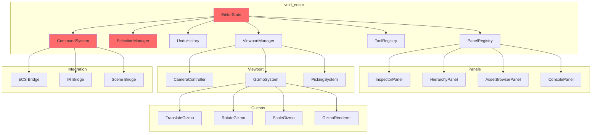
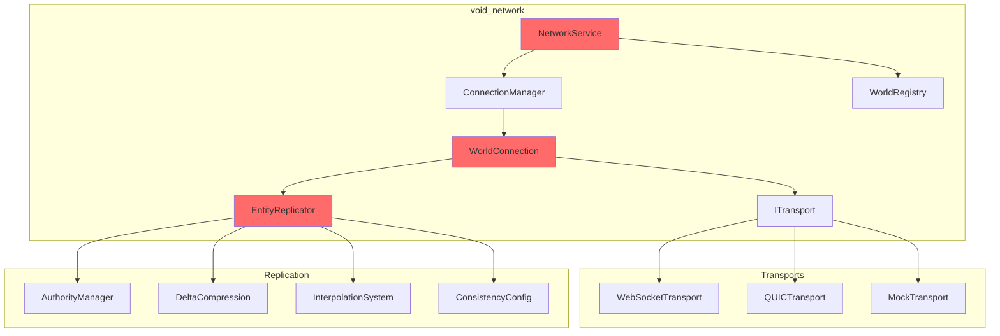
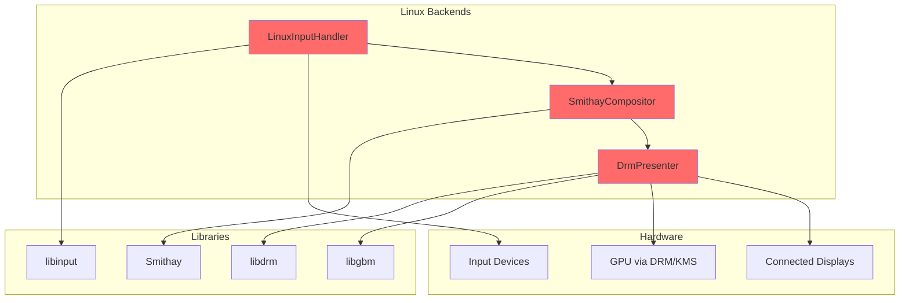
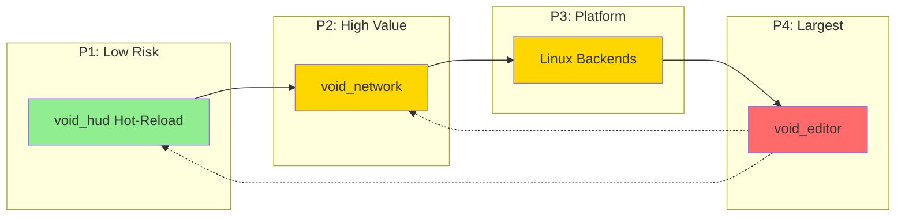

# Phase 12: Implementation Gaps

> **Created**: 2026-01-25
> **Status**: NOT IMPLEMENTED
> **Severity**: CRITICAL
> **Modules**: void_editor, void_network, Linux Backends, void_hud (hot-reload)

---

## Executive Summary

| Gap | Lines Required | Priority | Complexity | Dependencies |
|-----|----------------|----------|------------|--------------|
| void_editor | ~10,000+ | P4 | Very High | All modules |
| void_network | ~5,000+ | P2 | High | void_services, void_event |
| Linux Backends | ~3,000+ | P3 | Medium | void_compositor, void_presenter |
| void_hud Hot-Reload | ~500 | P1 | Low | void_hud, void_core |

**Total Implementation Scope**: ~18,500+ lines of production-grade C++

---

## Gap 1: void_editor

### Current State
- **Modern C++**: Only `src/editor/stub.cpp` exists (6 lines)
- **No include directory**: `include/void_engine/editor/` does not exist
- **Status**: COMPLETELY MISSING

### Legacy Analysis (8,832 lines, 47 files)

```
legacy/crates/void_editor/src/
├── lib.rs                    (89 lines)
├── main.rs                   (entry point)
├── core/
│   ├── mod.rs
│   ├── editor_state.rs       (~350 lines)
│   ├── history.rs            (~280 lines)
│   ├── preferences.rs        (~180 lines)
│   └── selection.rs          (~320 lines)
├── commands/
│   ├── mod.rs
│   ├── command.rs            (~200 lines)
│   ├── entity_commands.rs    (~350 lines)
│   └── transform_commands.rs (~280 lines)
├── panels/
│   ├── mod.rs
│   ├── panel.rs              (~150 lines)
│   ├── inspector.rs          (~580 lines)
│   ├── hierarchy.rs          (~420 lines)
│   ├── asset_browser.rs      (~510 lines)
│   └── console.rs            (~320 lines)
├── viewport/
│   ├── mod.rs
│   ├── viewport_state.rs     (~280 lines)
│   ├── camera_controller.rs  (~380 lines)
│   ├── gizmo_state.rs        (~220 lines)
│   └── gizmos/
│       ├── mod.rs
│       ├── gizmo.rs          (~180 lines)
│       ├── translate.rs      (~350 lines)
│       ├── rotate.rs         (~380 lines)
│       ├── scale.rs          (~320 lines)
│       └── renderer.rs       (~450 lines)
├── tools/
│   ├── mod.rs
│   ├── tool.rs               (~120 lines)
│   ├── selection_tool.rs     (~280 lines)
│   ├── transform_tools.rs    (~350 lines)
│   └── creation_tool.rs      (~290 lines)
├── assets/
│   ├── mod.rs
│   ├── asset_database.rs     (~420 lines)
│   ├── prefab.rs             (~280 lines)
│   └── thumbnail_cache.rs    (~350 lines)
├── integration/
│   ├── mod.rs
│   ├── ecs_bridge.rs         (~380 lines)
│   └── ir_bridge.rs          (~320 lines)
├── ui/
│   ├── mod.rs
│   ├── theme.rs              (~180 lines)
│   └── widgets/
│       ├── mod.rs
│       ├── color_picker.rs   (~280 lines)
│       └── transform_widget.rs (~220 lines)
├── gpu/
│   ├── mod.rs
│   └── resources.rs          (~350 lines)
└── scene/
    ├── mod.rs
    └── serializer.rs         (~420 lines)
```

### Key Features Required

1. **Core Editor State**
   - EditorState management
   - Multi-entity selection (shift/ctrl)
   - Undo/Redo history with transaction support
   - User preferences persistence
   - Hot-reload state preservation

2. **Command System**
   - Command pattern for all modifications
   - Composite commands for transactions
   - Entity creation/deletion commands
   - Transform modification commands
   - Serializable for undo history

3. **Panel System**
   - Inspector (property editing)
   - Hierarchy (scene tree)
   - Asset Browser (file-based)
   - Console (logging)
   - Dockable/resizable panels

4. **Viewport System**
   - 3D scene view
   - Camera controller (orbit, pan, zoom, fly)
   - Gizmos (translate, rotate, scale)
   - Multi-viewport support
   - Selection via picking

5. **Tools System**
   - Selection tool (click, box select)
   - Transform tools (move, rotate, scale)
   - Creation tool (primitives, lights)
   - Extensible tool registry

6. **Integration**
   - void_ecs bridge (entity manipulation)
   - void_ir bridge (patch-based modifications)
   - void_scene integration
   - void_render integration

### Architecture Diagram



### Hot-Reload Requirements

```cpp
// Required snapshot structure
struct EditorSnapshot {
    static constexpr uint32_t MAGIC = 0x45445452;  // "EDTR"
    static constexpr uint32_t VERSION = 1;

    // Selection state
    std::vector<EntityId> selected_entities;
    SelectionMode selection_mode;

    // Camera state per viewport
    std::vector<ViewportCameraState> viewport_cameras;

    // Tool state
    std::string active_tool;
    GizmoMode gizmo_mode;
    TransformSpace transform_space;

    // Panel layout
    std::vector<PanelLayoutState> panel_layout;

    // Undo history (serialized commands)
    std::vector<SerializedCommand> undo_stack;
    std::vector<SerializedCommand> redo_stack;

    // Preferences
    EditorPreferences preferences;
};
```

---

## Gap 2: void_network

### Current State
- **Module does not exist**: No void_network directory anywhere
- **Documentation claims**: "Networking moved to separate module"
- **Reality**: Module was never created

### Legacy Analysis (6 files, ~2,000+ lines)

```
legacy/crates/void_services/src/network/
├── mod.rs              (~550 lines)  - NetworkService, NetworkStats
├── connection.rs       (~380 lines)  - WorldConnection, session management
├── consistency.rs      (~280 lines)  - ConsistencyLevel, per-component config
├── discovery.rs        (~320 lines)  - WorldRegistry, server discovery
├── replication.rs      (~450 lines)  - EntityReplicator, state sync
└── transport.rs        (~380 lines)  - WebSocket transport abstraction
```

### Key Features Required

1. **Network Service**
   - Service lifecycle (start/stop/health)
   - Connection management
   - Statistics tracking
   - Update channel (mpsc pattern)

2. **World Connection**
   - WebSocket/QUIC transport abstraction
   - Session authentication
   - Reconnection with exponential backoff
   - Keep-alive ping

3. **Entity Replication**
   - Authority management
   - Component-level replication
   - Interpolation/extrapolation
   - Conflict resolution

4. **Consistency Configuration**
   - Per-component consistency levels
   - Eventual vs Strong consistency
   - Prioritized updates

5. **World Discovery**
   - Server registry
   - World metadata
   - Join/leave handling

### Architecture Diagram



### Hot-Reload Requirements

```cpp
struct NetworkSnapshot {
    static constexpr uint32_t MAGIC = 0x4E455457;  // "NETW"
    static constexpr uint32_t VERSION = 1;

    // Connection state
    bool is_connected;
    std::string server_address;
    std::string session_id;

    // Replication state
    std::unordered_map<EntityId, Authority> authorities;
    std::unordered_map<EntityId, uint64_t> entity_versions;

    // Statistics
    NetworkStats stats;

    // Pending updates (to resume after reload)
    std::vector<EntityUpdate> pending_outgoing;
};
```

---

## Gap 3: Linux Backends

### Current State
- **Smithay**: Commented out in CMakeLists.txt (lines 21-28)
- **DRM**: Listed but no implementation files
- **Code exists in legacy**: `drm.rs` (374 lines), `smithay_main.rs`

### Legacy Analysis

**DRM Presenter** (374 lines in `void_presenter/src/drm.rs`):
- Direct GPU rendering via DRM/KMS
- GBM buffer management
- Double-buffering with page flip
- wgpu integration
- No display server dependency

**Smithay Compositor** (referenced in `void_runtime`):
- Wayland compositor integration
- Input handling via libinput
- Display management

### Files Required

```
src/presenter/
├── drm_presenter.cpp       (~400 lines)  - DRM/KMS presenter
├── drm_presenter.hpp       (~150 lines)  - Header

src/compositor/
├── smithay_compositor.cpp  (~600 lines)  - Smithay Wayland compositor
├── smithay_compositor.hpp  (~200 lines)  - Header
├── linux_input.cpp         (~400 lines)  - libinput handling
├── linux_input.hpp         (~150 lines)  - Header

include/void_engine/presenter/
├── drm.hpp                 (~100 lines)  - DRM types

include/void_engine/compositor/
├── smithay.hpp             (~150 lines)  - Smithay types
├── linux_input.hpp         (~100 lines)  - Input types
```

### Architecture Diagram



### Hot-Reload Requirements

```cpp
struct DrmPresenterSnapshot {
    static constexpr uint32_t MAGIC = 0x44524D50;  // "DRMP"
    static constexpr uint32_t VERSION = 1;

    // Display configuration
    std::string device_path;
    uint32_t width, height;
    uint32_t refresh_rate;

    // Frame tracking
    uint64_t frame_number;

    // Config
    PresenterConfig config;
};

struct SmithayCompositorSnapshot {
    static constexpr uint32_t MAGIC = 0x534D5448;  // "SMTH"
    static constexpr uint32_t VERSION = 1;

    // Layer state
    std::vector<LayerSnapshot> layers;

    // Input state
    InputState input_state;

    // Display configuration
    std::vector<OutputConfig> outputs;
};
```

---

## Gap 4: void_hud Hot-Reload

### Current State
- **Implementation exists**: 5,765 lines in void_hud
- **Missing**: HotReloadable interface
- **No snapshot/restore**: Cannot preserve state across reload

### Required Implementation

```cpp
// In include/void_engine/hud/hot_reload.hpp

struct HudElementSnapshot {
    HudElementId id;
    std::string type_name;
    std::vector<uint8_t> serialized_state;
};

struct HudSystemSnapshot {
    static constexpr uint32_t MAGIC = 0x48554453;  // "HUDS"
    static constexpr uint32_t VERSION = 1;

    // All active elements
    std::vector<HudElementSnapshot> elements;

    // Layer configuration
    std::vector<HudLayerSnapshot> layers;

    // Animation states
    std::vector<AnimationSnapshot> animations;

    // Data bindings
    std::vector<BindingSnapshot> bindings;
};

// In HudSystem class
class HudSystem : public void_core::HotReloadable {
public:
    // HotReloadable interface
    void_core::Result<void_core::HotReloadSnapshot> snapshot() override;
    void_core::Result<void> restore(void_core::HotReloadSnapshot snapshot) override;
    bool is_compatible(const void_core::Version& new_version) const override;
    void_core::Version current_version() const override;
    std::string type_name() const override;

private:
    HudSystemSnapshot take_system_snapshot();
    void apply_system_snapshot(const HudSystemSnapshot& snapshot);
};

// Serialization
std::vector<uint8_t> serialize(const HudSystemSnapshot& snapshot);
std::optional<HudSystemSnapshot> deserialize(std::span<const uint8_t> data);
```

### Files to Modify

```
include/void_engine/hud/
├── hot_reload.hpp        (NEW - ~200 lines)
├── elements.hpp          (MODIFY - add serialize methods)
├── animation.hpp         (MODIFY - add snapshot)
├── binding.hpp           (MODIFY - add snapshot)

src/hud/
├── hot_reload.cpp        (NEW - ~300 lines)
├── element_serialize.cpp (NEW - ~200 lines)
```

---

## Implementation Dependencies



**Implementation Order Rationale**:
1. **void_hud Hot-Reload**: Smallest scope, extends existing code, low risk
2. **void_network**: Enables multiplayer, required for Metaverse OS
3. **Linux Backends**: Platform support, enables broader deployment
4. **void_editor**: Largest scope, depends on all other modules

---

## Quality Requirements

All implementations MUST:

1. **Hot-Reload Support**
   - Implement `void_core::HotReloadable` interface
   - Binary serialization via snapshot/restore
   - Version compatibility checking
   - State preservation across reloads

2. **Performance**
   - Lock-free where possible
   - Cache-friendly data layouts
   - Minimal allocations in hot paths
   - Profile-guided optimization ready

3. **Extensibility**
   - Interface-based design
   - Factory patterns for backends
   - Plugin architecture where appropriate
   - Clear module boundaries

4. **Documentation**
   - Doxygen comments on all public APIs
   - Architecture diagrams (Mermaid)
   - Usage examples
   - Error handling documentation

5. **Testing**
   - Unit tests for all public APIs
   - Integration tests for cross-module functionality
   - Hot-reload stress tests
   - Platform-specific tests

---

## Acceptance Criteria

### void_editor
- [ ] All 47 legacy files have C++ equivalents
- [ ] Command system with undo/redo works
- [ ] All panels render and function
- [ ] Gizmos work for transform operations
- [ ] Hot-reload preserves editor state
- [ ] void_ecs integration works
- [ ] void_ir patch generation works

### void_network
- [ ] NetworkService lifecycle works
- [ ] WebSocket transport connects
- [ ] Entity replication synchronizes
- [ ] Reconnection with backoff works
- [ ] Hot-reload preserves connection state
- [ ] Statistics tracking accurate

### Linux Backends
- [ ] DRM presenter initializes
- [ ] Display mode setting works
- [ ] Double-buffering with page flip works
- [ ] Smithay compositor starts
- [ ] Input handling works
- [ ] Hot-reload preserves display state

### void_hud Hot-Reload
- [ ] HudSystem implements HotReloadable
- [ ] All element types serialize
- [ ] Animations preserve state
- [ ] Data bindings restore
- [ ] Layers maintain order
- [ ] No visual glitches on reload

---

## Related Documentation

- [MASTER_CHECKLIST.md](../MASTER_CHECKLIST.md) - Overall status
- [IMPLEMENTATION_ANALYSIS.md](../IMPLEMENTATION_ANALYSIS.md) - Technical specifications
- [.claude/skills/implementation-gaps.md](../../.claude/skills/implementation-gaps.md) - Implementation guide
