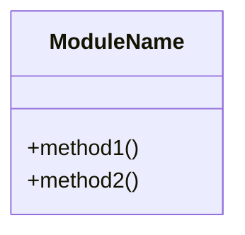
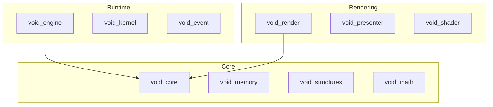
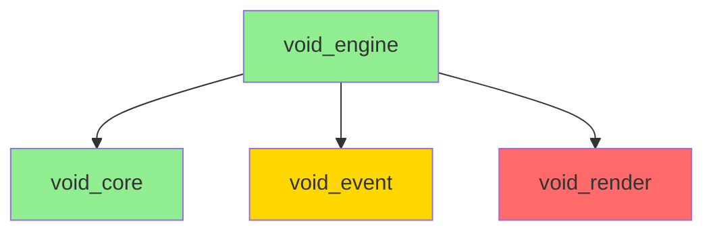
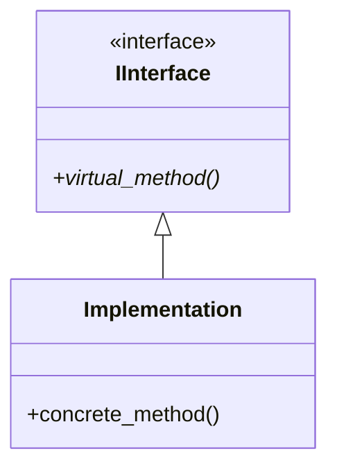
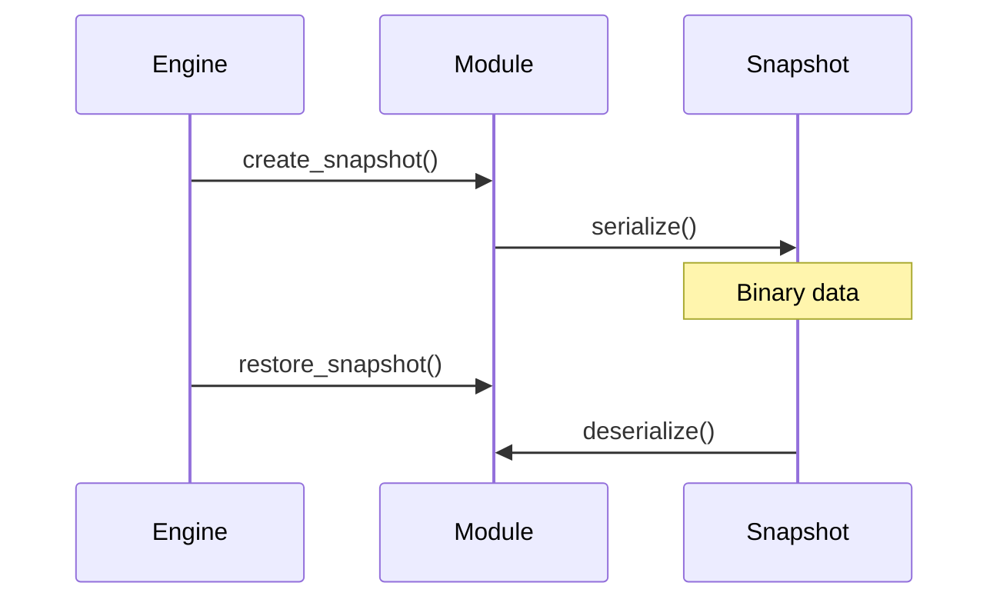

# Void Engine Migration Validation Prompt

## Mission Statement

Execute a **complete, verifiable validation** of the void_engine migration from legacy Rust to modern C++20. This is a **discovery-only phase** - no code will be written. Every finding must be backed by actual file evidence from the codebase.

---

## Primary Objectives

1. **Validate every module** listed in `doc/ACTUAL_MIGRATION_STATUS.md` against:
   - Legacy Rust implementation (`legacy/crates/`)
   - Legacy documentation (`legacy/docs/`)
   - Modern C++ implementation (`src/` and `include/void_engine/`)

2. **Generate per-phase documentation** in `doc/phase/phase_X.md` for each major section

3. **Maintain a master checklist** (`doc/MASTER_CHECKLIST.md`) with progressive mermaid diagrams

4. **Verify hot-reload/hot-swap** capability for every module

---

## Execution Rules

### CRITICAL: No Fabrication
- **NEVER** claim a feature exists without reading the actual file
- **NEVER** mark something as complete without file path evidence
- **ALWAYS** use Glob, Grep, and Read tools to verify
- **ALWAYS** include file paths and line numbers for claims
- Quote actual code snippets as evidence

### Required Tools Usage
- Use `ultrathink` mode for complex analysis
- Use `Explore` agent for codebase discovery
- Use `Grep` for finding implementations
- Use `Read` for verifying file contents
- Reference `.claude/skills/` guides as needed:
  - `cpp-expert.md` for C++ verification
  - `rust-expert.md` for legacy Rust analysis
  - `hot-reload.md` for hot-swap verification
  - `architecture.md` for module design validation

---

## Phase Structure

For each phase, create `doc/phase/phase_X.md` with this structure:

```markdown
# Phase X: [Module Name]

## Executive Summary
- Migration Status: [Claimed %] → [Verified %]
- Hot-Reload Status: [Yes/No/Partial]
- Integration Status: [Integrated/Pending/Missing]

## Legacy Analysis

### Rust Crate Location
- Path: `legacy/crates/[module_name]/`
- Main files: [list with line counts]

### Legacy Features (from Rust)
| Feature | Rust File | Line | Implemented |
|---------|-----------|------|-------------|
| ... | ... | ... | ✓/✗/Partial |

### Legacy Documentation
- Path: `legacy/docs/[relevant_docs]`
- Key concepts: [list]

## Modern C++ Analysis

### Header Files
| File | Purpose | Lines | Complete |
|------|---------|-------|----------|
| ... | ... | ... | ✓/✗ |

### Implementation Files
| File | Purpose | Lines | Complete |
|------|---------|-------|----------|
| ... | ... | ... | ✓/✗ |

### Public API
- Location: `include/void_engine/[module]/`
- Exported types: [list]

## Hot-Reload Verification

### Snapshot System
- [ ] Snapshot struct exists
- [ ] Serialize method implemented
- [ ] Deserialize method implemented
- [ ] State restoration verified

### Evidence
```cpp
// Quote actual code showing hot-reload support
```

## Integration Status

### Dependencies
```mermaid
graph LR
    [module] --> dep1
    [module] --> dep2
```

### Engine Wiring
- [ ] Initialized in Engine::init()
- [ ] Updated in Engine::update()
- [ ] Shutdown in Engine::shutdown()

## Discrepancies Found
1. [List any gaps between legacy and modern]
2. [List any missing features]
3. [List any incomplete implementations]

## Mermaid Architecture Diagram


## Verification Evidence
- File: [path], Line: [number]
- Grep result: [command and output]
- Read excerpt: [relevant code]
```

---

## Master Checklist Structure

Create and maintain `doc/MASTER_CHECKLIST.md`:

```markdown
# Void Engine Migration Master Checklist

## Overall Progress
- Total Modules: [N]
- Verified Complete: [X]
- Verified Partial: [Y]
- Needs Work: [Z]

## Module Status

### Core Infrastructure
- [ ] void_core - [status]
- [ ] void_memory - [status]
- [ ] void_structures - [status]
- [ ] void_math - [status]

### Event & Kernel
- [ ] void_event - [status]
- [ ] void_kernel - [status]

### Engine Runtime
- [ ] void_engine - [status]
- [ ] void_shell - [status]
- [ ] void_runtime - [status]

### Rendering
- [ ] void_render - [status]
- [ ] void_shader - [status]
- [ ] void_presenter - [status]
- [ ] void_compositor - [status]

### Scene & Assets
- [ ] void_scene - [status]
- [ ] void_asset - [status]

### ECS & Scripting
- [ ] void_ecs - [status]
- [ ] void_graph - [status]
- [ ] void_script - [status]
- [ ] void_scripting - [status]
- [ ] void_cpp - [status]
- [ ] void_ir - [status]

### Audio & UI
- [ ] void_audio - [status]
- [ ] void_ui - [status]
- [ ] void_hud - [status]

### AI & Physics
- [ ] void_ai - [status]
- [ ] void_physics - [status]

### Gameplay
- [ ] void_combat - [status]
- [ ] void_inventory - [status]
- [ ] void_triggers - [status]
- [ ] void_gamestate - [status]

### Platform
- [ ] void_xr - [status]
- [ ] void_services - [status]

## Hot-Reload Matrix

| Module | Snapshot | Serialize | Deserialize | Tested |
|--------|----------|-----------|-------------|--------|
| void_core | ✓/✗ | ✓/✗ | ✓/✗ | ✓/✗ |
| ... | ... | ... | ... | ... |

## Master Architecture Diagram



## Verification Log
| Date | Module | Verifier | Result | Notes |
|------|--------|----------|--------|-------|
| ... | ... | Claude | ... | ... |
```

---

## Validation Workflow

### Step 1: Initial Discovery
For each module in ACTUAL_MIGRATION_STATUS.md:

1. **Locate Legacy Rust**
   ```
   Glob: legacy/crates/[module_name]/**/*.rs
   Read: legacy/crates/[module_name]/Cargo.toml
   Read: legacy/crates/[module_name]/src/lib.rs
   ```

2. **Locate Legacy Docs**
   ```
   Glob: legacy/docs/**/*[module_name]*.md
   Grep: [module_name] in legacy/docs/
   ```

3. **Locate Modern C++**
   ```
   Glob: include/void_engine/[module_name]/**/*.hpp
   Glob: src/[module_name]/**/*.cpp
   Read: src/[module_name]/CMakeLists.txt
   ```

### Step 2: Feature Comparison
For each feature claimed in ACTUAL_MIGRATION_STATUS.md:

1. **Find in Legacy**
   - Grep for function/struct names
   - Read implementation details
   - Note any Rust-specific patterns

2. **Find in Modern**
   - Grep for equivalent C++ implementation
   - Compare signatures and behavior
   - Verify completeness

3. **Document Gap**
   - If missing, note in discrepancies
   - If partial, note what's missing
   - If complete, provide evidence

### Step 3: Hot-Reload Verification
For each module:

1. **Check for Snapshot Types**
   ```
   Grep: Snapshot in include/void_engine/[module]/
   Grep: serialize in src/[module]/
   Grep: deserialize in src/[module]/
   ```

2. **Verify Serialization**
   - Read snapshot implementation
   - Check binary format handling
   - Verify magic numbers and versioning

3. **Check State Restoration**
   - Find restore/apply methods
   - Verify all state is captured
   - Note any volatile state not preserved

### Step 4: Integration Verification
For each module:

1. **Check Engine Integration**
   ```
   Grep: [module] in src/core/engine.cpp
   Grep: [module] in include/void_engine/core/engine.hpp
   ```

2. **Check CMake**
   ```
   Read: src/[module]/CMakeLists.txt
   Grep: [module] in CMakeLists.txt (root)
   ```

3. **Check Dependencies**
   - Read CMakeLists.txt DEPENDENCIES
   - Verify all deps are satisfied
   - Build dependency graph

---

## Mermaid Diagram Standards

### Module Dependency Graph

- Green (#90EE90): Fully verified
- Yellow (#FFD700): Partial/Needs review
- Red (#FF6B6B): Missing/Broken

### Class Hierarchy


### Hot-Reload Flow


---

## Output Files

After complete validation, the following files should exist:

```
doc/
├── MASTER_CHECKLIST.md          # Master status with growing mermaid
├── prompt.md                     # This file
├── phase/
│   ├── phase_01_core.md         # void_core, void_memory, void_structures, void_math
│   ├── phase_02_event_kernel.md # void_event, void_kernel
│   ├── phase_03_engine.md       # void_engine, void_shell, void_runtime
│   ├── phase_04_render.md       # void_render, void_shader, void_presenter, void_compositor
│   ├── phase_05_scene.md        # void_scene, void_asset
│   ├── phase_06_ecs.md          # void_ecs
│   ├── phase_07_scripting.md    # void_graph, void_script, void_scripting, void_cpp, void_ir
│   ├── phase_08_audio_ui.md     # void_audio, void_ui, void_hud
│   ├── phase_09_ai_physics.md   # void_ai, void_physics
│   ├── phase_10_gameplay.md     # void_combat, void_inventory, void_triggers, void_gamestate
│   └── phase_11_platform.md     # void_xr, void_services
```

---

## Validation Criteria

### For "Complete" Status
- [ ] All legacy features have C++ equivalents
- [ ] Public API headers exist and are documented
- [ ] Implementation files compile (based on CMakeLists)
- [ ] Hot-reload snapshot system implemented
- [ ] Integration points wired in engine

### For "Partial" Status
- [ ] Core functionality exists
- [ ] Some features missing or stubbed
- [ ] Hot-reload may be incomplete
- [ ] Integration may be pending

### For "Missing" Status
- [ ] Only stubs or declarations
- [ ] No real implementation
- [ ] No hot-reload support
- [ ] No engine integration

---

## Execution Command

When ready to begin validation, execute phases in order:

1. Create `doc/phase/` directory
2. Create `doc/MASTER_CHECKLIST.md` with empty template
3. For each phase (1-11):
   - Explore legacy crates
   - Explore legacy docs
   - Explore modern C++
   - Compare and document
   - Update master checklist
   - Add to master mermaid diagram
4. Generate final summary

---

## Important Notes

- **Time**: This is a thorough process. Each phase may take significant exploration.
- **Accuracy**: Never assume. Always verify with actual file reads.
- **Evidence**: Include file paths, line numbers, and code snippets.
- **Honesty**: If something is missing or broken, document it clearly.
- **Diagrams**: Update the master mermaid after each phase completion.

---

## Begin Validation

To start the validation process, respond with:

"Ready to begin Phase 1: Core Infrastructure validation. Please confirm to proceed."

Then await user confirmation before executing each phase.
