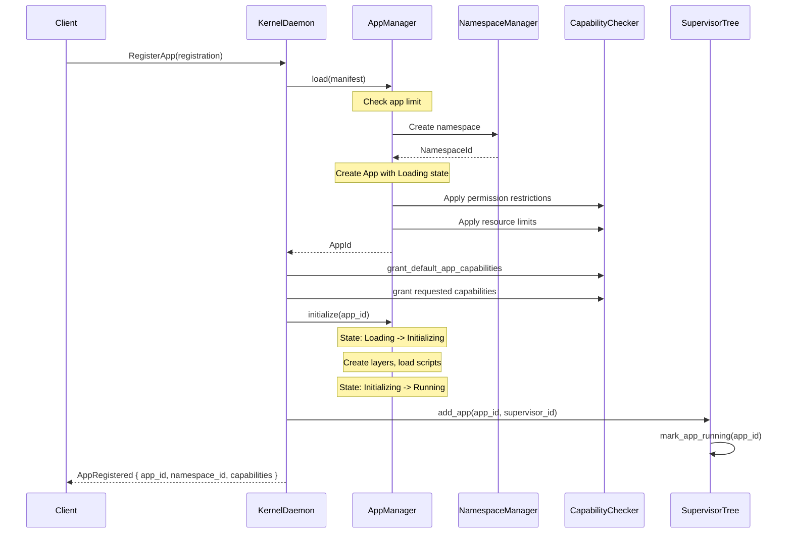
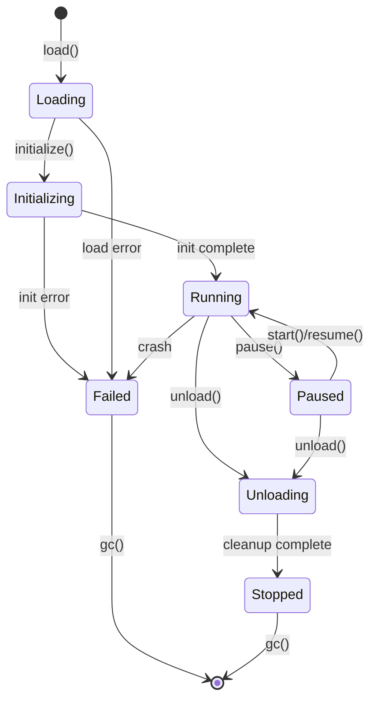
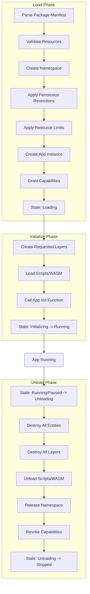
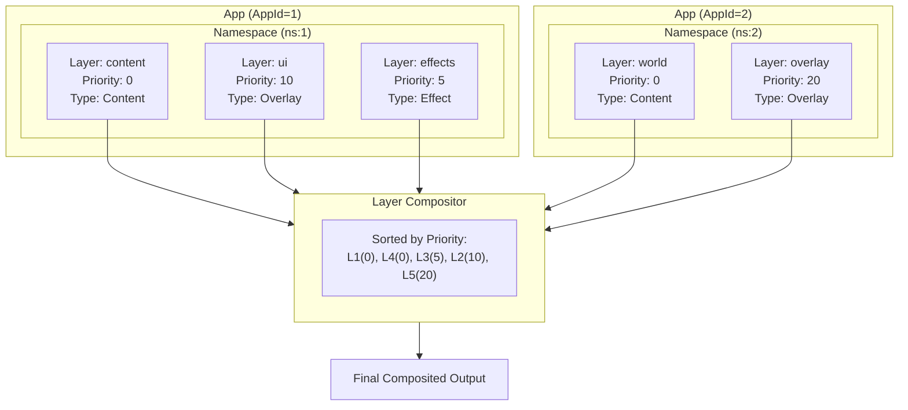
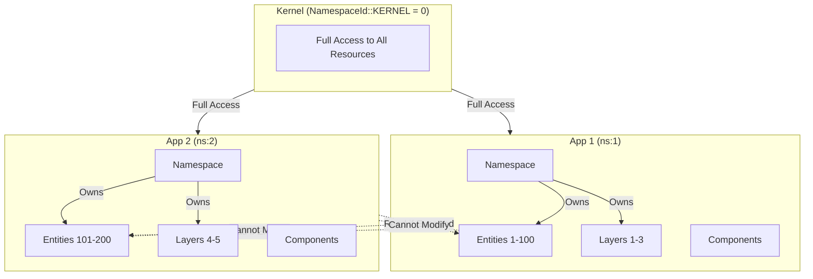
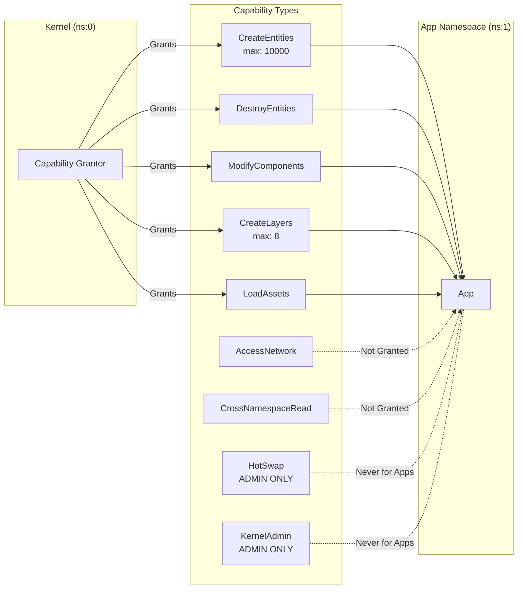
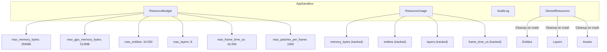
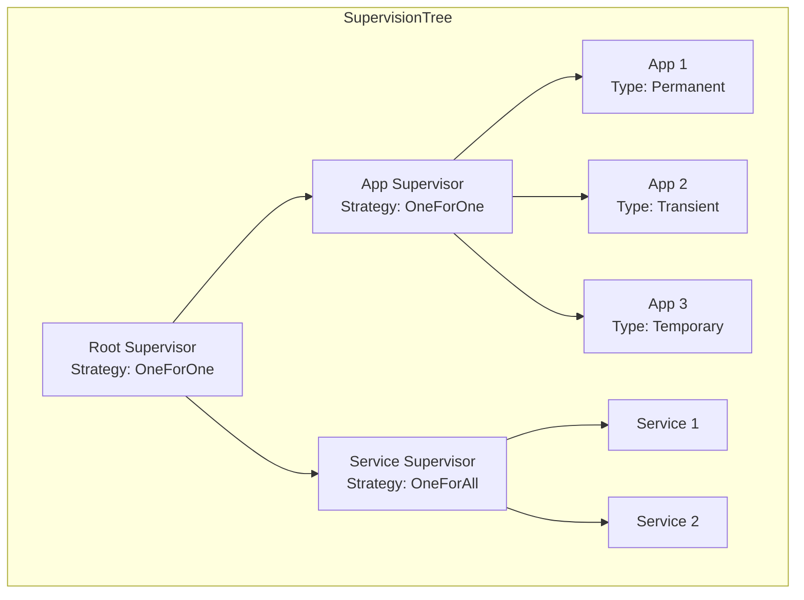
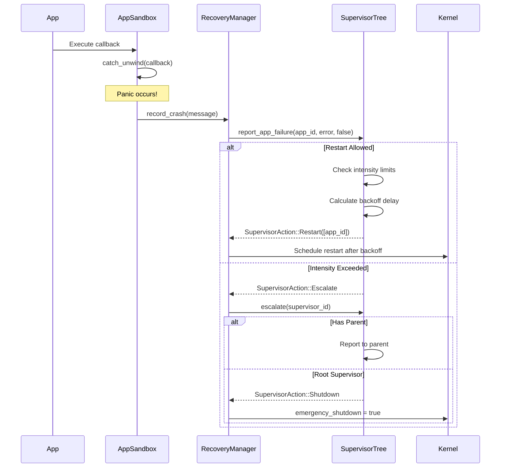

# Void GUI v2 - App System Architecture

## Overview

The App system in Void GUI v2 is the primary unit of isolation and execution. Unlike traditional GUI frameworks where "apps" might simply be scenes or views, Void's Apps are **fully isolated process-like entities** with their own namespaces, capabilities, resource budgets, and lifecycle management. The architecture draws inspiration from microkernel designs (seL4), actor systems (Erlang OTP), and modern container orchestration.

---

## 1. What Apps Actually Are

Apps in Void Engine are **isolated modular units** that:

1. **Run in their own namespace** - Each app gets a unique `NamespaceId` that scopes all its operations
2. **Own their own layers** - Apps render to layers they create and own (can have multiple)
3. **Have explicit capabilities** - All permissions are granted via unforgeable capability tokens
4. **Are resource-constrained** - Memory, entities, layers, and CPU time are budgeted
5. **Are supervised** - Part of an Erlang-style supervision tree for fault tolerance
6. **Are sandboxed** - Crash containment prevents one app from affecting others

### Core Data Structures

```rust
// From crates/void_kernel/src/app.rs
pub struct App {
    pub id: AppId,                      // Unique identifier (atomic counter)
    pub manifest: AppManifest,          // Configuration from package
    pub namespace_id: NamespaceId,      // Isolation boundary
    pub state: AppState,                // Current lifecycle state
    pub loaded_at: Instant,             // When loaded
    pub last_active: Instant,           // Last activity timestamp
    pub error: Option<String>,          // Error if failed
    pub layers: Vec<LayerId>,           // Owned layers
    pub metrics: AppMetrics,            // Performance metrics
}
```

### App Manifest

The manifest defines what an app needs and what permissions it requests:

```rust
pub struct AppManifest {
    pub name: String,
    pub version: String,
    pub description: Option<String>,
    pub author: Option<String>,
    pub layers: Vec<LayerRequest>,       // Requested layers
    pub resources: ResourceRequirements, // Resource limits
    pub permissions: AppPermissions,     // Requested permissions
}
```

---

## 2. App Creation Flow



### Key Steps in App Creation

| Step | Description | Location |
|------|-------------|----------|
| 1. Manifest Validation | Validate required fields | `app.rs:227` |
| 2. Namespace Creation | Assign unique `NamespaceId` | `app.rs:233` |
| 3. Permission Mapping | Translate manifest permissions | `app.rs:237` |
| 4. Resource Limits | Apply limits to namespace | `app.rs:242-245` |
| 5. App Instantiation | Create app in `Loading` state | `app.rs:251` |
| 6. Capability Granting | Grant default + requested capabilities | `daemon.rs:575` |
| 7. Initialization | Transition to `Running` | `app.rs:262` |
| 8. Supervision Registration | Add to supervision tree | `daemon.rs:539` |

---

## 3. App Lifecycle State Machine



### State Definitions

| State | Description |
|-------|-------------|
| `Loading` | App manifest parsed, namespace created, waiting for initialization |
| `Initializing` | Creating layers, loading scripts/WASM, calling app's init function |
| `Running` | App is active, processing frames, emitting patches |
| `Paused` | App is temporarily suspended but resources retained |
| `Unloading` | Destroying entities, layers, releasing namespace |
| `Stopped` | App has cleanly terminated, awaiting GC |
| `Failed` | App encountered an unrecoverable error |

### State Transition Code

```rust
// From app.rs
pub fn start(&mut self, id: AppId) -> Result<(), AppError> {
    let app = self.apps.get_mut(&id).ok_or(AppError::NotFound(id))?;
    match app.state {
        AppState::Paused | AppState::Initializing => {
            app.set_state(AppState::Running);
            Ok(())
        }
        AppState::Running => Ok(()), // Already running
        _ => Err(AppError::InvalidState),
    }
}
```

---

## 4. App Loading/Unloading Flow



### Loading Implementation

```rust
// From app.rs - AppManager::load()
pub fn load(&mut self, manifest: AppManifest) -> Result<AppId, AppError> {
    if self.apps.len() >= self.max_apps {
        return Err(AppError::TooManyApps);
    }

    // Create namespace for this app
    let mut namespace = Namespace::new(&manifest.name);

    // Apply permission restrictions
    if !manifest.permissions.cross_app_read {
        namespace.permissions.cross_namespace_read = false;
    }

    // Apply resource limits
    if let Some(max_entities) = manifest.resources.max_entities {
        namespace.limits.max_entities = Some(max_entities);
    }
    if let Some(max_layers) = manifest.resources.max_layers {
        namespace.limits.max_layers = Some(max_layers);
    }

    let namespace_id = namespace.id;
    let handle = self.patch_bus.register_namespace(namespace);

    let app = App::new(manifest, namespace_id);
    let id = app.id;

    self.apps.insert(id, app);
    self.handles.insert(id, handle);

    Ok(id)
}
```

### Unloading Implementation

```rust
// From app.rs - AppManager::unload()
pub fn unload(&mut self, id: AppId) -> Result<(), AppError> {
    let app = self.apps.get_mut(&id).ok_or(AppError::NotFound(id))?;
    app.set_state(AppState::Unloading);

    // 1. Destroy all app's entities
    // 2. Destroy all app's layers
    // 3. Unload app's scripts/WASM
    // 4. Release namespace

    app.set_state(AppState::Stopped);
    self.handles.remove(&id);
    Ok(())
}
```

---

## 5. Layer Ownership



### Layer-App Relationship

Each layer is owned by exactly one namespace (and thus one app):

```rust
// From layer.rs
pub struct Layer {
    pub id: LayerId,
    pub name: String,
    pub owner: NamespaceId,  // <-- Ownership binding
    pub config: LayerConfig,
    pub dirty: bool,
    pub last_rendered_frame: u64,
}
```

### Layer Types

```rust
pub enum LayerType {
    Content,  // 3D world content
    Effect,   // Post-processing effects
    Overlay,  // UI overlays
    Portal,   // 3D portal surfaces
}
```

### Layer Manager Tracking

```rust
pub struct LayerManager {
    layers: HashMap<LayerId, Layer>,
    by_namespace: HashMap<NamespaceId, Vec<LayerId>>,  // Per-namespace index
    sorted_layers: Vec<LayerId>,                        // Priority-sorted
}
```

### Layer Destruction on App Unload

```rust
pub fn destroy_namespace_layers(&mut self, namespace: NamespaceId) {
    if let Some(layer_ids) = self.by_namespace.remove(&namespace) {
        for id in layer_ids {
            self.layers.remove(&id);
            self.sorted_layers.retain(|&lid| lid != id);
        }
        log::debug!("Destroyed all layers for namespace {}", namespace);
    }
}
```

---

## 6. Namespace Isolation Model



### Security Properties

1. **Apps cannot forge namespace IDs** - IDs are generated atomically
2. **Apps can only modify entities in their own namespace**
3. **Cross-namespace reads require explicit capability**
4. **Resource limits are enforced per-namespace**

### Access Control Implementation

```rust
// From namespace.rs
pub fn check_access(
    &self,
    requester: NamespaceId,
    target_namespace: NamespaceId,
    target_entity: u64,
    write: bool,
) -> NamespaceAccess {
    // Kernel has full access
    if requester.is_kernel() {
        return NamespaceAccess::Allowed;
    }

    // Same namespace - always allowed
    if requester == target_namespace {
        return NamespaceAccess::Allowed;
    }

    // Cross-namespace access - check exports and capabilities
    if write {
        return NamespaceAccess::Denied(NamespaceError::CrossNamespaceWrite);
    }
    // Check if entity is exported...
}
```

### Entity Export System

Apps can selectively export entities for cross-namespace access:

```rust
pub struct EntityExport {
    pub local_id: u64,
    pub readable_components: Vec<String>,
    pub writable_components: Vec<String>,
    pub access: ExportAccess,
}

pub enum ExportAccess {
    Public,                           // Any namespace can access
    Allowlist(Vec<NamespaceId>),     // Only specific namespaces
    CapabilityRequired(String),       // Requires a specific capability
}
```

---

## 7. Capability System



### Capability Structure

```rust
pub struct Capability {
    pub id: CapabilityId,           // Unforgeable token
    pub kind: CapabilityKind,       // What it permits
    pub holder: NamespaceId,        // Who holds it
    pub grantor: NamespaceId,       // Who granted it
    pub created_at: Instant,        // When created
    pub expires_at: Option<Instant>, // Optional expiration
    pub delegable: bool,            // Can be passed to others
    pub reason: Option<String>,     // For auditing
}
```

### Capability Types

```rust
pub enum CapabilityKind {
    CreateEntities { max: Option<u32> },
    DestroyEntities,
    ModifyComponents { allowed_types: Option<Vec<String>> },
    CreateLayers { max: Option<u32> },
    ModifyLayers { allowed_layers: Option<Vec<LayerId>> },
    LoadAssets { allowed_paths: Option<Vec<String>> },
    AccessNetwork { allowed_hosts: Option<Vec<String>> },
    AccessFilesystem { allowed_paths: Option<Vec<String>> },
    CrossNamespaceRead { allowed_namespaces: Option<Vec<NamespaceId>> },
    ExecuteScripts,
    HotSwap,              // Admin only
    ManageCapabilities,   // Admin only
    KernelAdmin,          // Admin only
}
```

### Default App Capabilities

```rust
pub fn grant_default_app_capabilities(&mut self, namespace: NamespaceId, grantor: NamespaceId) {
    self.grant(Capability::new(
        CapabilityKind::CreateEntities { max: Some(10000) },
        namespace, grantor,
    ));
    self.grant(Capability::new(
        CapabilityKind::DestroyEntities,
        namespace, grantor,
    ));
    self.grant(Capability::new(
        CapabilityKind::ModifyComponents { allowed_types: None },
        namespace, grantor,
    ));
    self.grant(Capability::new(
        CapabilityKind::CreateLayers { max: Some(8) },
        namespace, grantor,
    ));
    self.grant(Capability::new(
        CapabilityKind::LoadAssets { allowed_paths: None },
        namespace, grantor,
    ));
}
```

---

## 8. Resource Budgets and Sandboxing



### ResourceBudget Structure

```rust
pub struct ResourceBudget {
    pub max_memory_bytes: u64,           // Default: 256 MB
    pub max_gpu_memory_bytes: u64,       // Default: 512 MB
    pub max_entities: u32,               // Default: 10,000
    pub max_layers: u32,                 // Default: 8
    pub max_assets: u32,                 // Default: 1000
    pub max_frame_time_us: u64,          // Default: 16,000 (~16ms)
    pub max_patches_per_frame: u32,      // Default: 1000
    pub max_draw_calls: u32,             // Default: 1000
    pub max_compute_dispatches: u32,     // Default: 100
}
```

### Crash Containment

```rust
pub fn execute<F, R>(&mut self, f: F) -> Result<R, SandboxError>
where
    F: FnOnce() -> R + panic::UnwindSafe,
{
    let start = Instant::now();
    let result = panic::catch_unwind(f);

    match result {
        Ok(value) => {
            if elapsed.as_micros() as u64 > self.budget.max_frame_time_us {
                log::warn!("Sandbox exceeded time budget");
            }
            Ok(value)
        }
        Err(panic_payload) => {
            self.record_crash(&message);
            Err(SandboxError::Panic { ... })
        }
    }
}
```

### Crash Limits

```rust
pub fn exceeded_crash_limit(&self) -> bool {
    self.crash_count >= self.max_crashes  // Default: 3
}
```

---

## 9. Supervision Integration



### Restart Strategies

```rust
pub enum RestartStrategy {
    OneForOne,  // Restart only the failed child
    OneForAll,  // Restart all children when one fails
    RestForOne, // Restart failed child and all started after it
}
```

### Child Types

```rust
pub enum ChildType {
    Permanent,  // Always restart
    Temporary,  // Never restart
    Transient,  // Restart only if abnormal exit
}
```

### Restart Intensity

```rust
pub struct RestartIntensity {
    pub max_restarts: u32,      // Default: 5
    pub window_secs: u32,       // Default: 60s
    pub backoff: BackoffConfig,
}

pub struct BackoffConfig {
    pub initial_delay_ms: u64,  // Default: 100ms
    pub max_delay_ms: u64,      // Default: 30,000ms
    pub multiplier: f32,        // Default: 2.0
}
```

### Failure Handling Flow



---

## 10. Package Format

Apps are distributed as `.mvp` (Metaverse Package) files:

```
myapp.mvp (ZIP archive)
├── manifest.toml      # App manifest
├── icon.png           # App icon (optional)
├── assets/            # Asset files
│   ├── models/
│   ├── textures/
│   └── audio/
├── scripts/           # VoidScript files
│   └── main.vs
├── wasm/              # WASM modules (optional)
│   └── logic.wasm
└── signature          # Package signature (optional)
```

### Package Manifest (TOML)

```toml
[package]
name = "my-app"
version = "1.0.0"
author = "Developer"
description = "My awesome app"

[app]
entry = "scripts/main.vs"

[[layers]]
name = "content"
type = "content"
priority = 0

[[layers]]
name = "ui"
type = "overlay"
priority = 100

[resources]
max_entities = 5000
max_layers = 4
max_memory_mb = 128

[permissions]
cross_app_read = false
network_access = false
filesystem_access = false
```

---

## Key Design Principles

| Principle | Implementation |
|-----------|----------------|
| **Kernel Never Dies** | All app failures contained via `catch_unwind` |
| **Apps Are Untrusted** | Capability checks on every operation |
| **Declarative State** | Changes only via IR patches |
| **Layer Isolation** | Failed shader = black layer, not crash |
| **Hot-Swap Everything** | No restart ever required |
| **Mandatory Rollback** | Last-known-good always available |
| **Resource Budgets** | Every app is sandboxed |
| **Supervision Trees** | Automatic restart with backoff |

---

## Critical Source Files

| File | Purpose |
|------|---------|
| `crates/void_kernel/src/app.rs` | Core App struct, AppManager, lifecycle |
| `crates/void_kernel/src/layer.rs` | Layer ownership, LayerManager |
| `crates/void_kernel/src/namespace.rs` | Namespace isolation, access control |
| `crates/void_kernel/src/capability.rs` | Capability system, permissions |
| `crates/void_kernel/src/sandbox.rs` | ResourceBudget, crash containment |
| `crates/void_kernel/src/supervisor.rs` | Supervision tree, restart strategies |
| `crates/void_kernel/src/daemon.rs` | App registration, lifecycle orchestration |
| `crates/void_kernel/src/package.rs` | Package parsing, manifest loading |
