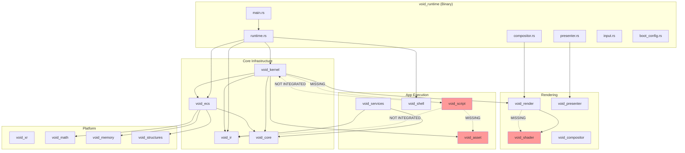

# Void Runtime Requirements Analysis

**Document Status**: Critical Path Analysis
**Last Updated**: 2026-01-05
**Goal**: Enable full example apps (Nebula Genesis, Portal Dimensions, Synthwave Dreamscape) to run

---

## Executive Summary

The `void_runtime` crate is the heart of the Metaverse OS - it creates the persistent runtime that hosts applications. Currently, the runtime has solid foundational infrastructure but lacks the integration layers needed to actually **execute** the example applications.

**Current State**: Runtime boots, shows a shell overlay, renders demo shapes.
**Target State**: Runtime loads apps from manifests, executes VoidScript, renders multi-layer content.

---

## 1. Current State Analysis

### 1.1 What Works

| Component | Status | Description |
|-----------|--------|-------------|
| Kernel Boot | Working | `void_kernel::Kernel` initializes with config, watchdog, supervisor tree |
| Layer Management | Working | `LayerManager` creates/destroys layers, tracks visibility/priority |
| App Management | Partial | `AppManager` loads manifests, creates namespaces, but no actual app execution |
| Patch Bus | Working | `PatchBus` routes IR transactions between namespaces |
| ECS World | Working | `void_ecs::World` exists but not integrated with rendering |
| Shell Commands | Working | CLI mode and overlay execute basic commands |
| GPU Presenter | Working | wgpu-based rendering to window/DRM |
| Basic Compositor | Working | Renders colored quads, text overlay |

### 1.2 What's Missing for App Execution

| Component | Status | Blocker Level |
|-----------|--------|---------------|
| Manifest Parser | Not Implemented | CRITICAL - Apps can't load |
| Script Loader | Not Implemented | CRITICAL - VoidScript not executed |
| Script-to-Kernel Bridge | Not Implemented | CRITICAL - `emit_patch()` is stub |
| Entity Rendering | Not Implemented | CRITICAL - No GPU representation |
| Material System | Not Implemented | HIGH - Shaders can't bind |
| Shader Compiler | Not Implemented | HIGH - WGSL not compiled |
| Post-Processing | Not Implemented | MEDIUM - Effects don't render |
| Asset Pipeline | Partial | HIGH - Assets not loaded at runtime |

---

## 2. Dependency Graph



---

## 3. Example App Requirements Analysis

### 3.1 Nebula Genesis Requirements

**Entry Point**: `examples/nebula-genesis/scripts/main.vs`

| Feature Required | Used In | Current Status |
|-----------------|---------|----------------|
| `emit_patch()` for entity creation | `spawn_galaxy_entity()` | STUB - not connected to kernel |
| `emit_patch()` for component updates | `update_galaxy()` | STUB |
| Particle instancing (100K particles) | Galaxy rendering | NOT IMPLEMENTED |
| Additive blend layers | star_field, nebula_clouds | NOT IMPLEMENTED |
| Post-processing bloom | bloom layer | NOT IMPLEMENTED |
| Lifecycle hooks (`on_init`, `on_update`) | App entry | NOT IMPLEMENTED |
| Math builtins (`sin`, `cos`, `sqrt`, `random`) | Physics sim | IMPLEMENTED (stubs) |
| Shader loading | galaxy_particle.wgsl | NOT IMPLEMENTED |
| Transform component | Entity positioning | STUB |
| Material uniforms | view_matrix, time | NOT IMPLEMENTED |

**Layers Declared**:
- `deep_space` (priority -100, replace blend)
- `nebula_clouds` (priority -50, additive)
- `star_field` (priority 0, additive)
- `galaxy_core` (priority 50, additive)
- `bloom` (priority 100, effect/additive)
- `ui` (priority 200, overlay/normal)

### 3.2 Portal Dimensions Requirements

**Entry Point**: `examples/portal-dimensions/scripts/main.vs`

| Feature Required | Used In | Current Status |
|-----------------|---------|----------------|
| Portal render-to-texture | Recursive portals | NOT IMPLEMENTED |
| Multiple render targets | portal_a, portal_b layers | NOT IMPLEMENTED |
| Dimension switching | `teleport_through_portal()` | NOT IMPLEMENTED |
| Environment component | Sky/ambient colors | NOT IMPLEMENTED |
| Distortion shader | Post-process | NOT IMPLEMENTED |
| Chromatic aberration | Post-process | NOT IMPLEMENTED |
| Player entity with physics | Movement, collision | NOT IMPLEMENTED |
| Portal collision detection | Transition trigger | NOT IMPLEMENTED |

**Layers Declared**:
- `world` (priority 0, replace)
- `portal_a` (priority 10, portal type, replace)
- `portal_b` (priority 20, portal type, replace)
- `distortion` (priority 50, effect)
- `chromatic` (priority 60, effect)
- `ui` (priority 100, overlay)

### 3.3 Synthwave Dreamscape Requirements

**Entry Point**: `examples/synthwave-dreamscape/scripts/main.vs`

| Feature Required | Used In | Current Status |
|-----------------|---------|----------------|
| Fullscreen quad rendering | Sky gradient | NOT IMPLEMENTED |
| Infinite grid shader | neon_grid.wgsl | NOT IMPLEMENTED |
| Procedural geometry | Mountains | NOT IMPLEMENTED |
| Beat-reactive animation | Pulse effects | NOT IMPLEMENTED |
| CRT/scanline effect | crt_effect.wgsl | NOT IMPLEMENTED |
| Theme switching | Color palette updates | NOT IMPLEMENTED |
| Keyboard input | Speed/theme control | PARTIAL (winit events) |

**Layers Declared**:
- `sky` (priority -100, replace)
- `sun` (priority -50, additive)
- `mountains` (priority 0, normal)
- `grid` (priority 10, additive)
- `particles` (priority 20, additive)
- `glow` (priority 100, effect/additive)
- `scanlines` (priority 110, effect/multiply)
- `ui` (priority 200, overlay)

---

## 4. Missing Components - Detailed Analysis

### 4.1 CRITICAL: App Manifest Loader

**Location**: Should be in `void_kernel::package` or new `void_manifest` crate

**Current State**: `AppManifest` struct exists but is manually constructed in code.

**Required**:
```rust
// Example of what's needed
pub struct ManifestLoader {
    pub fn load_from_file(path: &Path) -> Result<AppManifest, ManifestError>;
    pub fn load_from_toml(content: &str) -> Result<AppManifest, ManifestError>;
    pub fn validate(manifest: &AppManifest) -> Result<(), ValidationError>;
}

// Must parse this TOML structure from example manifests:
// [package]
// name = "nebula-genesis"
// ...
// [app]
// app_type = "demo"
// entry = "scripts/main.vs"
// [[app.layers]]
// name = "star_field"
// type = "content"
// priority = 0
// blend = "additive"
```

**Priority**: P0 - Blocking everything

### 4.2 CRITICAL: Script Execution Bridge

**Location**: New integration layer between `void_script` and `void_runtime`

**Current State**:
- `VoidScript` interpreter exists with full parser/evaluator
- Built-in functions are STUBs that return mock data
- No connection to the kernel's patch bus

**Required**:
```rust
pub struct AppScriptContext {
    /// Script interpreter
    script: VoidScript,
    /// Reference to kernel for patch submission
    kernel: Arc<Mutex<Kernel>>,
    /// This app's namespace handle
    namespace: NamespaceHandle,
    /// ECS world for queries
    world: Arc<RwLock<World>>,
}

impl AppScriptContext {
    /// Wire emit_patch() to actually submit to PatchBus
    fn register_kernel_builtins(&mut self) {
        let patch_bus = self.kernel.patch_bus();
        let namespace = self.namespace.clone();

        self.script.register_fn("emit_patch", move |args| {
            let patch_data = args[0].to_json()?;
            let patch = Patch::from_json(&patch_data, namespace.id())?;
            let tx = TransactionBuilder::new(namespace.id())
                .patch(patch)
                .build();
            namespace.submit(tx)?;
            Ok(Value::Bool(true))
        });
    }

    /// Call lifecycle hooks
    fn call_init(&mut self) -> Result<(), ScriptError>;
    fn call_update(&mut self, dt: f32) -> Result<(), ScriptError>;
    fn call_shutdown(&mut self) -> Result<(), ScriptError>;
}
```

**Integration Points**:
1. `emit_patch()` -> `PatchBus::submit()`
2. `get_namespace()` -> Return current app's `NamespaceId`
3. `get_fps()` -> `Kernel::timing.avg_fps`
4. `random()`, math functions -> Already implemented, just need real RNG
5. Entity creation -> Create in ECS via patch
6. Component updates -> Modify ECS via patch

**Priority**: P0 - Core functionality

### 4.3 CRITICAL: Entity Rendering Pipeline

**Location**: Integration between `void_ecs`, `void_render`, and GPU

**Current State**:
- ECS stores components
- `void_render` has resource descriptions
- No actual GPU resource allocation or rendering

**Required**:
```rust
pub trait RenderableComponent {
    fn get_mesh(&self) -> MeshId;
    fn get_material(&self) -> MaterialId;
    fn get_layer(&self) -> LayerId;
}

pub struct EntityRenderer {
    /// GPU resources for each entity
    entity_resources: HashMap<EntityId, EntityGpuResources>,
    /// Shared mesh cache
    mesh_cache: MeshCache,
    /// Material instances
    materials: HashMap<MaterialId, Material>,
}

impl EntityRenderer {
    /// Called when ECS has entity with Renderable component
    fn prepare_entity(&mut self, entity: EntityId, renderable: &Renderable);

    /// Render all entities to their assigned layers
    fn render_to_layers(
        &mut self,
        world: &World,
        layer_manager: &LayerManager,
        encoder: &mut CommandEncoder,
    );
}
```

**Component Types Needed**:
- `Transform` { position, rotation, scale }
- `Renderable` { mesh, layer, instance_count }
- `Material` { shader, blend_mode, uniforms }
- `ParticleBuffer` { positions, velocities, colors, sizes, count }

**Priority**: P0 - No visuals without this

### 4.4 HIGH: Shader Compilation Pipeline

**Location**: `void_shader` crate (exists but needs runtime integration)

**Current State**:
- `void_shader` has shader module definitions
- No runtime compilation or loading from files

**Required**:
```rust
pub struct ShaderManager {
    /// Compiled shader modules
    modules: HashMap<String, wgpu::ShaderModule>,
    /// Pipeline cache
    pipelines: HashMap<PipelineKey, wgpu::RenderPipeline>,
}

impl ShaderManager {
    /// Load and compile WGSL from file
    fn load_shader(&mut self, device: &Device, path: &str) -> Result<ShaderId, ShaderError>;

    /// Create render pipeline for material
    fn create_pipeline(
        &mut self,
        device: &Device,
        shader_id: ShaderId,
        vertex_layout: &VertexBufferLayout,
        blend_mode: BlendMode,
        format: TextureFormat,
    ) -> Result<PipelineId, ShaderError>;
}
```

**Example Shaders to Support**:
- `galaxy_particle.wgsl` - Instanced particle rendering
- `bloom.wgsl` - Multi-pass bloom effect
- `neon_grid.wgsl` - Procedural grid with glow
- `synthwave_sun.wgsl` - Gradient circle with scanlines
- `portal_surface.wgsl` - Swirling portal effect
- `chromatic.wgsl` - Chromatic aberration post-process
- `crt_effect.wgsl` - CRT simulation

**Priority**: P1 - Needed for any custom visuals

### 4.5 HIGH: Material and Uniform System

**Location**: New or in `void_render`

**Current State**: `Material` component mentioned but no uniform binding

**Required**:
```rust
pub struct Material {
    /// Shader to use
    pub shader: ShaderId,
    /// Uniform buffer data
    pub uniforms: UniformBlock,
    /// Blend mode
    pub blend_mode: BlendMode,
    /// Textures
    pub textures: Vec<TextureBinding>,
}

pub struct UniformBlock {
    /// Named uniform values
    values: HashMap<String, UniformValue>,
    /// GPU buffer (lazy-allocated)
    buffer: Option<Buffer>,
}

pub enum UniformValue {
    Float(f32),
    Vec2([f32; 2]),
    Vec3([f32; 3]),
    Vec4([f32; 4]),
    Mat4([[f32; 4]; 4]),
    Int(i32),
}
```

**Common Uniforms from Examples**:
- `time: f32`
- `view_matrix: mat4x4<f32>`
- `projection_matrix: mat4x4<f32>`
- `color_top, color_bottom: vec4<f32>`
- `glow_intensity: f32`
- `distortion: f32`

**Priority**: P1 - Materials are referenced everywhere

### 4.6 HIGH: Asset Loading at Runtime

**Location**: `void_asset` crate

**Current State**:
- `AssetServer` exists with loader registry
- Not integrated with runtime or script context

**Required**:
```rust
pub struct RuntimeAssetServer {
    /// Core asset server
    server: AssetServer,
    /// Watches for hot-reload
    watcher: Option<FileWatcher>,
}

impl RuntimeAssetServer {
    /// Load asset from app's asset directory
    fn load_app_asset<T>(&self, app_id: AppId, path: &str) -> Handle<T>
    where T: Asset;

    /// Get app's asset root
    fn app_asset_root(&self, app_id: AppId) -> PathBuf;
}
```

**Asset Types Needed**:
- Shaders (`.wgsl`)
- Scripts (`.vs`)
- Future: Textures, Meshes, Audio

**Priority**: P1 - Apps reference assets

### 4.7 MEDIUM: Post-Processing Pipeline

**Location**: New subsystem in `void_render` or `void_compositor`

**Current State**: Not implemented

**Required**:
```rust
pub struct PostProcessPipeline {
    /// Intermediate render targets
    targets: Vec<RenderTarget>,
    /// Effect passes in order
    passes: Vec<PostProcessPass>,
}

pub struct PostProcessPass {
    pub name: String,
    pub shader: ShaderId,
    pub inputs: Vec<TextureInput>,
    pub output: RenderTargetId,
    pub uniforms: UniformBlock,
}

// Common effects needed:
// - Bloom (threshold + blur + composite)
// - Chromatic aberration
// - CRT effect (scanlines, curvature, vignette)
// - Distortion (screen-space warp)
```

**Priority**: P2 - Enhances visuals but not blocking

### 4.8 MEDIUM: Multi-Layer Composition

**Location**: `void_runtime::compositor.rs` or `void_render::compositor`

**Current State**:
- `LayerManager` tracks layer priorities
- Compositor renders simple shapes, not layer content

**Required**:
```rust
pub struct LayerCompositor {
    /// Render target per layer
    layer_targets: HashMap<LayerId, RenderTarget>,
    /// Final composite target
    composite_target: RenderTarget,
    /// Blend shaders for each mode
    blend_pipelines: HashMap<BlendMode, RenderPipeline>,
}

impl LayerCompositor {
    /// Render entity to its layer's target
    fn render_to_layer(&mut self, layer_id: LayerId, ...);

    /// Composite all layers in priority order
    fn composite_layers(&mut self, layers: &[LayerId], output: &TextureView);
}
```

**Blend Modes from Examples**:
- `replace` - Opaque overwrite
- `normal` - Alpha blend
- `additive` - Add RGB
- `multiply` - Multiply RGB

**Priority**: P2 - Needed for visual correctness

---

## 5. Implementation Priority Order

### Phase 1: App Loading (P0)
1. **Manifest Loader** - Parse TOML manifests from examples
2. **Script Loader** - Load `.vs` files, handle `import`
3. **Script-Kernel Bridge** - Wire `emit_patch()` to `PatchBus`
4. **Lifecycle Hooks** - Call `on_init()`, `on_update(dt)`

### Phase 2: Basic Rendering (P0)
5. **Entity Renderer** - GPU resources for ECS entities
6. **Transform System** - Position/rotation/scale to GPU
7. **Basic Material** - Single shader with uniforms
8. **Shader Loading** - Compile WGSL at runtime

### Phase 3: Visual Quality (P1)
9. **Material Uniforms** - Full uniform buffer system
10. **Texture Loading** - Image assets to GPU
11. **Particle System** - Instanced rendering for ParticleBuffer
12. **Multi-Layer Targets** - Render to layer textures

### Phase 4: Effects (P2)
13. **Layer Composition** - Blend layers correctly
14. **Post-Processing** - Bloom, CRT, etc.
15. **Portal Rendering** - Render-to-texture recursion
16. **Hot-Reload** - Watch assets, reload shaders

---

## 6. Integration Points Summary

### void_runtime <-> void_kernel
```
Runtime                         Kernel
-------                         ------
runtime.update()      -->       kernel.begin_frame()
                                kernel.process_transactions()
                                kernel.build_render_graph()
                                kernel.end_frame()

runtime.load_app()    -->       kernel.app_manager().load(manifest)
                                kernel.app_manager().initialize(id)

runtime.shutdown()    -->       kernel.shutdown()
```

### void_script <-> void_kernel (MISSING)
```
Script                          Kernel
------                          ------
emit_patch(data)      -->       patch_bus.submit(transaction)
get_namespace()       -->       app_handle.namespace_id()
spawn("entity")       -->       emit_patch({type: "entity", op: "create"})
set_component(...)    -->       emit_patch({type: "component", op: "update"})
```

### void_ecs <-> void_render (MISSING)
```
ECS                             Render
---                             ------
Query<Transform, Renderable>    EntityRenderer.prepare()
ComponentChanged<Material>      MaterialCache.invalidate()
EntitySpawned                   EntityGpuResources.allocate()
EntityDespawned                 EntityGpuResources.free()
```

### void_asset <-> void_runtime (PARTIAL)
```
Asset                           Runtime
-----                           -------
AssetServer                     RuntimeAssetServer wrapper
Handle<Shader>        -->       ShaderManager.get_or_load()
Handle<Script>        -->       ScriptLoader.load()
AssetEvent::Modified  -->       Hot-reload trigger
```

---

## 7. File Structure Recommendations

```
crates/
  void_runtime/
    src/
      main.rs              # Entry point (exists)
      runtime.rs           # Core runtime (exists)
      compositor.rs        # Layer compositor (exists, needs rework)
      presenter.rs         # GPU presenter (exists)
      input.rs             # Input handling (exists)
      boot_config.rs       # Backend config (exists)

      app/                 # NEW: App execution
        mod.rs
        manifest.rs        # Manifest parser
        script_context.rs  # Script-kernel bridge
        lifecycle.rs       # Hook management

      render/              # NEW: Entity rendering
        mod.rs
        entity_renderer.rs # ECS to GPU
        material.rs        # Material system
        shader_manager.rs  # Shader compilation
        particle.rs        # Particle instancing

      post_process/        # NEW: Effects
        mod.rs
        bloom.rs
        chromatic.rs
        crt.rs
```

---

## 8. Critical Path to First Demo

**Minimum for "Nebula Genesis" to show anything**:

1. Load `examples/nebula-genesis/manifest.toml`
2. Parse to `AppManifest`
3. Load `scripts/main.vs`
4. Call `on_init()`
5. `emit_patch()` creates galaxy entity
6. Kernel creates entity in ECS
7. Entity renderer sees new `Renderable` component
8. Load `galaxy_particle.wgsl`
9. Allocate GPU buffers for ParticleBuffer
10. Render instanced quads with shader
11. Composite to screen

**Estimated Effort**: 2-3 weeks focused work

---

## 9. Testing Strategy

### Unit Tests
- Manifest parsing (TOML -> AppManifest)
- Script execution (emit_patch returns correct structure)
- Uniform buffer packing
- Blend mode shader generation

### Integration Tests
- Load example manifest -> app initializes
- Script emit_patch -> entity appears in ECS
- Entity with Renderable -> GPU draw call generated

### Visual Tests
- Render single colored quad
- Render instanced particles
- Layer blending correctness
- Post-process effects

---

## 10. Risk Assessment

| Risk | Impact | Mitigation |
|------|--------|------------|
| WGSL shader complexity | HIGH | Start with simple shaders, add features incrementally |
| Particle instancing performance | MEDIUM | Use GPU instancing from start, profile early |
| Script execution overhead | MEDIUM | Cache compiled scripts, batch patches |
| Layer composition cost | MEDIUM | Cull invisible layers, lazy allocation |
| Memory management | HIGH | Implement proper resource cleanup, use handles |

---

## Appendix A: Example App Manifest Format

```toml
[package]
name = "app-name"
display_name = "Human Readable Name"
version = "1.0.0"
description = "Description"
author = "Author"
license = "MIT"
keywords = ["tag1", "tag2"]
categories = ["demo", "visualization"]

[app]
app_type = "demo"  # demo, game, tool, service
entry = "scripts/main.vs"

[[app.layers]]
name = "content"
type = "content"   # content, effect, overlay, portal
priority = 0
blend = "normal"   # normal, additive, multiply, replace

[app.permissions]
scripts = true
network = false
filesystem = false

[app.resources]
max_entities = 50000
max_memory = 268435456
max_layers = 8
max_cpu_ms = 16.0

[assets]
include = ["assets/"]
compression = 6

[scripts]
language = "voidscript"

[platform]
min_version = "1.0.0"
required_features = ["webgpu", "compute"]
```

---

## Appendix B: VoidScript Runtime Functions Needed

**Core Functions (emit_patch ecosystem)**:
```
emit_patch(patch_data)          # Submit IR patch to kernel
get_namespace()                 # Get current app's namespace ID
get_frame()                     # Current frame number
get_delta_time()                # Frame delta time
get_fps()                       # Average FPS
```

**Entity Functions**:
```
spawn(archetype, components)    # -> emit_patch entity create
destroy(entity)                 # -> emit_patch entity destroy
get_entity(name)                # Query by name
find_entities(query)            # Query by components
```

**Transform Functions**:
```
set_position(entity, x, y, z)
get_position(entity)
set_rotation(entity, x, y, z)
set_scale(entity, x, y, z)
```

**Component Functions**:
```
set_component(entity, name, data)
get_component(entity, name)
has_component(entity, name)
```

**Math Functions** (already implemented):
```
sin, cos, tan, asin, acos, atan, atan2
sqrt, pow, exp, log, log10
floor, ceil, round, abs, min, max
clamp, lerp, smoothstep
random(min, max)
```

**Input Functions** (needed):
```
get_keyboard_state()            # Keys pressed
get_mouse_position()            # Cursor position
get_mouse_button(button)        # Button state
is_key_pressed(key)             # Single key check
```

---

## Appendix C: Component Schemas

```rust
// Transform - position/rotation/scale
struct Transform {
    position: [f32; 3],      // World position
    rotation: [f32; 4],      // Quaternion
    scale: [f32; 3],         // Non-uniform scale
}

// Renderable - what to draw
struct Renderable {
    mesh: String,            // Mesh ID ("quad", "cube", "custom")
    instance_count: u32,     // For instancing
    layer: String,           // Target layer name
}

// Material - how to draw
struct Material {
    shader: String,          // Path to .wgsl
    blend_mode: String,      // "normal", "additive", etc.
    depth_write: bool,
    depth_test: bool,
    double_sided: bool,
    uniforms: HashMap<String, Value>,  // Shader uniforms
}

// ParticleBuffer - instanced particle data
struct ParticleBuffer {
    positions: Vec<[f32; 3]>,
    velocities: Vec<[f32; 3]>,
    colors: Vec<[f32; 4]>,
    sizes: Vec<f32>,
    count: u32,
}

// BloomEffect - post-process bloom
struct BloomEffect {
    intensity: f32,
    threshold: f32,
    blur_passes: u32,
    blur_scale: f32,
}

// UIText - text overlay
struct UIText {
    text: String,
    position: [i32; 2],
    font_size: u32,
    color: [f32; 4],
    layer: String,
}
```

---

## Conclusion

The void_runtime has strong foundations - the kernel architecture, patch bus, ECS, and scripting language are all in place. The critical missing piece is **integration**: connecting VoidScript execution to the kernel, and connecting ECS entities to GPU rendering.

Focus development on the integration layers (script-kernel bridge, entity renderer) rather than building new standalone systems. The infrastructure exists; it just needs to be wired together.

**Next Immediate Steps**:
1. Implement TOML manifest parser
2. Create `AppScriptContext` that wires `emit_patch()` to `PatchBus`
3. Call lifecycle hooks from runtime update loop
4. Implement basic `EntityRenderer` that draws `Renderable` components

With these four pieces, the first demo app will show something on screen.
