# Void GUI v2 - Metaverse Operating System

## Executive Summary

Void GUI v2 is a **production-grade metaverse operating system kernel** written entirely in Rust. It implements a revolutionary architecture where the kernel never dies, all components are hot-swappable, and applications are completely isolated through capability-based security and namespace separation.

**Version:** 0.1.0
**License:** MIT OR Apache-2.0
**Crates:** 25 workspace members
**Platform:** Linux (primary), Windows, WASM

---

## What Makes This Project Unique

### 1. The Kernel Never Dies

Unlike traditional applications, Void GUI v2 is designed to **never crash**. Every potential failure point is wrapped in panic handlers, and a sophisticated supervision tree (borrowed from Erlang/OTP) automatically restarts failed components.

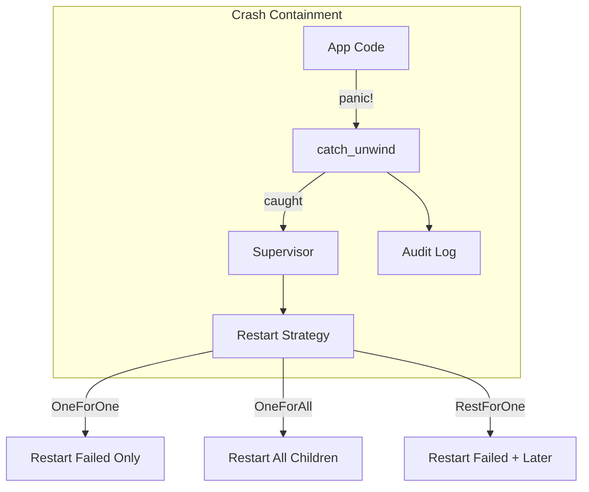

### 2. Everything is Hot-Swappable

Every component can be replaced at runtime without stopping the system:

| Component | Hot-Swap Mechanism | Zero-Downtime |
|-----------|-------------------|---------------|
| **Plugins** | `void_core::hot_reload` | ✅ State preserved |
| **Assets** | File watching + `void_asset_server` | ✅ Atomic swap |
| **Shaders** | Naga recompilation | ✅ Frame-boundary swap |
| **Services** | Lifecycle API | ✅ Graceful restart |
| **Renderers** | Backend switching | ✅ Mid-frame capable |
| **Layers** | Layer composition | ✅ Instant |

### 3. Declarative State via IR Patches

Applications never mutate state directly. Instead, they emit **declarative patches** that the kernel validates and applies atomically:

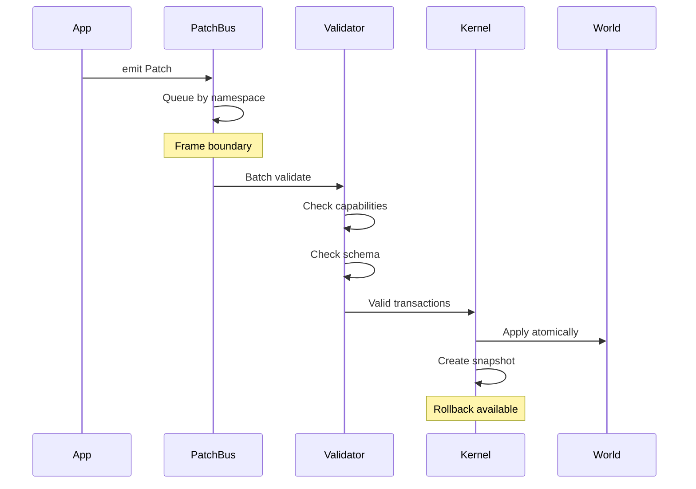

### 4. seL4-Inspired Capability Security

Security isn't role-based—it's **capability-based**, inspired by the seL4 microkernel:

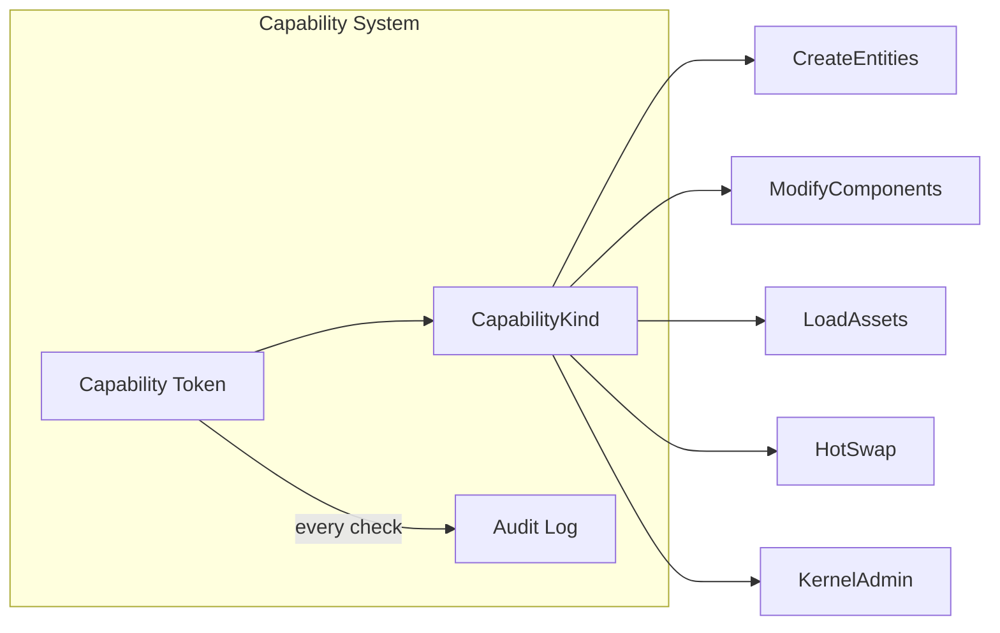

**Properties:**
- **Unforgeable**: Cannot be guessed or manufactured
- **Explicit**: All permissions must be granted
- **Revocable**: Can be revoked at any time
- **Auditable**: Every capability check is logged

### 5. Erlang-Style Supervision Trees

Borrowed from Erlang/OTP, the most battle-tested fault-tolerant system:

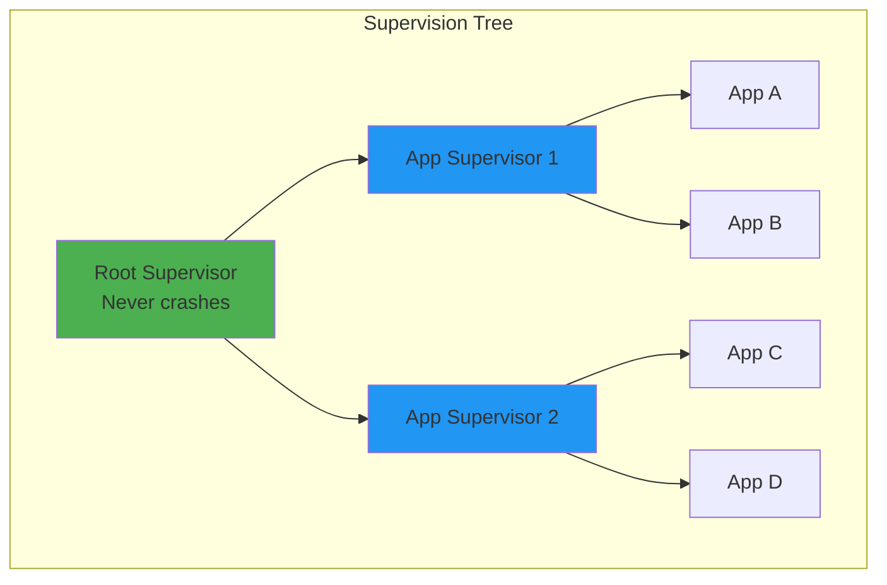

---

## System Architecture

### High-Level Overview

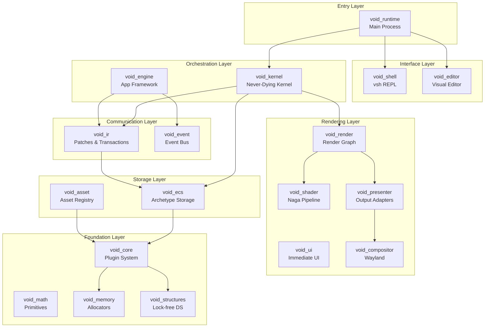

### Crate Dependency Graph

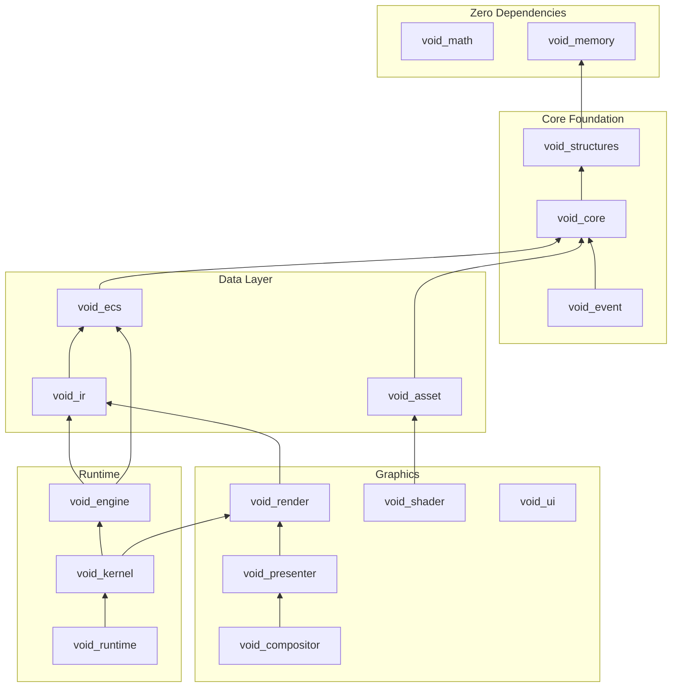

---

## Core Systems Deep Dive

### Plugin System (void_core)

The foundation of extensibility—everything is a plugin:

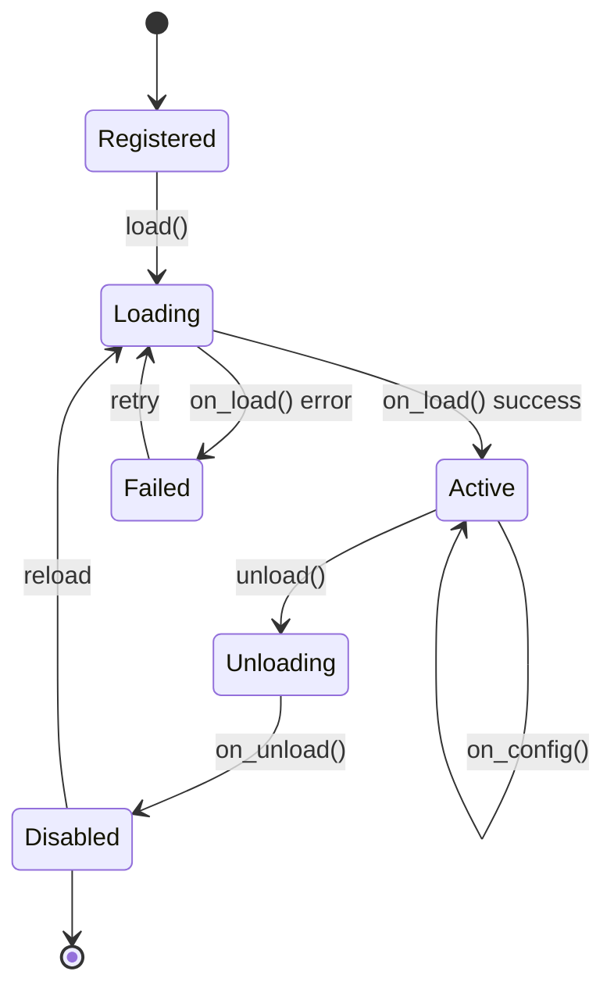

**Key Features:**
- Dynamic registration at runtime
- Hot-reload with state preservation
- Type registry for runtime introspection
- Versioned compatibility checking

### IR Patch System (void_ir)

The revolutionary declarative state management:

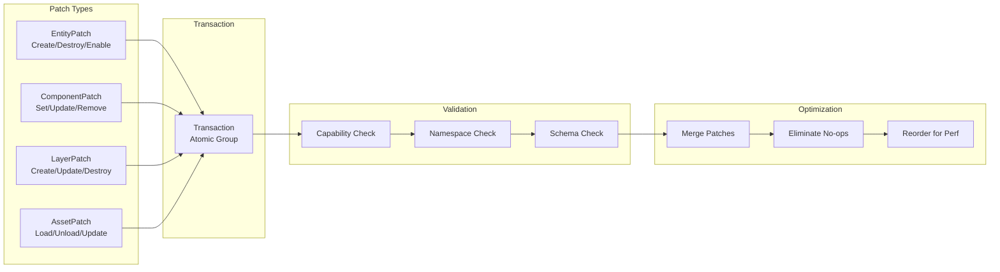

**Transaction Properties:**
- ✅ Atomic: All-or-nothing
- ✅ Validated: Schema/capability checked
- ✅ Rollback-capable: Full snapshot support
- ✅ Conflict-aware: Concurrent modification detection

### Entity-Component System (void_ecs)

Archetype-based storage for cache-efficient iteration:

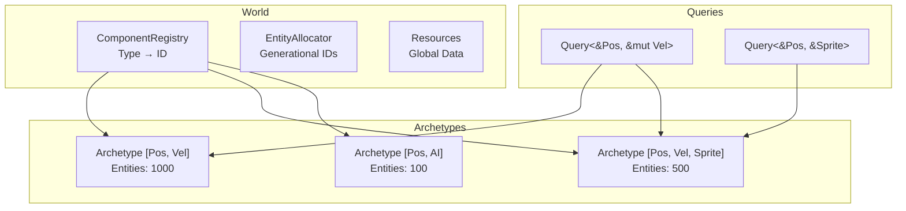

**Key Features:**
- Generational entity IDs (use-after-free prevention)
- Dynamic component registration
- Cache-efficient archetype storage
- Type-safe query system

### Kernel Architecture (void_kernel)

The never-dying heart of the system:

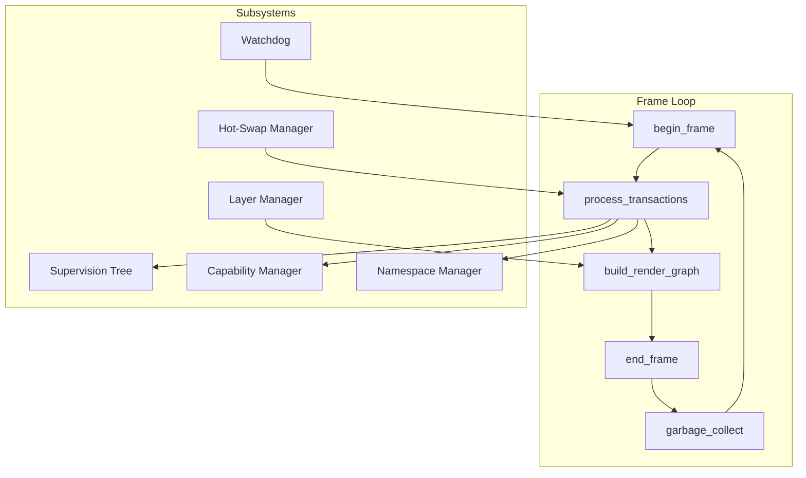

### Rendering Pipeline

Multi-layer composition with crash isolation:

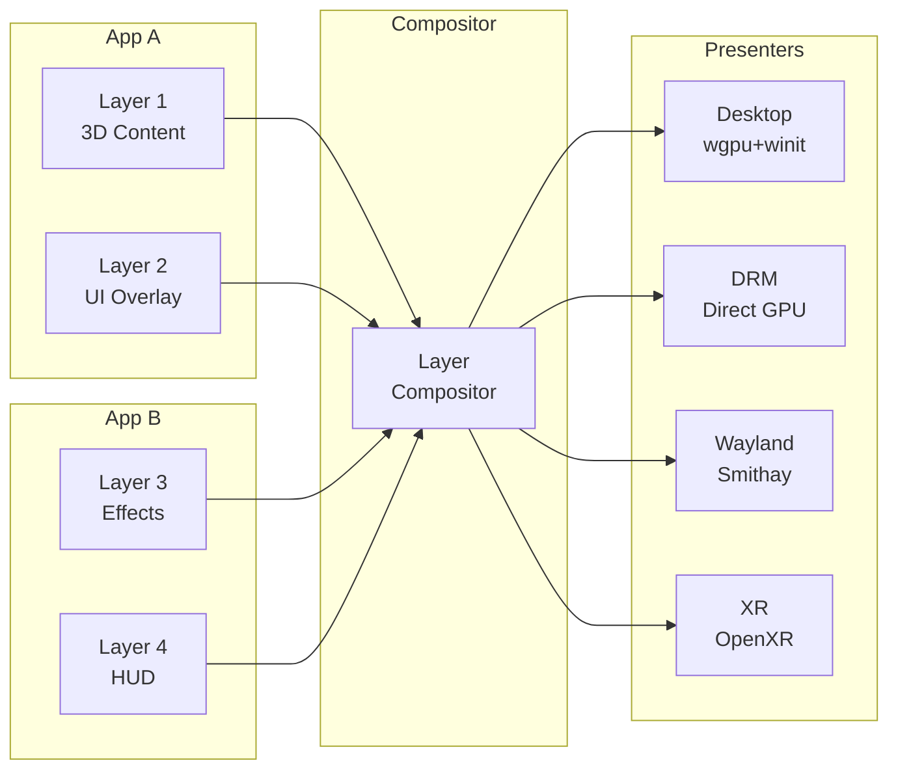

---

## Namespace Isolation Model

Apps are completely isolated through namespace separation:

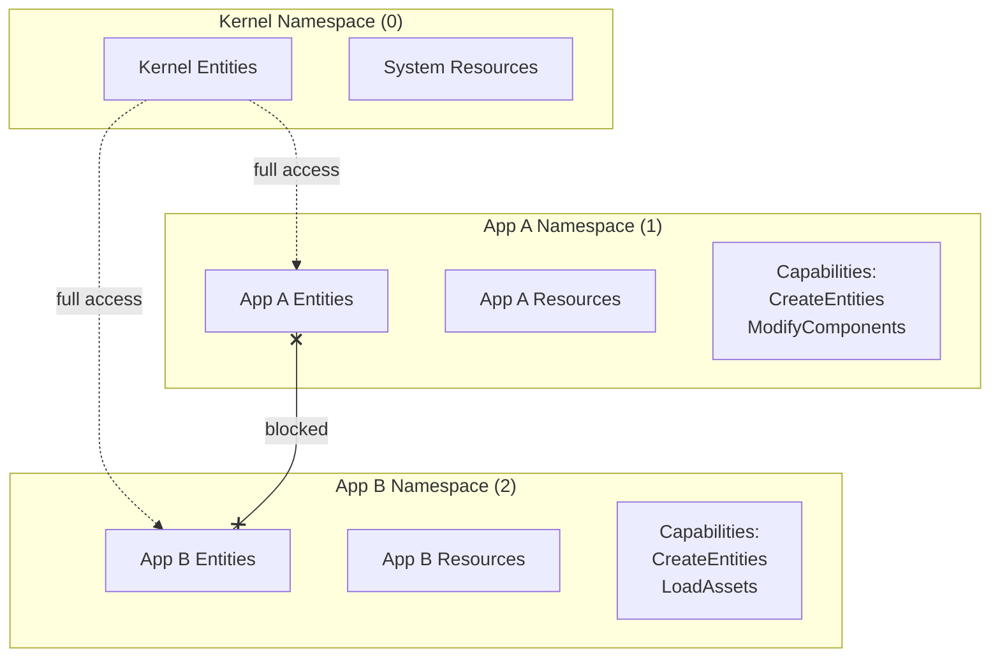

**Guarantees:**
- Apps can only modify their own entities
- Cross-namespace access requires explicit capability
- Entity IDs include namespace for isolation
- Kernel namespace has full access

---

## Resource Budget System

Apps are sandboxed with strict resource limits:

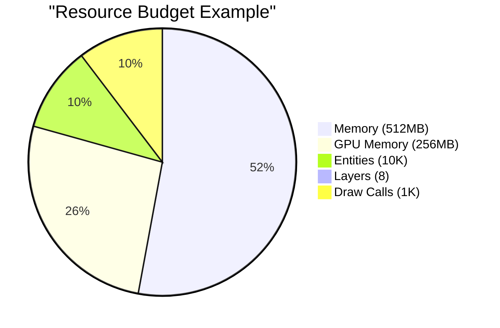

| Resource | Limit | Enforcement |
|----------|-------|-------------|
| Memory | `max_memory_bytes` | Tracked per-allocation |
| GPU Memory | `max_gpu_memory_bytes` | Texture/buffer limits |
| Entities | `max_entities` | Entity creation blocked |
| Layers | `max_layers` | Layer creation blocked |
| Frame Time | `max_frame_time_us` | Watchdog termination |
| Patches/Frame | `max_patches_per_frame` | Patch dropped |
| Draw Calls | `max_draw_calls` | Culling enforced |

---

## Hot-Swap Deep Dive

### State Preservation Flow

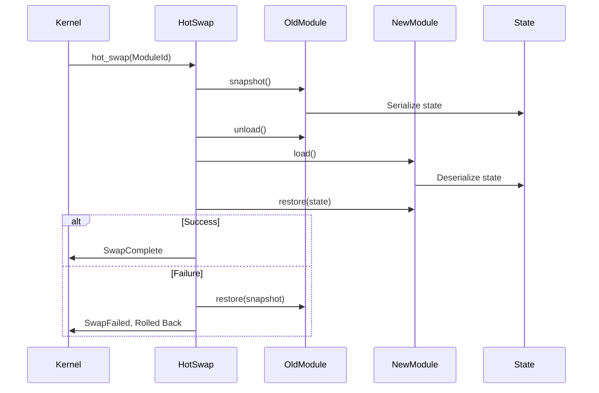

### Shader Hot-Reload

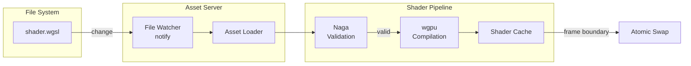

---

## Service Architecture

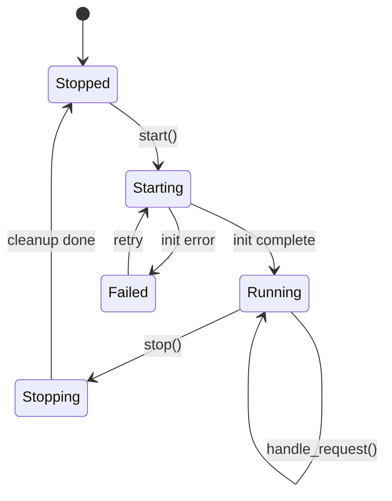

**Built-in Services:**
- `AssetService`: Loading/caching with hot-reload
- `SessionService`: User session management
- `AudioService`: Audio playback (rodio backend)
- `EventBus`: Inter-service event routing
- `NetworkService`: WebSocket communication

---

## External Dependencies

### Minimal Core Philosophy

The core crates have **zero external dependencies**:

| Crate | External Deps |
|-------|---------------|
| void_core | 0 |
| void_math | 0 |
| void_memory | 0 |
| void_structures | parking_lot only |

### Carefully Selected Dependencies

| Category | Crate | Purpose |
|----------|-------|---------|
| Serialization | serde, bincode | State serialization |
| Concurrency | parking_lot, crossbeam | Locks, channels |
| Graphics | wgpu, winit, naga | GPU abstraction |
| UI | egui, glyphon | Immediate-mode UI |
| Async | tokio | Service runtime |
| Files | notify | Hot-reload watching |

---

## Feature Flags

| Feature | Description | Default |
|---------|-------------|---------|
| `hot-reload` | Enable hot-reload support | ✅ |
| `smithay-compositor` | Full Wayland compositor | ❌ |
| `xr` | OpenXR VR/AR support | ❌ |
| `audio-backend` | Audio via rodio | ❌ |
| `drm-backend` | Direct GPU rendering | ❌ |

---

## Configuration Reference

### Kernel Configuration

```rust
pub struct KernelConfig {
    pub target_fps: u32,              // Default: 60
    pub fixed_timestep: f32,          // Default: 1/60
    pub max_delta_time: f32,          // Default: 0.25
    pub hot_reload: bool,             // Default: true
    pub rollback_frames: u32,         // Default: 3
    pub max_apps: u32,                // Default: 64
    pub max_layers: u32,              // Default: 128
    pub enable_watchdog: bool,        // Default: true
}
```

### Boot Configuration

```rust
pub enum Backend {
    Smithay,  // DRM/KMS Wayland compositor
    Winit,    // Window on existing display
    Xr,       // OpenXR VR/AR
    Cli,      // Command-line only
    Auto,     // Auto-detect
}
```

---

## Queryable Code Index

### By Pattern

| Pattern | Primary Crate | Key File |
|---------|---------------|----------|
| Plugin System | void_core | `src/plugin.rs` |
| Type Registry | void_core | `src/registry.rs` |
| Hot Reload | void_core | `src/hot_reload.rs` |
| ECS World | void_ecs | `src/world.rs` |
| Archetypes | void_ecs | `src/archetype.rs` |
| IR Patches | void_ir | `src/patch.rs` |
| Transactions | void_ir | `src/transaction.rs` |
| Patch Bus | void_ir | `src/bus.rs` |
| Supervision | void_kernel | `src/supervision.rs` |
| Capabilities | void_kernel | `src/capability.rs` |
| Recovery | void_kernel | `src/recovery.rs` |
| Sandboxing | void_kernel | `src/sandbox.rs` |
| Render Graph | void_render | `src/graph.rs` |
| Layer Composition | void_render | `src/compositor.rs` |
| Shader Pipeline | void_shader | `src/pipeline.rs` |
| Presenters | void_presenter | `src/lib.rs` |

### By Trait

| Trait | Crate | Purpose |
|-------|-------|---------|
| `Plugin` | void_core | Pluggable components |
| `HotReloadable` | void_core | Hot-swap support |
| `Component` | void_ecs | ECS components |
| `Bundle` | void_ecs | Component groups |
| `Service` | void_services | Async services |
| `Presenter` | void_presenter | Output adapters |

### By Enum

| Enum | Crate | Purpose |
|------|-------|---------|
| `PluginStatus` | void_core | Plugin lifecycle |
| `PatchKind` | void_ir | Patch types |
| `RestartStrategy` | void_kernel | Supervisor strategy |
| `CapabilityKind` | void_kernel | Permission types |
| `RecoveryResult` | void_kernel | Recovery outcomes |
| `LayerType` | void_kernel | Render layer types |
| `Backend` | void_runtime | Output backends |

---

## Testing Strategy

```bash
# Full workspace test
cargo test --workspace

# Single crate
cargo test -p void_kernel

# With features
cargo test -p void_runtime --features "hot-reload"

# Doc tests
cargo test --doc --workspace
```

---

## Build Profiles

```toml
[profile.dev]
opt-level = 0
debug = true

[profile.release]
opt-level = 3
lto = true
codegen-units = 1

[profile.release-with-debug]
inherits = "release"
debug = true
```

---

## Versioning

All crates share the same version and are released together:
- Current: `0.1.0`
- SemVer: Breaking changes bump major version
- Changelog: See `CHANGELOG.md`

---

## License

Dual-licensed under:
- MIT License
- Apache License 2.0

Choose whichever license works best for your use case.
